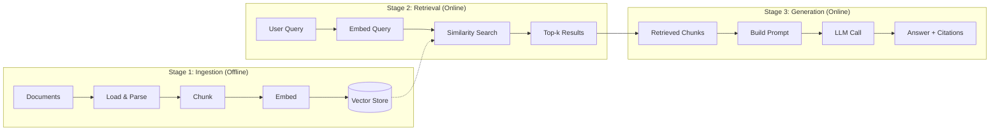

# 1.2 Anatomy of a RAG Pipeline

Every RAG system -- from a weekend prototype to a production platform serving
millions of queries -- follows the same three-stage architecture. Understanding
each stage and its sub-components is essential before we start building.

## The Three Stages



Let us walk through each stage in detail.

---

## Stage 1: Ingestion (Offline)

Ingestion transforms raw documents into a searchable vector index. It runs
offline (or in a batch pipeline) and consists of four sub-steps.

### 1.1 Load and Parse

Raw data comes in many formats: PDF, HTML, Markdown, DOCX, JSON, plain text.
The loader extracts clean text and preserves structural metadata (titles,
headings, page numbers, timestamps).

```rust
/// A loaded document with metadata
struct Document {
    /// Unique identifier (file path, URL, database ID)
    id: String,
    /// Extracted plain text content
    content: String,
    /// Structured metadata for filtering and citation
    metadata: HashMap<String, String>,
}

/// Load documents from a directory
fn load_documents(dir: &Path) -> Vec<Document> {
    std::fs::read_dir(dir)
        .expect("failed to read directory")
        .filter_map(|entry| {
            let path = entry.ok()?.path();
            let content = std::fs::read_to_string(&path).ok()?;
            Some(Document {
                id: path.display().to_string(),
                content,
                metadata: HashMap::from([
                    ("source".into(), path.display().to_string()),
                    ("format".into(), "text".into()),
                ]),
            })
        })
        .collect()
}
```

### 1.2 Chunk

Documents are typically too long to embed as a single vector. We split them
into *chunks* -- segments that are small enough to embed meaningfully but
large enough to retain context.

Common chunk sizes range from 256 to 1024 tokens, with 128--256 tokens of
overlap between adjacent chunks to prevent information loss at boundaries.

```rust
/// Split text into overlapping chunks
fn chunk_text(text: &str, chunk_size: usize, overlap: usize) -> Vec<String> {
    let words: Vec<&str> = text.split_whitespace().collect();
    let step = chunk_size.saturating_sub(overlap).max(1);

    words
        .windows(chunk_size.min(words.len()))
        .step_by(step)
        .map(|window| window.join(" "))
        .collect()
}
```

We will explore chunking strategies in depth in Chapter 2.

### 1.3 Embed

Each chunk is converted into a dense vector (embedding) using an embedding
model. The embedding captures the *semantic meaning* of the text -- chunks
about similar topics will have similar vectors regardless of exact wording.

```rust
/// Trait for embedding providers
trait Embedder {
    /// Embed a batch of texts into vectors
    async fn embed_batch(&self, texts: &[&str]) -> Result<Vec<Vec<f32>>>;
}

/// Example: calling OpenAI's embedding API
struct OpenAIEmbedder {
    client: reqwest::Client,
    api_key: String,
    model: String, // e.g., "text-embedding-3-small"
}

impl Embedder for OpenAIEmbedder {
    async fn embed_batch(&self, texts: &[&str]) -> Result<Vec<Vec<f32>>> {
        let response = self.client
            .post("https://api.openai.com/v1/embeddings")
            .bearer_auth(&self.api_key)
            .json(&serde_json::json!({
                "model": &self.model,
                "input": texts,
            }))
            .send()
            .await?;

        // Parse and return embedding vectors
        let body: EmbeddingResponse = response.json().await?;
        Ok(body.data.into_iter().map(|d| d.embedding).collect())
    }
}
```

### 1.4 Store

Embedded chunks are stored in a *vector store* -- a database optimized for
similarity search over high-dimensional vectors. Options range from in-memory
stores (for prototyping) to managed services like AWS S3 Vectors, Pinecone,
or pgvector.

Each stored entry contains:
- The embedding vector
- The original chunk text
- Metadata (source document, position, timestamps)

```rust
/// A stored chunk with its embedding
struct StoredChunk {
    id: String,
    text: String,
    embedding: Vec<f32>,
    metadata: HashMap<String, String>,
}
```

---

## Stage 2: Retrieval (Online)

When a user asks a question, the retrieval stage finds the most relevant
chunks from the vector store. This runs in the hot path and must be fast.

### 2.1 Embed the Query

The user's query is embedded using the *same* embedding model used during
ingestion. This ensures the query vector lives in the same semantic space
as the stored chunk vectors.

```rust
let query = "What is our reimbursement policy for conferences?";
let query_embedding = embedder.embed_batch(&[query]).await?;
```

### 2.2 Similarity Search

The query embedding is compared against all stored embeddings using a
distance metric -- typically cosine similarity or dot product. The vector
store returns the *k* most similar chunks.

```rust
/// Find the top-k most similar chunks to a query
fn retrieve(
    query_embedding: &[f32],
    store: &[StoredChunk],
    k: usize,
) -> Vec<&StoredChunk> {
    let mut scored: Vec<(&StoredChunk, f32)> = store
        .iter()
        .map(|chunk| {
            let score = cosine_similarity(query_embedding, &chunk.embedding);
            (chunk, score)
        })
        .collect();

    scored.sort_by(|a, b| b.1.partial_cmp(&a.1).unwrap());
    scored.into_iter().take(k).map(|(chunk, _)| chunk).collect()
}
```

### 2.3 Top-k Selection

Choosing *k* involves a tradeoff:
- **Too small** (k=1--3): May miss relevant information
- **Too large** (k=20+): Floods the context window, dilutes signal, increases
  cost and latency
- **Sweet spot**: Typically k=5--10, then rerank (Chapter 3)

---

## Stage 3: Generation (Online)

The retrieved chunks are assembled into a prompt and sent to an LLM to
generate a grounded answer.

### 3.1 Build the Prompt

A well-structured RAG prompt separates the retrieved context from the
user's question and instructs the model to use only the provided evidence.

```rust
fn build_rag_prompt(query: &str, chunks: &[&StoredChunk]) -> String {
    let context = chunks
        .iter()
        .enumerate()
        .map(|(i, chunk)| {
            format!(
                "[Source {}] ({})\n{}",
                i + 1,
                chunk.metadata.get("source").unwrap_or(&"unknown".into()),
                chunk.text
            )
        })
        .collect::<Vec<_>>()
        .join("\n\n");

    format!(
        "You are a helpful assistant. Answer the user's question using ONLY \
         the provided context. If the context does not contain enough \
         information, say so. Cite sources by number.\n\n\
         ## Context\n\n{context}\n\n\
         ## Question\n\n{query}\n\n\
         ## Answer"
    )
}
```

### 3.2 LLM Call

The assembled prompt is sent to an LLM. The model generates an answer
that (ideally) synthesizes the retrieved evidence and cites specific
sources.

### 3.3 Post-Processing

Production systems often post-process the response:
- Extract and validate citations
- Check for hallucinated claims not present in context
- Format the answer for the target interface

---

## Putting It All Together

Here is the complete flow as pseudocode:

```rust
async fn rag_query(query: &str, store: &VectorStore, embedder: &dyn Embedder) -> String {
    // Stage 2a: Embed the query
    let query_vec = embedder.embed_batch(&[query]).await.unwrap();

    // Stage 2b: Retrieve top-k chunks
    let chunks = store.search(&query_vec[0], 5).await;

    // Stage 3a: Build the prompt
    let prompt = build_rag_prompt(query, &chunks);

    // Stage 3b: Generate the answer
    let answer = llm_client.complete(&prompt).await;

    answer
}
```

## Latency Budget

In production, each stage has a latency budget:

| Stage | Typical Latency | Notes |
|-------|----------------|-------|
| Query embedding | 20--50ms | Single API call or local model |
| Similarity search | 5--50ms | Depends on index type and size |
| Prompt construction | <1ms | String formatting |
| LLM generation | 500--3000ms | Dominates total latency |
| **Total** | **~600--3100ms** | LLM is the bottleneck |

The retrieval stages (embed + search) are fast. The LLM generation step
dominates. This means you can afford sophisticated retrieval strategies
(hybrid search, reranking) without materially impacting end-to-end latency.

## Summary

Every RAG system follows the same three stages: ingest documents into a
vector store, retrieve relevant chunks at query time, and generate a
grounded answer. The details of *how* you chunk, embed, retrieve, and
prompt determine the quality of your system.

In the next section we will implement this entire pipeline in Rust with
nothing but the standard library and basic vector math.

---

*Next: [1.3 Naive RAG in Rust](ch01-03-naive-rag-rust.md)*
