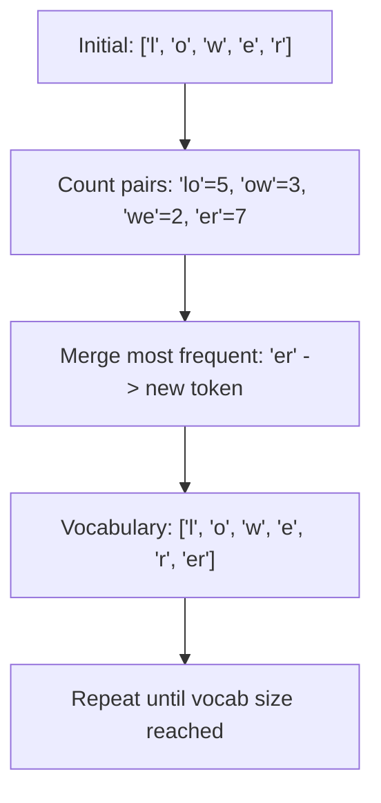

# 2.1 Tokenization

Before text can be embedded, it must be *tokenized* -- split into the
discrete units that neural networks actually process. Tokenization is the
invisible layer that determines how much text fits in a context window,
how much an API call costs, and where semantic boundaries fall.

## What Is a Token?

A token is not a word. It is not a character. It is a sub-word unit learned
from training data. The sentence "Tokenization is surprisingly important"
might tokenize as:

```text
["Token", "ization", " is", " surprisingly", " important"]
```

Note that "Tokenization" is split into two tokens while common words remain
whole. This is the key insight: frequent strings get their own tokens,
rare strings are composed from smaller pieces.

## Byte Pair Encoding (BPE)

BPE is the tokenization algorithm used by GPT models and most modern
embedding models. It works through iterative merging:

1. Start with individual bytes (or characters) as the initial vocabulary
2. Count all adjacent pairs in the training corpus
3. Merge the most frequent pair into a new token
4. Repeat until the vocabulary reaches the target size (e.g., 100,000 tokens)



### BPE in Rust

The `tiktoken-rs` crate provides the exact tokenizers used by OpenAI models:

```rust
use tiktoken_rs::cl100k_base;

fn count_tokens(text: &str) -> usize {
    let bpe = cl100k_base().expect("failed to load tokenizer");
    let tokens = bpe.encode_with_special_tokens(text);
    tokens.len()
}

fn demonstrate_tokenization() {
    let bpe = cl100k_base().expect("failed to load tokenizer");

    let examples = vec![
        "Hello, world!",
        "Retrieval-Augmented Generation",
        "edgequake::storage::VectorStorage",
        "The quick brown fox jumps over the lazy dog",
    ];

    for text in examples {
        let tokens = bpe.encode_with_special_tokens(text);
        println!(
            "{:50} -> {} tokens: {:?}",
            text,
            tokens.len(),
            tokens
        );
    }
}
```

Running this produces output like:

```text
Hello, world!                                      -> 4 tokens: [9906, 11, 1917, 0]
Retrieval-Augmented Generation                     -> 5 tokens: [...]
edgequake::storage::VectorStorage                  -> 8 tokens: [...]
The quick brown fox jumps over the lazy dog        -> 9 tokens: [...]
```

### Key Observation

Technical terms, code identifiers, and domain-specific vocabulary consume
*more* tokens per word than common English. This matters for RAG because
domain-heavy chunks may be shorter in words but identical in token count
to general-purpose text.

## WordPiece

WordPiece (used by BERT and some embedding models) is similar to BPE but
uses a different merging criterion. Instead of raw frequency, WordPiece
merges pairs that maximize the likelihood of the training data under a
language model.

The practical difference is small: both produce sub-word vocabularies of
similar quality. The important thing is to use the tokenizer that matches
your embedding model.

```rust
// Using the tokenizers crate for WordPiece models
use tokenizers::Tokenizer;

fn wordpiece_example() -> Result<(), Box<dyn std::error::Error>> {
    // Load a pretrained BERT tokenizer
    let tokenizer = Tokenizer::from_pretrained("bert-base-uncased", None)?;

    let text = "Retrieval-Augmented Generation improves factual accuracy";
    let encoding = tokenizer.encode(text, false)?;

    println!("Tokens: {:?}", encoding.get_tokens());
    println!("IDs:    {:?}", encoding.get_ids());
    println!("Count:  {}", encoding.get_tokens().len());

    Ok(())
}
```

## Why Token Counting Matters for RAG

Token limits create hard constraints at every stage of a RAG pipeline:

### 1. Embedding Model Input Limits

| Model | Max Input Tokens |
|-------|-----------------|
| OpenAI text-embedding-3-small | 8,191 |
| OpenAI text-embedding-3-large | 8,191 |
| Cohere embed-v3 | 512 |
| BGE-large-en-v1.5 | 512 |
| E5-mistral-7b | 4,096 |

If your chunk exceeds the model's limit, it is silently truncated. The
embedding only captures the first N tokens -- the rest is invisible to
retrieval.

### 2. LLM Context Windows

Retrieved chunks must fit in the LLM's context window along with the
system prompt, user query, and generation budget:

```text
Context Window Budget (e.g., 128K tokens)
├── System prompt:        ~200 tokens
├── User query:           ~50 tokens
├── Retrieved chunks:     ~4,000 tokens (k=5 * 800 tokens each)
├── Generation budget:    ~2,000 tokens
└── Remaining headroom:   ~121,750 tokens (unused)
```

Even with large context windows, cramming too many chunks degrades quality
(the "lost in the middle" problem -- see Chapter 3).

### 3. API Cost

Embedding APIs charge per token. If your chunks are 1,000 tokens but the
first 400 tokens are boilerplate headers, you are paying to embed noise.

## Token Counting in Practice

Always validate chunk sizes in tokens, not characters or words:

```rust
use tiktoken_rs::cl100k_base;

struct TokenAwareChunker {
    max_tokens: usize,
    overlap_tokens: usize,
    tokenizer: tiktoken_rs::CoreBPE,
}

impl TokenAwareChunker {
    fn new(max_tokens: usize, overlap_tokens: usize) -> Self {
        Self {
            max_tokens,
            overlap_tokens,
            tokenizer: cl100k_base().expect("failed to load tokenizer"),
        }
    }

    /// Count tokens in a text string
    fn token_count(&self, text: &str) -> usize {
        self.tokenizer.encode_with_special_tokens(text).len()
    }

    /// Validate that a chunk fits within the token budget
    fn validate_chunk(&self, chunk: &str) -> bool {
        self.token_count(chunk) <= self.max_tokens
    }

    /// Split text into token-aware chunks
    fn chunk(&self, text: &str) -> Vec<String> {
        let sentences: Vec<&str> = text.split(". ").collect();
        let mut chunks = Vec::new();
        let mut current_chunk = String::new();
        let mut current_tokens = 0;

        for sentence in sentences {
            let sentence_with_period = format!("{}. ", sentence);
            let sentence_tokens = self.token_count(&sentence_with_period);

            if current_tokens + sentence_tokens > self.max_tokens {
                if !current_chunk.is_empty() {
                    chunks.push(current_chunk.trim().to_string());
                }
                current_chunk = sentence_with_period;
                current_tokens = sentence_tokens;
            } else {
                current_chunk.push_str(&sentence_with_period);
                current_tokens += sentence_tokens;
            }
        }

        if !current_chunk.is_empty() {
            chunks.push(current_chunk.trim().to_string());
        }

        chunks
    }
}
```

## Common Pitfalls

1. **Counting words instead of tokens**: "state-of-the-art" is one word
   but typically 5+ tokens.

2. **Ignoring special tokens**: Many tokenizers add `[CLS]`, `[SEP]`, or
   `<|endoftext|>` tokens that consume budget.

3. **Assuming 1 token ~ 4 characters**: This rule of thumb works for
   English prose but breaks for code, URLs, and non-Latin scripts.

4. **Using the wrong tokenizer**: Each model family has its own tokenizer.
   Counting tokens with `cl100k_base` (GPT-4) then embedding with a BERT
   model that uses WordPiece will give incorrect counts.

## Summary

Tokenization converts text into the discrete units that models actually
process. BPE and WordPiece are the dominant algorithms, producing sub-word
vocabularies that balance coverage and efficiency. Token counting creates
hard constraints on chunk size, context window usage, and API cost. Always
measure chunks in tokens using the tokenizer that matches your embedding
model.

---

*Next: [2.2 Embedding Models](ch02-02-embedding-models.md)*
