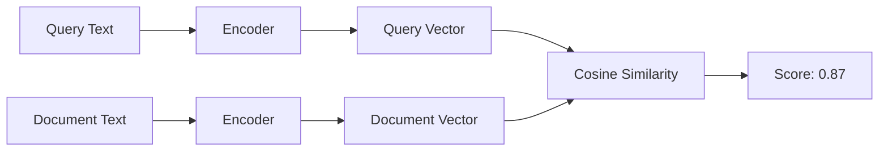
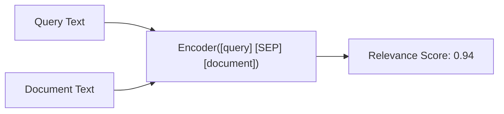

# 2.2 Embedding Models

An embedding model transforms text into a dense vector in high-dimensional
space such that semantically similar texts have similar vectors. Choosing
the right model -- and understanding its tradeoffs -- is one of the most
impactful decisions in RAG system design.

## Bi-Encoders vs Cross-Encoders

There are two fundamentally different architectures for computing text
similarity, and they serve different roles in a RAG pipeline.

### Bi-Encoders (Independent Encoding)

A bi-encoder processes the query and each document *independently*, producing
a vector for each. Similarity is computed by comparing vectors (cosine
similarity, dot product).



**Advantages:**
- Document vectors are computed *once* at ingestion time and cached
- Query encoding is a single model call regardless of corpus size
- Enables sub-millisecond retrieval via approximate nearest neighbor (ANN) indices

**Disadvantages:**
- Cannot capture fine-grained query-document interactions
- Lower accuracy than cross-encoders for nuanced relevance judgments

**Examples:** OpenAI text-embedding-3, Cohere embed-v3, BGE, E5, GTE

### Cross-Encoders (Joint Encoding)

A cross-encoder processes the query and document *together* as a single
input, producing a scalar relevance score rather than independent vectors.



**Advantages:**
- Can capture token-level interactions between query and document
- Significantly more accurate relevance scoring

**Disadvantages:**
- Must run the model once per (query, document) pair
- Cannot pre-compute document representations
- Too slow for initial retrieval over large corpora

**Examples:** Cohere Rerank, cross-encoder/ms-marco-MiniLM-L-12-v2

### When to Use Each

| Stage | Architecture | Why |
|-------|-------------|-----|
| **Indexing** | Bi-encoder | Pre-compute document embeddings |
| **Initial retrieval** | Bi-encoder | Fast search over millions of vectors |
| **Reranking** | Cross-encoder | Accurate scoring of top-k candidates |

This two-stage pattern (bi-encoder retrieve, cross-encoder rerank) is the
standard architecture in production RAG systems. We cover reranking in
detail in Chapter 3.

## Model Comparison

### OpenAI Embedding Models

| Model | Dimensions | Max Tokens | Cost (per 1M tokens) | Notes |
|-------|-----------|-----------|---------------------|-------|
| text-embedding-3-small | 1536 (or 512) | 8,191 | $0.02 | Good quality/cost ratio |
| text-embedding-3-large | 3072 (or 256-3072) | 8,191 | $0.13 | Highest quality |
| text-embedding-ada-002 | 1536 | 8,191 | $0.10 | Legacy, still widely used |

The `text-embedding-3` models support *Matryoshka dimensions* -- you can
request a lower-dimensional output (e.g., 512 instead of 1536) with minimal
quality loss. This reduces storage and search costs.

### Open-Source Models

| Model | Dimensions | Max Tokens | Notes |
|-------|-----------|-----------|-------|
| BGE-large-en-v1.5 | 1024 | 512 | Strong MTEB benchmark performance |
| E5-mistral-7b | 4096 | 4,096 | LLM-based, highest quality |
| GTE-large | 1024 | 512 | Good all-around |
| all-MiniLM-L6-v2 | 384 | 256 | Very fast, lower quality |

### Calling Embedding APIs from Rust

```rust
use reqwest::Client;
use serde::{Deserialize, Serialize};

#[derive(Serialize)]
struct EmbeddingRequest {
    model: String,
    input: Vec<String>,
    dimensions: Option<usize>,
}

#[derive(Deserialize)]
struct EmbeddingResponse {
    data: Vec<EmbeddingData>,
    usage: Usage,
}

#[derive(Deserialize)]
struct EmbeddingData {
    embedding: Vec<f32>,
    index: usize,
}

#[derive(Deserialize)]
struct Usage {
    prompt_tokens: usize,
    total_tokens: usize,
}

/// Embed texts using OpenAI's API
async fn embed_texts(
    client: &Client,
    api_key: &str,
    texts: Vec<String>,
    model: &str,
    dimensions: Option<usize>,
) -> Result<Vec<Vec<f32>>, Box<dyn std::error::Error>> {
    let request = EmbeddingRequest {
        model: model.to_string(),
        input: texts,
        dimensions,
    };

    let response: EmbeddingResponse = client
        .post("https://api.openai.com/v1/embeddings")
        .bearer_auth(api_key)
        .json(&request)
        .send()
        .await?
        .json()
        .await?;

    println!("Tokens used: {}", response.usage.total_tokens);

    // Sort by index to preserve input order
    let mut data = response.data;
    data.sort_by_key(|d| d.index);
    Ok(data.into_iter().map(|d| d.embedding).collect())
}
```

## Dimension Tradeoffs

Embedding dimension directly affects storage, memory, and search performance:

```text
1M chunks at different dimensions:
  384-dim  * 4 bytes = 1.5 GB
  1024-dim * 4 bytes = 3.9 GB
  1536-dim * 4 bytes = 5.9 GB
  3072-dim * 4 bytes = 11.7 GB
```

### The Matryoshka Trick

Modern models like `text-embedding-3-small` support truncating embeddings
to fewer dimensions. The first N dimensions capture the most important
information (like a PCA projection):

```rust
/// Truncate an embedding to fewer dimensions and re-normalize
fn truncate_embedding(embedding: &[f32], target_dim: usize) -> Vec<f32> {
    let truncated = &embedding[..target_dim.min(embedding.len())];

    // Re-normalize after truncation
    let magnitude: f32 = truncated.iter().map(|x| x * x).sum::<f32>().sqrt();
    if magnitude > 0.0 {
        truncated.iter().map(|x| x / magnitude).collect()
    } else {
        truncated.to_vec()
    }
}

// Example: reduce 1536-dim to 512-dim with ~1% quality loss
let full = embed_texts(&client, key, texts, "text-embedding-3-small", None).await?;
let compact: Vec<Vec<f32>> = full
    .iter()
    .map(|v| truncate_embedding(v, 512))
    .collect();
```

Alternatively, request the reduced dimension directly from the API:

```rust
let compact = embed_texts(
    &client,
    key,
    texts,
    "text-embedding-3-small",
    Some(512), // API returns 512-dim vectors directly
).await?;
```

## Distance Metrics

The choice of distance metric must match how your embedding model was
trained.

### Cosine Similarity

Measures the angle between vectors. Range: [-1, 1]. Most common for
normalized embeddings.

```rust
fn cosine_similarity(a: &[f32], b: &[f32]) -> f32 {
    let dot: f32 = a.iter().zip(b).map(|(x, y)| x * y).sum();
    let mag_a: f32 = a.iter().map(|x| x * x).sum::<f32>().sqrt();
    let mag_b: f32 = b.iter().map(|x| x * x).sum::<f32>().sqrt();
    dot / (mag_a * mag_b)
}
```

### Dot Product

Equivalent to cosine similarity when vectors are L2-normalized (which
OpenAI embeddings are). Faster to compute (no magnitude calculation).

```rust
fn dot_product(a: &[f32], b: &[f32]) -> f32 {
    a.iter().zip(b).map(|(x, y)| x * y).sum()
}
```

### Euclidean Distance

Measures straight-line distance. Lower is more similar. Sensitive to
magnitude differences.

```rust
fn euclidean_distance(a: &[f32], b: &[f32]) -> f32 {
    a.iter()
        .zip(b)
        .map(|(x, y)| (x - y).powi(2))
        .sum::<f32>()
        .sqrt()
}
```

### Which to Use?

| Metric | When to Use | Notes |
|--------|------------|-------|
| Cosine similarity | Default choice for most embedding models | Magnitude-invariant |
| Dot product | Normalized embeddings (OpenAI, Cohere) | Faster than cosine |
| Euclidean | Some specialized models | Rarely the best choice for text |

> **EdgeQuake note**: S3 Vectors uses cosine distance (1 - cosine similarity).
> EdgeQuake converts this to a similarity score via `1.0 - distance`.

## Batch Embedding Strategies

Production ingestion pipelines embed millions of chunks. Efficient batching
is critical:

```rust
/// Embed chunks in batches to stay within API limits
async fn embed_in_batches(
    client: &Client,
    api_key: &str,
    chunks: &[String],
    batch_size: usize,
) -> Result<Vec<Vec<f32>>, Box<dyn std::error::Error>> {
    let mut all_embeddings = Vec::with_capacity(chunks.len());

    for batch in chunks.chunks(batch_size) {
        let embeddings = embed_texts(
            client,
            api_key,
            batch.to_vec(),
            "text-embedding-3-small",
            Some(512),
        )
        .await?;
        all_embeddings.extend(embeddings);

        // Respect rate limits
        tokio::time::sleep(std::time::Duration::from_millis(100)).await;
    }

    Ok(all_embeddings)
}
```

OpenAI's batch embedding endpoint accepts up to 2,048 texts per request
with a total token limit of ~8,000 tokens per text. For large-scale
ingestion, EdgeQuake uses the OpenAI Batch API for 50% cost savings
(covered in Part III).

## Summary

Bi-encoders produce independent vectors for fast retrieval; cross-encoders
produce pairwise scores for accurate reranking. Modern embedding models
support Matryoshka dimensions for flexible quality/cost tradeoffs. Always
match your distance metric to your model's training objective, and batch
your embedding calls for production efficiency.

---

*Next: [2.3 Chunking Strategies](ch02-03-chunking-strategies.md)*
