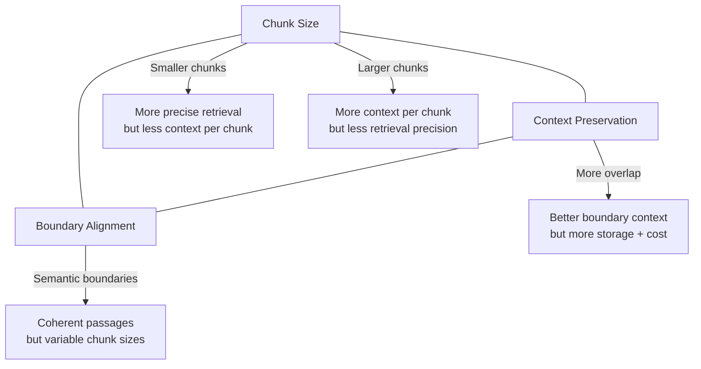

# 2.3 Chunking Strategies

Chunking is the art of splitting documents into pieces that are small enough
to embed meaningfully, large enough to retain context, and aligned with
semantic boundaries so that retrieval returns coherent passages rather than
sentence fragments.

There is no universally optimal chunking strategy. The right choice depends
on your document types, embedding model, and retrieval requirements.

## The Chunking Design Space

Every chunking strategy makes tradeoffs along three axes:



## Strategy 1: Fixed-Size Chunking

The simplest approach: split text into chunks of exactly N tokens (or
characters/words) with a fixed overlap.

```rust
/// Fixed-size chunking by token count
fn fixed_size_chunk(
    text: &str,
    chunk_size: usize,
    overlap: usize,
) -> Vec<String> {
    let words: Vec<&str> = text.split_whitespace().collect();
    let step = chunk_size.saturating_sub(overlap).max(1);
    let mut chunks = Vec::new();

    let mut start = 0;
    while start < words.len() {
        let end = (start + chunk_size).min(words.len());
        chunks.push(words[start..end].join(" "));
        start += step;
        if end == words.len() {
            break;
        }
    }

    chunks
}
```

**Advantages:**
- Dead simple to implement
- Predictable chunk sizes (good for cost estimation)
- Works with any text format

**Disadvantages:**
- Splits mid-sentence, mid-paragraph, even mid-word
- No awareness of document structure
- Overlap is the only defense against boundary information loss

**Best for:** Unstructured text where no format information is available,
quick prototyping.

## Strategy 2: Recursive Character Splitting

Recursive splitting tries increasingly fine-grained separators until chunks
are small enough. It attempts to split on paragraph boundaries first, then
sentences, then words.

```rust
/// Recursive character splitter with configurable separators
struct RecursiveSplitter {
    chunk_size: usize,
    overlap: usize,
    separators: Vec<String>,
}

impl RecursiveSplitter {
    fn new(chunk_size: usize, overlap: usize) -> Self {
        Self {
            chunk_size,
            overlap,
            separators: vec![
                "\n\n".to_string(),   // Paragraphs first
                "\n".to_string(),     // Then line breaks
                ". ".to_string(),     // Then sentences
                ", ".to_string(),     // Then clauses
                " ".to_string(),      // Then words
            ],
        }
    }

    fn split(&self, text: &str) -> Vec<String> {
        self.split_recursive(text, 0)
    }

    fn split_recursive(&self, text: &str, depth: usize) -> Vec<String> {
        // Base case: text fits in a single chunk
        if text.split_whitespace().count() <= self.chunk_size {
            return vec![text.to_string()];
        }

        // Try each separator in order of preference
        let separator = if depth < self.separators.len() {
            &self.separators[depth]
        } else {
            // Fallback: split by character
            return fixed_size_chunk(text, self.chunk_size, self.overlap);
        };

        let parts: Vec<&str> = text.split(separator).collect();

        if parts.len() <= 1 {
            // Separator not found, try the next one
            return self.split_recursive(text, depth + 1);
        }

        // Merge small parts into chunks up to the size limit
        let mut chunks = Vec::new();
        let mut current = String::new();

        for part in parts {
            let candidate = if current.is_empty() {
                part.to_string()
            } else {
                format!("{}{}{}", current, separator, part)
            };

            if candidate.split_whitespace().count() > self.chunk_size {
                if !current.is_empty() {
                    chunks.push(current.clone());
                }
                // If this single part is too large, recurse on it
                if part.split_whitespace().count() > self.chunk_size {
                    chunks.extend(self.split_recursive(part, depth + 1));
                    current = String::new();
                } else {
                    current = part.to_string();
                }
            } else {
                current = candidate;
            }
        }

        if !current.is_empty() {
            chunks.push(current);
        }

        chunks
    }
}
```

**Advantages:**
- Respects natural text boundaries (paragraphs, sentences)
- Produces more coherent chunks than fixed-size
- Widely adopted (LangChain, LlamaIndex default)

**Disadvantages:**
- Variable chunk sizes complicate capacity planning
- May produce very small chunks from short paragraphs
- Still unaware of semantic content

**Best for:** General-purpose RAG over prose documents (articles, reports,
documentation).

## Strategy 3: Semantic Chunking

Semantic chunking uses embedding similarity to detect topic boundaries.
Adjacent sentences that are semantically similar stay together; a
significant similarity drop signals a chunk boundary.

```rust
/// Semantic chunking based on embedding similarity between sentences
async fn semantic_chunk(
    text: &str,
    embedder: &dyn Embedder,
    similarity_threshold: f32,
    max_chunk_tokens: usize,
) -> Vec<String> {
    // Split into sentences
    let sentences: Vec<&str> = text
        .split(|c: char| c == '.' || c == '!' || c == '?')
        .map(|s| s.trim())
        .filter(|s| !s.is_empty())
        .collect();

    if sentences.is_empty() {
        return vec![];
    }

    // Embed each sentence
    let sentence_strs: Vec<&str> = sentences.iter().copied().collect();
    let embeddings = embedder.embed_batch(&sentence_strs).await.unwrap();

    // Group sentences where adjacent similarity exceeds threshold
    let mut chunks = Vec::new();
    let mut current_chunk = vec![sentences[0]];
    let mut current_tokens = token_count(sentences[0]);

    for i in 1..sentences.len() {
        let sim = cosine_similarity(&embeddings[i - 1], &embeddings[i]);
        let sentence_tokens = token_count(sentences[i]);

        let should_split = sim < similarity_threshold
            || current_tokens + sentence_tokens > max_chunk_tokens;

        if should_split {
            chunks.push(current_chunk.join(". ") + ".");
            current_chunk = vec![sentences[i]];
            current_tokens = sentence_tokens;
        } else {
            current_chunk.push(sentences[i]);
            current_tokens += sentence_tokens;
        }
    }

    if !current_chunk.is_empty() {
        chunks.push(current_chunk.join(". ") + ".");
    }

    chunks
}
```

**Advantages:**
- Chunks align with actual topic boundaries
- Each chunk contains a coherent semantic unit
- Adapts to document structure automatically

**Disadvantages:**
- Requires an embedding call for every sentence (expensive at scale)
- Similarity threshold requires tuning per domain
- Highly variable chunk sizes

**Best for:** Documents with clear topic transitions (research papers,
multi-topic articles), when embedding cost is acceptable.

## Strategy 4: Markdown-Aware Chunking

For structured documents (Markdown, HTML, RST), leverage the document
structure itself. Headers define natural section boundaries.

```rust
/// Split markdown into chunks based on headers
fn markdown_chunk(text: &str, max_chunk_size: usize) -> Vec<MarkdownChunk> {
    let mut chunks = Vec::new();
    let mut current_headers: Vec<String> = Vec::new();
    let mut current_content = String::new();

    for line in text.lines() {
        if line.starts_with('#') {
            // Flush current content
            if !current_content.trim().is_empty() {
                chunks.push(MarkdownChunk {
                    headers: current_headers.clone(),
                    content: current_content.trim().to_string(),
                });
            }

            // Update header stack
            let level = line.chars().take_while(|c| *c == '#').count();
            let title = line.trim_start_matches('#').trim().to_string();

            // Pop headers at the same or lower level
            current_headers.truncate(level.saturating_sub(1));
            current_headers.push(title);

            current_content = String::new();
        } else {
            current_content.push_str(line);
            current_content.push('\n');
        }
    }

    // Flush final section
    if !current_content.trim().is_empty() {
        chunks.push(MarkdownChunk {
            headers: current_headers,
            content: current_content.trim().to_string(),
        });
    }

    // Split oversized chunks
    chunks
        .into_iter()
        .flat_map(|chunk| {
            if chunk.content.split_whitespace().count() > max_chunk_size {
                split_oversized_markdown_chunk(chunk, max_chunk_size)
            } else {
                vec![chunk]
            }
        })
        .collect()
}

#[derive(Debug, Clone)]
struct MarkdownChunk {
    headers: Vec<String>,
    content: String,
}

impl MarkdownChunk {
    /// Format chunk with header context prepended
    fn to_text(&self) -> String {
        let header_path = self.headers.join(" > ");
        format!("{}\n\n{}", header_path, self.content)
    }
}
```

**Advantages:**
- Preserves document structure as metadata
- Header context improves retrieval relevance
- Natural section boundaries produce coherent chunks

**Disadvantages:**
- Only works with structured document formats
- Sections may be very uneven in size
- Requires format-specific parsing

**Best for:** Documentation, wikis, structured reports, code documentation.

## Strategy Comparison

| Strategy | Boundary Quality | Chunk Size Consistency | Compute Cost | Implementation Complexity |
|----------|:---:|:---:|:---:|:---:|
| Fixed-size | Poor | Excellent | Minimal | Low |
| Recursive character | Good | Good | Minimal | Medium |
| Semantic | Excellent | Poor | High (embedding calls) | High |
| Markdown-aware | Excellent | Variable | Minimal | Medium |

## Choosing a Strategy: Decision Tree

```text
Is the document structured (Markdown, HTML)?
├── Yes  -> Markdown-aware chunking
└── No   -> Is embedding cost acceptable for chunking?
            ├── Yes  -> Semantic chunking
            └── No   -> Is the text well-written prose?
                        ├── Yes  -> Recursive character splitting
                        └── No   -> Fixed-size chunking
```

## Overlap: The Universal Knob

Regardless of strategy, overlap between adjacent chunks prevents information
loss at boundaries. A sentence that straddles a chunk boundary appears in
both chunks.

```text
Chunk 1: [.......AAAAAAA|overlap|]
Chunk 2:                [overlap|BBBBBBB.......]
```

**Recommended overlap**: 10--20% of chunk size. For 512-token chunks, use
64--100 tokens of overlap.

## Practical Recommendations

For most RAG systems, start with these defaults:

| Parameter | Value | Rationale |
|-----------|-------|-----------|
| Strategy | Recursive character | Best general-purpose tradeoff |
| Chunk size | 512 tokens | Fits most embedding models |
| Overlap | 64 tokens | ~12% overlap |
| Separators | `\n\n`, `\n`, `. `, ` ` | Paragraph-first splitting |

Tune from there based on retrieval quality metrics on your actual data.

## Summary

Chunking determines the granularity and coherence of your retrieval units.
Fixed-size is simple but crude; recursive character splitting is the best
general-purpose default; semantic chunking produces the most coherent
chunks at higher cost; markdown-aware chunking leverages document structure
when available. Choose based on your document types, then tune chunk size
and overlap based on retrieval quality.

---

*Next: [2.4 EdgeQuake's Chunker](ch02-04-edgequake-chunker.md)*
