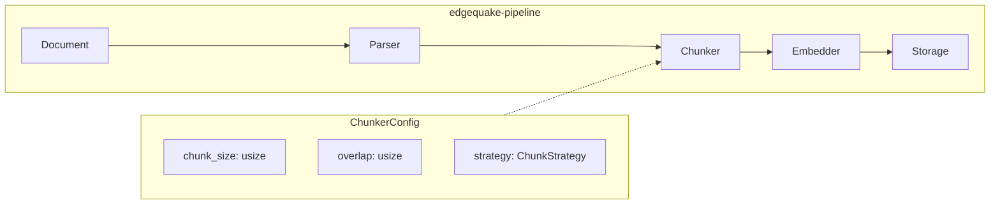

# 2.4 EdgeQuake's Chunker

Now that we understand tokenization, embedding models, and chunking
strategies in the abstract, let us see how the EdgeQuake framework
implements these concepts in production Rust code.

EdgeQuake's chunking lives in the `edgequake-pipeline` crate and is
designed to be configurable, composable, and token-aware.

## Architecture Overview



The Chunker sits between the Parser (which extracts clean text from raw
documents) and the Embedder (which converts chunks into vectors). It is
configured via `ChunkerConfig` and produces `Chunk` structs that carry
both the text and metadata through the rest of the pipeline.

## ChunkerConfig

The `ChunkerConfig` struct controls how documents are split:

```rust
/// Configuration for the document chunker
#[derive(Debug, Clone, Serialize, Deserialize)]
pub struct ChunkerConfig {
    /// Maximum number of tokens per chunk
    pub chunk_size: usize,

    /// Number of overlapping tokens between adjacent chunks
    pub overlap: usize,

    /// Chunking strategy to use
    pub strategy: ChunkStrategy,
}

/// Available chunking strategies
#[derive(Debug, Clone, Serialize, Deserialize)]
pub enum ChunkStrategy {
    /// Fixed-size chunks by token count
    FixedSize,

    /// Recursive character splitting with configurable separators
    Recursive {
        separators: Vec<String>,
    },

    /// Split on markdown headers, then sub-chunk if needed
    Markdown,
}

impl Default for ChunkerConfig {
    fn default() -> Self {
        Self {
            chunk_size: 512,
            overlap: 64,
            strategy: ChunkStrategy::Recursive {
                separators: vec![
                    "\n\n".to_string(),
                    "\n".to_string(),
                    ". ".to_string(),
                    " ".to_string(),
                ],
            },
        }
    }
}
```

### Configuration from Environment

In production, ChunkerConfig is typically loaded from environment variables
or a configuration file:

```rust
impl ChunkerConfig {
    /// Load from environment variables with sensible defaults
    pub fn from_env() -> Self {
        Self {
            chunk_size: std::env::var("CHUNK_SIZE")
                .ok()
                .and_then(|v| v.parse().ok())
                .unwrap_or(512),
            overlap: std::env::var("CHUNK_OVERLAP")
                .ok()
                .and_then(|v| v.parse().ok())
                .unwrap_or(64),
            strategy: match std::env::var("CHUNK_STRATEGY")
                .unwrap_or_default()
                .as_str()
            {
                "fixed" => ChunkStrategy::FixedSize,
                "markdown" => ChunkStrategy::Markdown,
                _ => ChunkStrategy::default_recursive(),
            },
        }
    }
}
```

## The Chunk Struct

Each chunk carries its text content along with provenance metadata that
flows through the entire pipeline:

```rust
/// A chunk of text extracted from a document
#[derive(Debug, Clone, Serialize, Deserialize)]
pub struct Chunk {
    /// Unique identifier for this chunk
    pub id: String,

    /// The chunk text content
    pub text: String,

    /// Source document identifier
    pub document_id: String,

    /// Position of this chunk within the document (0-indexed)
    pub chunk_index: usize,

    /// Total number of chunks from this document
    pub total_chunks: usize,

    /// Token count of the chunk text
    pub token_count: usize,

    /// Metadata inherited from the source document
    pub metadata: HashMap<String, String>,
}
```

The `document_id` and `chunk_index` fields are essential for:
- **Citation**: Linking retrieved chunks back to source documents
- **Deduplication**: Avoiding duplicate results from overlapping chunks
- **Reassembly**: Reconstructing context by fetching adjacent chunks

## The Chunker Implementation

The `Chunker` struct ties configuration to execution:

```rust
/// Document chunker that splits text into embeddable segments
pub struct Chunker {
    config: ChunkerConfig,
}

impl Chunker {
    pub fn new(config: ChunkerConfig) -> Self {
        Self { config }
    }

    /// Chunk a document into embeddable segments
    pub fn chunk_document(
        &self,
        document_id: &str,
        text: &str,
        metadata: HashMap<String, String>,
    ) -> Vec<Chunk> {
        let raw_chunks = match &self.config.strategy {
            ChunkStrategy::FixedSize => {
                self.fixed_size_chunk(text)
            }
            ChunkStrategy::Recursive { separators } => {
                self.recursive_chunk(text, separators)
            }
            ChunkStrategy::Markdown => {
                self.markdown_chunk(text)
            }
        };

        let total = raw_chunks.len();

        raw_chunks
            .into_iter()
            .enumerate()
            .map(|(i, chunk_text)| {
                let token_count = count_tokens(&chunk_text);
                Chunk {
                    id: format!("{}-chunk-{}", document_id, i),
                    text: chunk_text,
                    document_id: document_id.to_string(),
                    chunk_index: i,
                    total_chunks: total,
                    token_count,
                    metadata: metadata.clone(),
                }
            })
            .collect()
    }

    fn fixed_size_chunk(&self, text: &str) -> Vec<String> {
        // Implementation as shown in Section 2.3
        // Uses self.config.chunk_size and self.config.overlap
        todo!()
    }

    fn recursive_chunk(&self, text: &str, separators: &[String]) -> Vec<String> {
        // Implementation as shown in Section 2.3
        todo!()
    }

    fn markdown_chunk(&self, text: &str) -> Vec<String> {
        // Implementation as shown in Section 2.3
        todo!()
    }
}
```

## Pipeline Integration

The Chunker integrates into EdgeQuake's processing pipeline through the
`ProcessingResult` type. Here is how a document flows through the full
pipeline:

```rust
use edgequake_pipeline::{Chunker, ChunkerConfig, ProcessingResult};

/// Process a batch of documents through the full pipeline
async fn process_documents(
    documents: Vec<Document>,
    chunker_config: ChunkerConfig,
    embedder: &dyn Embedder,
) -> Result<ProcessingResult> {
    let chunker = Chunker::new(chunker_config);
    let mut all_chunks = Vec::new();

    // Phase 1: Chunk all documents
    for doc in &documents {
        let chunks = chunker.chunk_document(
            &doc.id,
            &doc.content,
            doc.metadata.clone(),
        );
        all_chunks.extend(chunks);
    }

    println!(
        "Chunked {} documents into {} chunks",
        documents.len(),
        all_chunks.len()
    );

    // Phase 2: Embed all chunks in batches
    let texts: Vec<&str> = all_chunks.iter().map(|c| c.text.as_str()).collect();
    let embeddings = embedder.embed_batch(&texts).await?;

    // Phase 3: Pair chunks with embeddings
    let embedded_chunks: Vec<EmbeddedChunk> = all_chunks
        .into_iter()
        .zip(embeddings)
        .map(|(chunk, embedding)| EmbeddedChunk { chunk, embedding })
        .collect();

    Ok(ProcessingResult {
        chunks: embedded_chunks,
        // ... other fields
    })
}
```

## Batch Ingestion Integration

EdgeQuake's batch ingestion pipeline (`edgequake-batch`) uses the Chunker
in its Prepare phase. The batch pipeline processes thousands of documents
and checkpoints progress via DynamoDB:

```rust
/// The Prepare phase of batch ingestion
async fn prepare_phase(
    documents: Vec<Document>,
    config: &BatchConfig,
) -> Result<PrepareOutput> {
    let chunker = Chunker::new(config.chunker_config.clone());

    let mut prepared_chunks = Vec::new();

    for doc in documents {
        let chunks = chunker.chunk_document(
            &doc.id,
            &doc.content,
            doc.metadata,
        );

        // Track chunk count per document for monitoring
        tracing::info!(
            document_id = %doc.id,
            chunk_count = chunks.len(),
            "document chunked"
        );

        prepared_chunks.extend(chunks);
    }

    // Checkpoint progress to DynamoDB
    checkpoint_progress(&prepared_chunks, &config.state_table).await?;

    Ok(PrepareOutput {
        chunks: prepared_chunks,
        total_documents: documents.len(),
    })
}
```

## Tuning for Your Domain

Different document types benefit from different configurations:

| Document Type | Strategy | Chunk Size | Overlap | Notes |
|--------------|----------|-----------|---------|-------|
| Legal contracts | Recursive | 384 | 48 | Smaller chunks for precise clause retrieval |
| Technical docs | Markdown | 512 | 64 | Leverage header structure |
| Chat transcripts | Fixed | 256 | 32 | Short, uniform messages |
| Research papers | Recursive | 768 | 96 | Longer chunks for complex arguments |
| Code files | Markdown | 512 | 64 | Treat function/class definitions as headers |

### Validation

Always validate your chunking configuration against your actual data:

```rust
/// Analyze chunk statistics for quality validation
fn analyze_chunks(chunks: &[Chunk]) {
    let token_counts: Vec<usize> = chunks.iter().map(|c| c.token_count).collect();

    let min = token_counts.iter().min().unwrap_or(&0);
    let max = token_counts.iter().max().unwrap_or(&0);
    let mean = token_counts.iter().sum::<usize>() as f64 / token_counts.len() as f64;
    let very_small = token_counts.iter().filter(|&&t| t < 50).count();
    let oversized = token_counts.iter().filter(|&&t| t > 512).count();

    println!("Chunk Statistics:");
    println!("  Total chunks: {}", chunks.len());
    println!("  Token range:  {} - {}", min, max);
    println!("  Mean tokens:  {:.1}", mean);
    println!("  Very small (<50 tokens): {} ({:.1}%)",
        very_small,
        very_small as f64 / chunks.len() as f64 * 100.0
    );
    println!("  Oversized (>512 tokens): {} ({:.1}%)",
        oversized,
        oversized as f64 / chunks.len() as f64 * 100.0
    );
}
```

Red flags to watch for:
- More than 10% of chunks under 50 tokens (too fragmented)
- More than 5% of chunks exceeding the embedding model's token limit
- Mean token count less than 50% of the configured chunk size

## Summary

EdgeQuake's Chunker provides a production-ready, configurable chunking
system that integrates seamlessly with the pipeline's processing phases.
The `ChunkerConfig` struct makes it easy to swap strategies and tune
parameters, while the `Chunk` struct preserves provenance metadata
throughout the pipeline. In the batch ingestion path, the chunker handles
thousands of documents with DynamoDB-backed progress checkpointing.

---

*Next: [Chapter 3: Advanced Retrieval Techniques](ch03-advanced-retrieval.md)*
