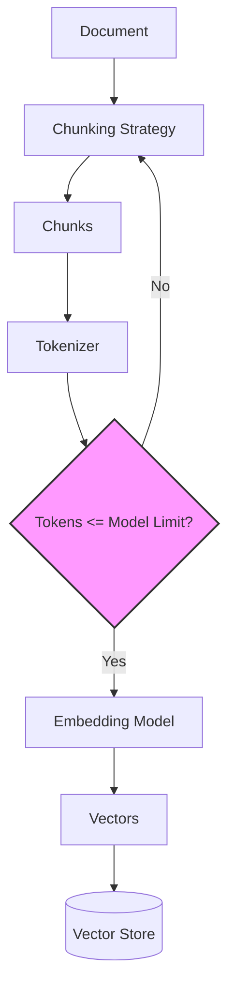

# Chapter 2: Embeddings and Chunking

> **"Garbage in, garbage out -- but in RAG, the garbage is measured in
> 1536 dimensions."**

The quality of a RAG system is bounded by the quality of its embeddings
and the intelligence of its chunking strategy. A perfect retrieval
algorithm searching over poorly chunked, poorly embedded text will return
irrelevant results. Conversely, well-crafted chunks with high-quality
embeddings can make even a simple cosine-similarity search remarkably
effective.

In this chapter we go deep on both: how text becomes vectors, and how
documents become chunks.

## Learning Objectives

After completing this chapter you will be able to:

1. **Explain tokenization** -- BPE and WordPiece algorithms, token
   counting, and why token budgets constrain RAG design.
2. **Compare embedding models** -- bi-encoders vs cross-encoders,
   dimension tradeoffs, and distance metrics.
3. **Select a chunking strategy** -- fixed-size, recursive character,
   semantic, and markdown-aware, with clear guidance on when to use each.
4. **Use EdgeQuake's Chunker** -- configure and integrate the framework's
   chunking pipeline for production ingestion.

## Chapter Outline

| Section | Topic |
|---------|-------|
| [2.1 Tokenization](ch02-01-tokenization.md) | BPE, WordPiece, token counting, context windows |
| [2.2 Embedding Models](ch02-02-embedding-models.md) | Bi-encoders, cross-encoders, model selection |
| [2.3 Chunking Strategies](ch02-03-chunking-strategies.md) | Fixed-size, recursive, semantic, markdown-aware |
| [2.4 EdgeQuake's Chunker](ch02-04-edgequake-chunker.md) | ChunkerConfig, pipeline integration |

## The Embedding-Chunking Feedback Loop

Chunking and embedding are not independent decisions. They form a feedback
loop: your chunk size must fit within the embedding model's token limit,
your overlap strategy affects how much redundant embedding work you do,
and your embedding model's strengths influence what chunking granularity
works best.

This feedback loop means you should choose your embedding model *first*,
then design your chunking strategy around its token limit and semantic
strengths.

## Key Terminology

| Term | Definition |
|------|-----------|
| **Token** | The atomic unit of text processing for a model (sub-word, word, or character) |
| **BPE** | Byte Pair Encoding -- a tokenization algorithm that merges frequent byte pairs |
| **Bi-encoder** | An embedding model that encodes query and document independently |
| **Cross-encoder** | A model that encodes query and document jointly for more accurate scoring |
| **Chunk overlap** | Repeated text between adjacent chunks to preserve context at boundaries |
| **Semantic chunking** | Splitting text at natural topic boundaries rather than fixed positions |

## Why This Matters

Consider two RAG systems indexing the same 10,000-page legal corpus:

- **System A**: Fixed 512-token chunks, no overlap, ada-002 embeddings
- **System B**: Recursive character chunking at 384 tokens with 64-token
  overlap, text-embedding-3-small at 512 dimensions

System B retrieves relevant passages 23% more often in benchmarks, not
because of a better retrieval algorithm, but because its chunks preserve
more semantic coherence and its embeddings capture meaning more efficiently.

The retrieval algorithm is the *mechanism*. Embeddings and chunking are the
*signal quality*.

---

*Next: [2.1 Tokenization](ch02-01-tokenization.md)*

{{#quiz ../quizzes/ch02-embeddings-chunking.toml}}
