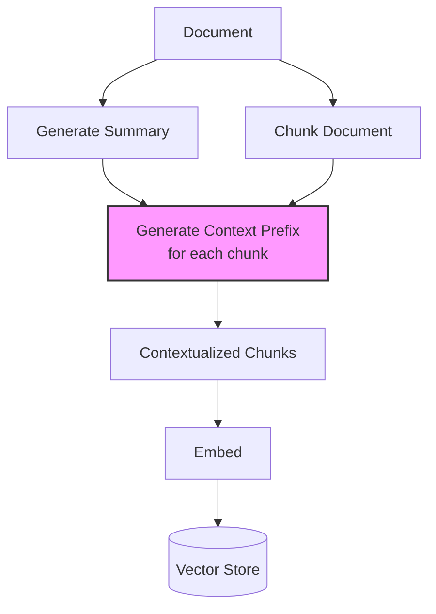

# 3.1 Contextual Retrieval

A chunk that reads "The policy was amended in Q3 to include these new
provisions" is nearly meaningless to an embedding model. *Which* policy?
*Which* Q3? *What* provisions? The chunk has lost the context of its
source document.

Contextual retrieval, introduced by Anthropic, addresses this by prepending
a short document-level summary to each chunk *before* embedding. The result
is chunks that carry their own context, dramatically improving retrieval
relevance.

## The Problem: Context-Poor Chunks

When we chunk a document, each chunk loses awareness of the broader
document it came from. Consider a 50-page legal contract chunked into
100 pieces. Chunk #47 might read:

```text
The parties agree that Section 12.3 shall be amended to reflect the
updated indemnification terms as described above. The effective date
of this amendment is thirty (30) days from execution.
```

This chunk is relevant to a query about "indemnification amendment dates"
but the embedding model has no idea which contract, which parties, or
what the "updated terms" refer to. The embedding will be generic -- and
may not rank highly for the right queries.

## The Solution: Contextual Prefixes

Before embedding, prepend a short context passage that situates the chunk
within its document:

```text
[Context: This chunk is from the Master Services Agreement between
Acme Corp and Widget Inc., dated January 2024. This section discusses
amendments to the indemnification provisions in Article 12.]

The parties agree that Section 12.3 shall be amended to reflect the
updated indemnification terms as described above. The effective date
of this amendment is thirty (30) days from execution.
```

Now the embedding model captures the connection between this chunk and
queries about "Acme Corp indemnification" or "Widget Inc contract amendments."

## Generating Context Prefixes

The context prefix is generated by sending the full document (or a summary)
along with each chunk to an LLM, asking it to produce a brief contextual
description:

```rust
/// Generate a contextual prefix for a chunk using an LLM
async fn generate_context_prefix(
    llm: &dyn LlmClient,
    document_summary: &str,
    chunk_text: &str,
) -> Result<String> {
    let prompt = format!(
        "<document_summary>\n\
         {document_summary}\n\
         </document_summary>\n\n\
         <chunk>\n\
         {chunk_text}\n\
         </chunk>\n\n\
         Please give a short succinct context (2-3 sentences) to situate \
         this chunk within the overall document. The context should help a \
         search engine understand what this chunk is about. Respond with \
         only the context, no preamble."
    );

    let response = llm.complete(&prompt).await?;
    Ok(response.trim().to_string())
}
```

### Applying Context to Chunks

```rust
/// Prepend contextual prefixes to all chunks from a document
async fn contextualize_chunks(
    llm: &dyn LlmClient,
    document: &Document,
    chunks: &mut [Chunk],
) -> Result<()> {
    // Generate or use existing document summary
    let summary = if let Some(s) = document.metadata.get("summary") {
        s.clone()
    } else {
        generate_document_summary(llm, &document.content).await?
    };

    for chunk in chunks.iter_mut() {
        let prefix = generate_context_prefix(
            llm,
            &summary,
            &chunk.text,
        ).await?;

        // Prepend the context to the chunk text
        chunk.text = format!(
            "[Context: {}]\n\n{}",
            prefix,
            chunk.text
        );

        // Store the prefix separately for debugging
        chunk.metadata.insert(
            "context_prefix".to_string(),
            prefix,
        );
    }

    Ok(())
}
```

## The Architecture



The key insight is that contextualization happens *once* at ingestion time.
The per-chunk LLM calls are an offline cost, not a query-time cost.

## Cost and Latency Tradeoffs

Contextual retrieval adds LLM calls during ingestion:

| Corpus Size | Chunks | Context Generation Cost* | Time** |
|------------|--------|------------------------|--------|
| 1,000 docs | ~10,000 chunks | ~$2 | ~30 min |
| 10,000 docs | ~100,000 chunks | ~$20 | ~5 hours |
| 100,000 docs | ~1,000,000 chunks | ~$200 | ~2 days |

*Using Claude Haiku for context generation at ~$0.25/M input tokens*
**With parallelism; sequential would be much slower*

For large corpora, EdgeQuake's batch pipeline amortizes this cost using
the OpenAI Batch API (50% discount) or parallel Claude API calls with
rate limiting.

### Caching Strategy

Since context generation is expensive, cache aggressively:

```rust
use std::collections::HashMap;

/// Cache context prefixes to avoid regenerating for unchanged chunks
struct ContextCache {
    cache: HashMap<String, String>, // chunk_hash -> context_prefix
}

impl ContextCache {
    fn get_or_generate(
        &mut self,
        chunk: &Chunk,
        generate_fn: impl FnOnce(&str) -> Result<String>,
    ) -> Result<String> {
        let hash = compute_hash(&chunk.text);

        if let Some(cached) = self.cache.get(&hash) {
            return Ok(cached.clone());
        }

        let prefix = generate_fn(&chunk.text)?;
        self.cache.insert(hash, prefix.clone());
        Ok(prefix)
    }
}
```

## Impact on Retrieval Quality

Anthropic's benchmarks show that contextual retrieval reduces retrieval
failure rates by up to 49% compared to standard chunking. The impact is
most pronounced for:

- **Ambiguous chunks** that reference "it", "this", "the above" without
  antecedents
- **Domain-specific documents** where the same terms have different meanings
  in different contexts
- **Multi-section documents** where each section builds on earlier context

### When Contextual Retrieval Helps Most

| Document Type | Improvement | Why |
|--------------|-------------|-----|
| Legal contracts | High | Heavy cross-referencing between sections |
| Technical manuals | Medium | Sections often self-contained |
| Chat transcripts | High | Pronouns and references lose meaning out of context |
| API documentation | Low | Each endpoint is typically self-contained |
| Financial reports | High | Numbers and trends meaningless without entity context |

## Combining with Other Techniques

Contextual retrieval is *complementary* to the other techniques in this
chapter. It improves the quality of the embeddings themselves, while
hybrid search and reranking improve how those embeddings are searched and
ranked:

```rust
/// Full pipeline: contextual retrieval + hybrid search + reranking
async fn advanced_retrieval(
    query: &str,
    vector_store: &VectorStore,  // Contains contextualized embeddings
    bm25_index: &Bm25Index,      // Contains contextualized text
    reranker: &dyn Reranker,
) -> Vec<SearchResult> {
    // Step 1: Dense retrieval over contextualized embeddings
    let dense_results = vector_store.search(query, 20).await;

    // Step 2: Lexical retrieval over contextualized text
    let lexical_results = bm25_index.search(query, 20);

    // Step 3: Fuse results (covered in Section 3.2)
    let fused = reciprocal_rank_fusion(&dense_results, &lexical_results, 20);

    // Step 4: Rerank (covered in Section 3.3)
    let reranked = reranker.rerank(query, &fused, 5).await;

    reranked
}
```

## Implementation Tips

1. **Use a fast, cheap model for context generation.** Claude Haiku or
   GPT-4o-mini are ideal -- the context prefix does not need to be
   literary, just informative.

2. **Keep prefixes short.** 2--3 sentences (50--80 tokens). Longer
   prefixes dilute the embedding signal from the actual chunk content.

3. **Include entity names.** The most valuable context is *who* and
   *what* -- specific names, dates, and identifiers that the chunk
   references implicitly.

4. **Store the prefix as metadata.** At retrieval time you may want to
   display the original chunk text without the prefix, or use the prefix
   for additional filtering.

## Summary

Contextual retrieval prepends a document-level context summary to each
chunk before embedding, giving the embedding model the information it
needs to produce semantically rich vectors. It is an offline, ingestion-time
optimization that dramatically improves retrieval relevance -- especially
for documents with heavy cross-referencing or ambiguous pronoun usage.
Combined with hybrid search and reranking, it forms the foundation of
production-grade retrieval.

---

*Next: [3.2 Hybrid Search](ch03-02-hybrid-search.md)*
