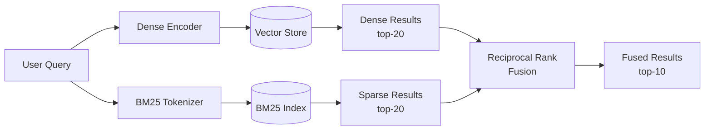

# 3.2 Hybrid Search

Dense vector search excels at semantic matching -- finding passages that
*mean* the same thing as the query even when they use different words. But
it has a blind spot: exact keyword matches. Ask for "error code E-4012" and
dense retrieval may return passages about error handling in general while
missing the one document that contains that exact code.

Hybrid search combines dense (semantic) and sparse (lexical) retrieval to
cover both failure modes.

## The Two Retrieval Paradigms

### Dense Retrieval (Semantic)

Queries and documents are encoded as dense vectors. Similarity is computed
via cosine similarity or dot product. Captures meaning.

```text
Query: "How to fix authentication failures"
Match: "Users experiencing login issues should reset their credentials"
Why:   Semantic similarity (same meaning, different words)
```

### Sparse Retrieval (Lexical)

Documents are represented as sparse vectors where each dimension
corresponds to a vocabulary term. Similarity is based on term overlap
and frequency. The dominant algorithm is BM25.

```text
Query: "error code E-4012"
Match: "If you encounter error code E-4012, restart the service"
Why:   Exact term match ("E-4012")
```

### Where Each Fails

| Query Type | Dense Only | Sparse Only |
|-----------|-----------|-------------|
| "authentication failures" | Finds relevant docs about login issues | Misses docs using "auth" or "login" instead |
| "error E-4012" | Returns generic error docs | Finds the exact match |
| "how to improve performance" | Understands intent | Matches "performance review" docs too |
| "ACME-2024-Q3-FILING" | May miss exact identifier | Finds it immediately |

Neither alone is sufficient. Hybrid search combines both.

## BM25: The Sparse Retrieval Workhorse

BM25 (Best Matching 25) is a probabilistic ranking function that scores
documents based on term frequency, document length, and corpus statistics.

### The BM25 Formula

For a query Q containing terms q1, q2, ..., qn, the BM25 score of a
document D is:

```text
BM25(D, Q) = SUM_i [ IDF(qi) * (f(qi, D) * (k1 + 1)) / (f(qi, D) + k1 * (1 - b + b * |D|/avgdl)) ]

Where:
  f(qi, D)  = frequency of term qi in document D
  |D|       = document length (in tokens)
  avgdl     = average document length in the corpus
  k1        = term frequency saturation parameter (typically 1.2)
  b         = length normalization parameter (typically 0.75)
  IDF(qi)   = inverse document frequency of term qi
```

### BM25 in Rust

```rust
use std::collections::HashMap;

/// A simple BM25 index
struct Bm25Index {
    /// Term -> document IDs containing that term, with term frequency
    inverted_index: HashMap<String, Vec<(usize, f32)>>,
    /// Document lengths (in tokens)
    doc_lengths: Vec<f32>,
    /// Average document length
    avg_doc_length: f32,
    /// Total number of documents
    num_docs: usize,
    /// BM25 parameters
    k1: f32,
    b: f32,
}

impl Bm25Index {
    fn new(k1: f32, b: f32) -> Self {
        Self {
            inverted_index: HashMap::new(),
            doc_lengths: Vec::new(),
            avg_doc_length: 0.0,
            num_docs: 0,
            k1,
            b,
        }
    }

    /// Add a document to the index
    fn add_document(&mut self, doc_id: usize, text: &str) {
        let tokens = tokenize(text);
        let doc_length = tokens.len() as f32;

        // Count term frequencies
        let mut term_freqs: HashMap<String, f32> = HashMap::new();
        for token in &tokens {
            *term_freqs.entry(token.clone()).or_default() += 1.0;
        }

        // Update inverted index
        for (term, freq) in term_freqs {
            self.inverted_index
                .entry(term)
                .or_default()
                .push((doc_id, freq));
        }

        self.doc_lengths.push(doc_length);
        self.num_docs += 1;
        self.avg_doc_length = self.doc_lengths.iter().sum::<f32>()
            / self.num_docs as f32;
    }

    /// Compute IDF for a term
    fn idf(&self, term: &str) -> f32 {
        let doc_freq = self
            .inverted_index
            .get(term)
            .map(|v| v.len())
            .unwrap_or(0) as f32;

        let n = self.num_docs as f32;
        ((n - doc_freq + 0.5) / (doc_freq + 0.5) + 1.0).ln()
    }

    /// Score a query against all documents
    fn search(&self, query: &str, k: usize) -> Vec<(usize, f32)> {
        let query_terms = tokenize(query);
        let mut scores: HashMap<usize, f32> = HashMap::new();

        for term in &query_terms {
            let idf = self.idf(term);

            if let Some(postings) = self.inverted_index.get(term) {
                for &(doc_id, tf) in postings {
                    let doc_len = self.doc_lengths[doc_id];
                    let numerator = tf * (self.k1 + 1.0);
                    let denominator = tf
                        + self.k1
                            * (1.0 - self.b + self.b * doc_len / self.avg_doc_length);

                    *scores.entry(doc_id).or_default() +=
                        idf * numerator / denominator;
                }
            }
        }

        let mut results: Vec<(usize, f32)> = scores.into_iter().collect();
        results.sort_by(|a, b| b.1.partial_cmp(&a.1).unwrap());
        results.truncate(k);
        results
    }
}

/// Simple whitespace tokenizer with lowercasing
fn tokenize(text: &str) -> Vec<String> {
    text.to_lowercase()
        .split(|c: char| !c.is_alphanumeric())
        .filter(|s| !s.is_empty() && s.len() > 1)
        .map(String::from)
        .collect()
}
```

## Reciprocal Rank Fusion (RRF)

Given two ranked lists (dense and sparse), how do we combine them into a
single ranking? Reciprocal Rank Fusion is the standard approach. It assigns
each result a score based on its rank in each list, then sums the scores:

```text
RRF_score(d) = SUM_r [ 1 / (k + rank_r(d)) ]

Where:
  r     = each ranking (dense, sparse)
  k     = smoothing constant (typically 60)
  rank  = 1-indexed position of document d in ranking r
```

### RRF in Rust

```rust
use std::collections::HashMap;

/// A result from a single retriever
#[derive(Debug, Clone)]
struct RankedResult {
    id: String,
    score: f32,
}

/// Reciprocal Rank Fusion: combine multiple ranked lists
fn reciprocal_rank_fusion(
    ranked_lists: &[Vec<RankedResult>],
    k: f32,
    top_n: usize,
) -> Vec<RankedResult> {
    let mut fused_scores: HashMap<String, f32> = HashMap::new();

    for list in ranked_lists {
        for (rank, result) in list.iter().enumerate() {
            let rrf_score = 1.0 / (k + (rank + 1) as f32);
            *fused_scores.entry(result.id.clone()).or_default() += rrf_score;
        }
    }

    let mut results: Vec<RankedResult> = fused_scores
        .into_iter()
        .map(|(id, score)| RankedResult { id, score })
        .collect();

    results.sort_by(|a, b| b.score.partial_cmp(&a.score).unwrap());
    results.truncate(top_n);
    results
}
```

### Why RRF Works

RRF is effective because:
- It is **rank-based**, not score-based. Dense and sparse scores are on
  completely different scales, making direct comparison meaningless.
- It **rewards consensus**. A document ranked highly by both retrievers
  gets a higher fused score than one ranked highly by only one.
- The **k parameter** controls how much rank position matters. Higher k
  flattens the distribution (less emphasis on exact rank).

## The Full Hybrid Search Pipeline



### Implementation

```rust
/// Hybrid search combining dense and sparse retrieval
async fn hybrid_search(
    query: &str,
    vector_store: &VectorStore,
    bm25_index: &Bm25Index,
    embedder: &dyn Embedder,
    top_k: usize,
) -> Vec<SearchResult> {
    // Dense retrieval
    let query_embedding = embedder.embed_batch(&[query]).await.unwrap();
    let dense_results = vector_store.search(&query_embedding[0], top_k * 2);

    let dense_ranked: Vec<RankedResult> = dense_results
        .iter()
        .map(|r| RankedResult {
            id: r.chunk.id.clone(),
            score: r.score,
        })
        .collect();

    // Sparse retrieval
    let sparse_raw = bm25_index.search(query, top_k * 2);
    let sparse_ranked: Vec<RankedResult> = sparse_raw
        .iter()
        .map(|(id, score)| RankedResult {
            id: id.to_string(),
            score: *score,
        })
        .collect();

    // Fuse with RRF
    let fused = reciprocal_rank_fusion(
        &[dense_ranked, sparse_ranked],
        60.0,
        top_k,
    );

    // Map back to full SearchResult objects
    resolve_results(&fused, vector_store)
}
```

## Weighting Dense vs Sparse

Not all queries benefit equally from both signals. You can weight the
retrieval sources:

```rust
/// Weighted RRF with per-source weights
fn weighted_rrf(
    ranked_lists: &[(Vec<RankedResult>, f32)], // (results, weight)
    k: f32,
    top_n: usize,
) -> Vec<RankedResult> {
    let mut fused_scores: HashMap<String, f32> = HashMap::new();

    for (list, weight) in ranked_lists {
        for (rank, result) in list.iter().enumerate() {
            let rrf_score = weight / (k + (rank + 1) as f32);
            *fused_scores.entry(result.id.clone()).or_default() += rrf_score;
        }
    }

    let mut results: Vec<RankedResult> = fused_scores
        .into_iter()
        .map(|(id, score)| RankedResult { id, score })
        .collect();

    results.sort_by(|a, b| b.score.partial_cmp(&a.score).unwrap());
    results.truncate(top_n);
    results
}

// Example: weight dense 0.7, sparse 0.3
let fused = weighted_rrf(
    &[
        (dense_ranked, 0.7),
        (sparse_ranked, 0.3),
    ],
    60.0,
    top_k,
);
```

### When to Weight Toward Sparse

- Queries containing specific identifiers, codes, or proper nouns
- Domains with specialized vocabulary (medical, legal)
- Exact-match use cases (finding specific policies, error codes)

### When to Weight Toward Dense

- Natural language questions ("how do I...")
- Conceptual queries where paraphrasing is common
- Cross-lingual retrieval

## Maintaining the BM25 Index

In EdgeQuake, the BM25 index is maintained alongside the vector store.
Both are updated during ingestion:

```rust
/// Ingest documents into both dense and sparse indices
async fn ingest_hybrid(
    documents: Vec<Document>,
    vector_store: &mut VectorStore,
    bm25_index: &mut Bm25Index,
    chunker: &Chunker,
    embedder: &dyn Embedder,
) -> Result<()> {
    for doc in documents {
        let chunks = chunker.chunk_document(&doc.id, &doc.content, doc.metadata);

        // Embed and store in vector index
        let texts: Vec<&str> = chunks.iter().map(|c| c.text.as_str()).collect();
        let embeddings = embedder.embed_batch(&texts).await?;

        for (chunk, embedding) in chunks.iter().zip(embeddings) {
            vector_store.insert(StoredChunk {
                id: chunk.id.clone(),
                text: chunk.text.clone(),
                embedding,
                metadata: chunk.metadata.clone(),
            });

            // Also index in BM25
            bm25_index.add_document(
                chunk.id.parse().unwrap_or(0),
                &chunk.text,
            );
        }
    }

    Ok(())
}
```

## Summary

Hybrid search combines the semantic understanding of dense retrieval with
the precision of lexical matching. BM25 handles exact keywords and
identifiers; dense vectors handle paraphrasing and conceptual similarity.
Reciprocal Rank Fusion merges the two ranked lists into a single ordering
that is consistently better than either alone. In practice, hybrid search
with RRF improves Recall@10 by 10--20% over dense-only retrieval.

---

*Next: [3.3 Reranking](ch03-03-reranking.md)*
