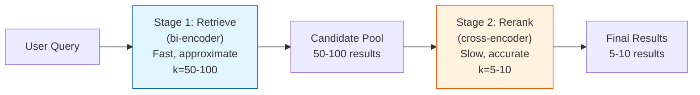
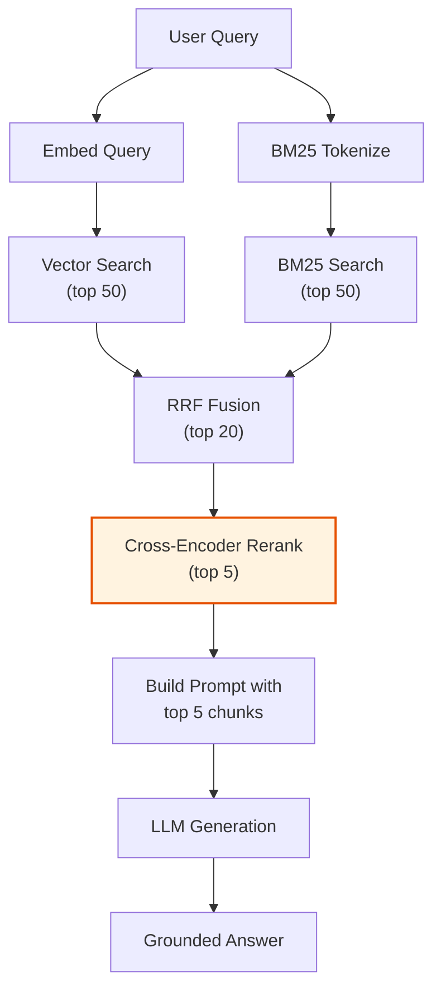

# 3.3 Reranking

Bi-encoder retrieval (whether dense, sparse, or hybrid) is fast but
approximate. It encodes the query and each document independently, so it
cannot capture fine-grained interactions between query terms and document
content. Reranking fixes this by applying a more powerful model to a small
set of candidates.

The pattern is simple: retrieve many, rerank few.

## The Two-Stage Retrieval Pattern



### Why Two Stages?

| Property | Stage 1 (Retrieve) | Stage 2 (Rerank) |
|----------|-------------------|------------------|
| Model | Bi-encoder | Cross-encoder |
| Speed | ~5ms for 1M docs | ~100ms for 50 docs |
| Accuracy | Good | Excellent |
| Scales to | Millions of docs | Tens of docs |
| Encodes | Query and docs independently | Query + doc jointly |

A cross-encoder over 1M documents would take ~2,000 seconds per query.
By first narrowing to 50 candidates with a bi-encoder (~5ms), we can
afford the expensive cross-encoder pass on the small candidate set (~100ms).

## How Cross-Encoder Reranking Works

A cross-encoder takes the query and a document as a *single input*,
separated by a special token. The model attends to both simultaneously,
capturing token-level interactions that bi-encoders miss.

```text
Input:  [CLS] How does Rust handle memory safety? [SEP] Rust's ownership
        system ensures memory safety at compile time through borrowing
        rules and lifetime annotations. [SEP]

Output: Relevance score: 0.94
```

The model produces a scalar relevance score, not a vector. This score
is more accurate than cosine similarity between independent embeddings
because the model can:

- Match "memory safety" in the query with "memory safety" in the document
  *in context*
- Understand that "ownership system" is the *mechanism* for memory safety
- Weigh the relevance of "compile time" to the query about "handling"

## Reranking with Cohere

Cohere's Rerank API is the most widely used commercial reranking service:

```rust
use reqwest::Client;
use serde::{Deserialize, Serialize};

#[derive(Serialize)]
struct RerankRequest {
    model: String,
    query: String,
    documents: Vec<String>,
    top_n: usize,
}

#[derive(Deserialize)]
struct RerankResponse {
    results: Vec<RerankResult>,
}

#[derive(Deserialize)]
struct RerankResult {
    index: usize,
    relevance_score: f32,
}

/// Rerank documents using Cohere's API
async fn rerank_cohere(
    client: &Client,
    api_key: &str,
    query: &str,
    documents: &[String],
    top_n: usize,
) -> Result<Vec<(usize, f32)>, Box<dyn std::error::Error>> {
    let request = RerankRequest {
        model: "rerank-v3.5".to_string(),
        query: query.to_string(),
        documents: documents.to_vec(),
        top_n,
    };

    let response: RerankResponse = client
        .post("https://api.cohere.com/v2/rerank")
        .bearer_auth(api_key)
        .json(&request)
        .send()
        .await?
        .json()
        .await?;

    Ok(response
        .results
        .into_iter()
        .map(|r| (r.index, r.relevance_score))
        .collect())
}
```

## Building a Reranker Trait

To support multiple reranking backends, define a trait:

```rust
use async_trait::async_trait;

/// A search result with its original retrieval score
#[derive(Debug, Clone)]
struct RetrievalResult {
    id: String,
    text: String,
    retrieval_score: f32,
    metadata: HashMap<String, String>,
}

/// A reranked result with the cross-encoder score
#[derive(Debug, Clone)]
struct RerankedResult {
    id: String,
    text: String,
    rerank_score: f32,
    original_rank: usize,
    metadata: HashMap<String, String>,
}

#[async_trait]
trait Reranker: Send + Sync {
    /// Rerank a list of retrieval results for a query
    async fn rerank(
        &self,
        query: &str,
        results: &[RetrievalResult],
        top_n: usize,
    ) -> Result<Vec<RerankedResult>>;
}

/// Cohere-based reranker implementation
struct CohereReranker {
    client: Client,
    api_key: String,
    model: String,
}

#[async_trait]
impl Reranker for CohereReranker {
    async fn rerank(
        &self,
        query: &str,
        results: &[RetrievalResult],
        top_n: usize,
    ) -> Result<Vec<RerankedResult>> {
        let documents: Vec<String> =
            results.iter().map(|r| r.text.clone()).collect();

        let reranked = rerank_cohere(
            &self.client,
            &self.api_key,
            query,
            &documents,
            top_n,
        )
        .await?;

        Ok(reranked
            .into_iter()
            .map(|(idx, score)| RerankedResult {
                id: results[idx].id.clone(),
                text: results[idx].text.clone(),
                rerank_score: score,
                original_rank: idx,
                metadata: results[idx].metadata.clone(),
            })
            .collect())
    }
}
```

## The Complete Retrieval Flow

Here is the full flow from query to final results with all three
techniques combined:



### Implementation

```rust
/// Full advanced retrieval pipeline
async fn advanced_retrieval_pipeline(
    query: &str,
    vector_store: &VectorStore,
    bm25_index: &Bm25Index,
    embedder: &dyn Embedder,
    reranker: &dyn Reranker,
) -> Vec<RerankedResult> {
    // Step 1: Hybrid search (retrieve 50 candidates)
    let candidates = hybrid_search(
        query,
        vector_store,
        bm25_index,
        embedder,
        50, // retrieve many
    )
    .await;

    // Step 2: Convert to RetrievalResult format
    let retrieval_results: Vec<RetrievalResult> = candidates
        .into_iter()
        .enumerate()
        .map(|(i, sr)| RetrievalResult {
            id: sr.chunk.id,
            text: sr.chunk.text,
            retrieval_score: sr.score,
            metadata: sr.chunk.metadata,
        })
        .collect();

    // Step 3: Rerank to get top 5
    let final_results = reranker
        .rerank(query, &retrieval_results, 5) // rerank few
        .await
        .unwrap();

    final_results
}
```

## Reranking Impact

Reranking typically improves NDCG@10 by 5--15% over hybrid search alone.
The impact is greatest when:

- The initial candidate pool is diverse (hybrid search)
- Queries are complex or nuanced
- Relevance depends on subtle query-document interactions

### Example: Before and After Reranking

```text
Query: "What are the tax implications of the Acme Corp acquisition?"

Before reranking (hybrid search top-5):
  1. [0.82] General overview of Acme Corp corporate structure
  2. [0.79] Tax implications of the Widget Inc acquisition
  3. [0.77] Acme Corp Q3 financial summary
  4. [0.75] Acquisition agreement between Acme Corp and Beta LLC
  5. [0.74] Corporate tax rate changes affecting acquisitions

After reranking (cross-encoder top-5):
  1. [0.96] Acquisition agreement between Acme Corp and Beta LLC
  2. [0.91] Tax implications of the Acme Corp acquisition (Section 7.2)
  3. [0.85] Corporate tax rate changes affecting acquisitions
  4. [0.62] Acme Corp Q3 financial summary
  5. [0.41] General overview of Acme Corp corporate structure
```

The cross-encoder correctly identified that the acquisition agreement
and specific tax implications sections are more relevant than the general
corporate overview, even though the general overview had higher lexical
and semantic overlap with the query terms.

## Latency Considerations

| Component | Latency | Notes |
|-----------|---------|-------|
| Bi-encoder retrieval | 5--50ms | ANN index search |
| BM25 retrieval | 1--10ms | Inverted index lookup |
| RRF fusion | <1ms | In-memory rank merging |
| Cross-encoder rerank (50 docs) | 50--200ms | API call or local inference |
| **Total retrieval** | **~60--260ms** | Well within LLM latency budget |

Since LLM generation takes 500--3000ms, the entire retrieval pipeline
(including reranking) adds negligible overhead to the end-to-end response
time.

## When Not to Rerank

Reranking is not always beneficial:

- **Homogeneous results**: If the top-k results are all equally relevant,
  reranking just shuffles them around.
- **Simple queries**: For single-term keyword lookups, BM25 alone is
  often sufficient.
- **Extreme latency constraints**: If you need sub-10ms retrieval (e.g.,
  autocomplete), skip reranking.
- **Very small corpora**: With <1,000 chunks, the initial retrieval is
  already highly accurate.

## Summary

Reranking applies a cross-encoder model to a small set of initial retrieval
candidates, producing more accurate relevance scores by jointly encoding
the query and each document. The two-stage pattern (retrieve many with
bi-encoders, rerank few with cross-encoders) is the standard production
architecture. Combined with hybrid search and contextual retrieval, it
forms a retrieval stack that significantly outperforms naive cosine
similarity search.

---

*Next: [3.4 Why RAG Alone Is Not Enough](ch03-04-limitations.md)*
