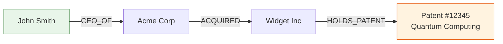
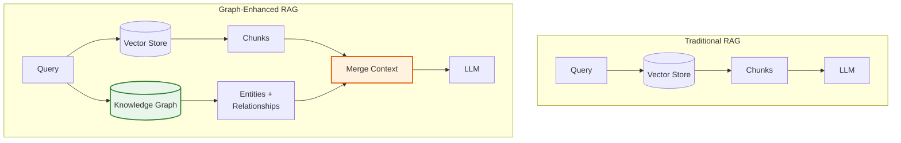

# 3.4 Why RAG Alone Is Not Enough

We have now built a sophisticated retrieval stack: contextual embeddings,
hybrid search with BM25 and dense retrieval, reciprocal rank fusion, and
cross-encoder reranking. This is the state of the art for flat retrieval.

It is not enough.

This section catalogs the specific failure modes that even advanced RAG
cannot solve -- failures that motivate the graph-enhanced approach we
develop in Part II.

## Failure Mode 1: Multi-Hop Reasoning

Many real-world questions require combining information from multiple
documents that are not directly related by keyword or semantic similarity.

### Example: The Epstein Dataset

Consider a corpus of legal documents, financial records, and flight logs:

```text
Query: "Which companies received funding from entities connected to
        individuals who traveled to the island in 2003?"

Required information chain:
  1. Flight logs → People who traveled to the island in 2003
  2. People → Their business entities and associations
  3. Entities → Funding relationships with companies
  4. Companies → Names and details

This requires 3 hops across 4 document types.
```

Flat retrieval retrieves the top-k chunks most similar to the query. It
might find some flight logs and some funding records, but it cannot
*traverse the chain* from flights to people to entities to companies.

```rust
/// What flat retrieval returns for a multi-hop query
fn flat_retrieval_failure() {
    let query = "companies funded by entities connected to island travelers in 2003";

    // Dense retrieval finds chunks containing similar terms:
    let results = vec![
        "Flight manifest for 2003 shows passengers A, B, C...",
        "Entity X provided funding to Company Y in 2004...",
        "Overview of island property records and visitors...",
        "Company Z received investment from various sources...",
        "Travel records for individuals associated with...",
    ];

    // Problem: No result connects A/B/C (travelers) to X (entity) to Y (company)
    // The LLM receives disconnected fragments and cannot bridge the gaps
}
```

### Why This Fails

Flat retrieval operates on *independent* similarity scores. There is no
mechanism to say "I found the travelers, now find their business
associations." Each chunk is scored against the query in isolation.

The LLM might *attempt* to reason across chunks, but it is working with
at most k=5--10 chunks -- a tiny fraction of the corpus. The probability
that the right chain of evidence lands in those 5--10 chunks by
independent similarity is vanishingly small.

## Failure Mode 2: Relationship Blindness

Flat retrieval treats documents as independent bags of text. It has no
model of the relationships *between* entities mentioned in those documents.

```text
Document A: "John Smith is the CEO of Acme Corp."
Document B: "Acme Corp acquired Widget Inc in 2023."
Document C: "Widget Inc holds Patent #12345 for quantum computing."

Query: "What patents does John Smith's company portfolio include?"

Flat retrieval might find Document A and Document C individually,
but it has no way to traverse: John Smith → Acme Corp → Widget Inc → Patent.
```

Knowledge graphs solve this by explicitly modeling entities (John Smith,
Acme Corp, Widget Inc, Patent #12345) and their relationships (CEO_OF,
ACQUIRED, HOLDS_PATENT). Graph traversal then answers the query directly.



## Failure Mode 3: Lost in the Middle

Even when relevant chunks are retrieved, their position in the LLM's
context affects whether they are used. Research (Liu et al., 2023) shows
that LLMs attend most strongly to the beginning and end of the context
window, while information in the middle is often ignored.

```text
Context position vs. LLM attention:
  [Beginning]  ████████████  High attention
  [Middle]     ██            Low attention -- information here is "lost"
  [End]        ████████████  High attention
```

This means that even if you retrieve the right chunks, their ordering in
the prompt matters. With k=10 retrieved chunks, chunks at positions 4--7
are significantly less likely to influence the generated answer.

```rust
/// Demonstrate the "lost in the middle" problem
fn lost_in_the_middle() {
    let retrieved_chunks = vec![
        "Relevant: Company founded in 2019",        // Position 1: USED
        "Somewhat relevant: Industry overview",       // Position 2: USED
        "Relevant: Key partnership with XYZ Corp",    // Position 3: partially used
        "CRITICAL: Revenue was $4.2M in Q3",         // Position 4: LOST
        "CRITICAL: CEO resigned on March 15",        // Position 5: LOST
        "Somewhat relevant: Market analysis",         // Position 6: LOST
        "Relevant: New product launch details",       // Position 7: partially used
        "Background: Competitor landscape",           // Position 8: USED
        "Relevant: Q4 projections show growth",       // Position 9: USED
        "Relevant: Board approved expansion",         // Position 10: USED
    ];

    // The LLM generates an answer that mentions the founding year,
    // Q4 projections, and board approval -- but MISSES the $4.2M
    // revenue figure and CEO resignation, which were buried in the middle.
}
```

### Mitigations (Partial)

- **Reranking**: Put the most relevant chunks first
- **Fewer chunks**: Use k=5 instead of k=10 to reduce the middle
- **Interleaved ordering**: Alternate important/less important chunks
- **Multiple passes**: Generate, identify gaps, re-retrieve

None of these fully solve the problem. Graph-enhanced retrieval helps by
providing *structured* context (entity relationships) rather than a flat
list of text chunks.

## Failure Mode 4: No Global Awareness

Flat retrieval is inherently *local*. It finds chunks similar to the query
but has no global awareness of the corpus structure, frequency patterns,
or cross-document themes.

### Questions That Require Global Awareness

| Question Type | Example | Why Flat RAG Fails |
|--------------|---------|-------------------|
| Aggregation | "How many companies did Entity X fund?" | Cannot count across documents |
| Comparison | "Compare the travel patterns of A and B" | Cannot systematically gather all data for A and B |
| Trend | "How did the network of connections evolve from 2001 to 2005?" | Cannot model temporal relationships |
| Completeness | "List ALL entities mentioned in the Panama Papers" | Top-k is inherently incomplete |

Graph-enhanced RAG addresses these by pre-extracting entities and
relationships into a queryable structure, enabling aggregation, traversal,
and global pattern analysis.

## The Case for Graph-Enhanced RAG

The failures above share a common root cause: flat retrieval treats a
corpus as an unstructured collection of text chunks. It has no model of
the *structure* latent in the data -- the entities, their relationships,
and how information flows between documents.

Graph-enhanced RAG adds a knowledge graph layer:



The knowledge graph enables:

1. **Multi-hop traversal**: Follow relationship chains across entities
2. **Relationship awareness**: Understand how entities connect
3. **Global queries**: Aggregate across the full graph structure
4. **Structured context**: Provide the LLM with entity-relationship
   triples, not just text chunks

## Preview: What Part II Covers

| Chapter | Topic |
|---------|-------|
| 4. Knowledge Graphs | Graph data models, property graphs, schema design |
| 5. Entity Extraction | Using LLMs to extract entities and relationships from text |
| 6. Graph-Enhanced Retrieval | Combining vector search with graph traversal |
| 7. EdgeQuake's Graph Pipeline | Production entity extraction, storage, and querying |

## A Concrete Example

Here is a preview of how graph-enhanced retrieval handles the multi-hop
query that flat retrieval could not:

```rust
/// Graph-enhanced retrieval for multi-hop queries
async fn graph_enhanced_query(
    query: &str,
    vector_store: &VectorStore,
    graph: &KnowledgeGraph,
    embedder: &dyn Embedder,
) -> RetrievalContext {
    // Step 1: Extract entities from the query
    let query_entities = extract_entities(query).await;
    // ["island", "2003", "companies", "funding"]

    // Step 2: Find matching entities in the graph
    let graph_entities = graph.find_entities(&query_entities).await;

    // Step 3: Traverse relationships (multi-hop)
    let traversal = graph.traverse(
        &graph_entities,
        TraversalConfig {
            max_hops: 3,
            relationship_types: vec!["TRAVELED_TO", "ASSOCIATED_WITH", "FUNDED"],
        },
    ).await;

    // Step 4: Also do vector search for supporting text
    let vector_results = vector_store.search(
        &embedder.embed_batch(&[query]).await.unwrap()[0],
        5,
    ).await;

    // Step 5: Combine graph traversal results with vector results
    RetrievalContext {
        graph_paths: traversal.paths,     // Entity-relationship chains
        text_chunks: vector_results,       // Supporting text evidence
        entities: traversal.entities,      // All discovered entities
    }
}
```

The graph traversal finds the complete chain: travelers -> people ->
entities -> companies, even though no single text chunk contains all
of this information.

## Summary

Even with contextual retrieval, hybrid search, and reranking, flat RAG
fails at multi-hop reasoning, relationship traversal, and global corpus
awareness. These failures are not engineering problems to be optimized
away -- they are architectural limitations of treating a corpus as a flat
collection of text chunks. Graph-enhanced RAG adds the structural layer
that enables relationship-aware, multi-hop retrieval. That is the subject
of Part II.

---

*End of Part I: RAG Foundations.*
*Continue to Part II: Graph-Enhanced RAG.*
