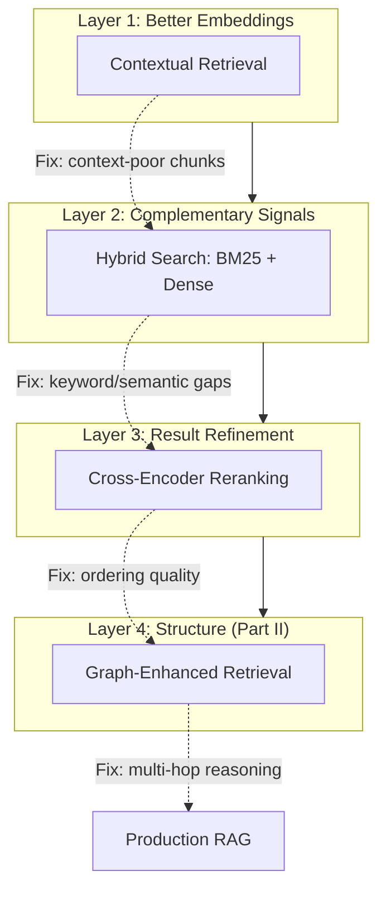

# Chapter 3: Advanced Retrieval Techniques

> **"The difference between a demo and a production RAG system is the
> retrieval quality."**

In Chapter 1 we built naive RAG with cosine similarity over a flat vector
store. It works -- for demos. In production, naive retrieval fails in
predictable ways: it misses keyword matches that matter, returns results
in suboptimal order, and cannot handle queries that require combining
information from multiple sources.

This chapter covers three techniques that close the gap between naive and
production-grade retrieval, plus an honest assessment of where even
advanced retrieval falls short -- setting up the motivation for
graph-enhanced RAG in Part II.

## Learning Objectives

After completing this chapter you will be able to:

1. **Implement contextual retrieval** -- Anthropic's technique for
   prepending document context to chunks before embedding.
2. **Build hybrid search** -- combining BM25 lexical matching with dense
   vector retrieval using Reciprocal Rank Fusion.
3. **Add reranking** -- using cross-encoder models to reorder initial
   retrieval results for higher precision.
4. **Articulate the limits of flat retrieval** -- why multi-hop reasoning
   and relationship-aware queries require graph structure.

## Chapter Outline

| Section | Topic |
|---------|-------|
| [3.1 Contextual Retrieval](ch03-01-contextual-retrieval.md) | Prepending document context for better embeddings |
| [3.2 Hybrid Search](ch03-02-hybrid-search.md) | BM25 + dense vectors + Reciprocal Rank Fusion |
| [3.3 Reranking](ch03-03-reranking.md) | Cross-encoder reranking for precision |
| [3.4 Why RAG Alone Is Not Enough](ch03-04-limitations.md) | Multi-hop failures, relationship blindness, Part II preview |

## The Retrieval Quality Stack

These techniques are not alternatives -- they are layers that stack on top
of each other. Each layer addresses a different failure mode:



## Measuring Retrieval Quality

Before optimizing retrieval, establish metrics. The standard measures are:

| Metric | What It Measures | Formula |
|--------|-----------------|---------|
| **Recall@k** | Fraction of relevant docs in top-k | relevant_in_top_k / total_relevant |
| **Precision@k** | Fraction of top-k that are relevant | relevant_in_top_k / k |
| **MRR** | Rank of the first relevant result | 1 / rank_of_first_relevant |
| **NDCG@k** | Rank-weighted relevance quality | Normalized discounted cumulative gain |

```rust
/// Compute Recall@k: what fraction of relevant documents did we find?
fn recall_at_k(retrieved: &[&str], relevant: &[&str], k: usize) -> f64 {
    let top_k: std::collections::HashSet<&str> =
        retrieved.iter().take(k).copied().collect();
    let relevant_set: std::collections::HashSet<&str> =
        relevant.iter().copied().collect();

    let found = top_k.intersection(&relevant_set).count();
    found as f64 / relevant_set.len() as f64
}

/// Compute Mean Reciprocal Rank
fn mrr(retrieved: &[&str], relevant: &[&str]) -> f64 {
    let relevant_set: std::collections::HashSet<&str> =
        relevant.iter().copied().collect();

    for (i, doc) in retrieved.iter().enumerate() {
        if relevant_set.contains(doc) {
            return 1.0 / (i as f64 + 1.0);
        }
    }

    0.0
}
```

Always measure before and after each optimization to confirm it actually
improves retrieval quality on your data.

## Key Terminology

| Term | Definition |
|------|-----------|
| **BM25** | Best Matching 25 -- a probabilistic lexical ranking function |
| **Hybrid search** | Combining lexical and semantic retrieval signals |
| **RRF** | Reciprocal Rank Fusion -- merging ranked lists from different retrievers |
| **Reranking** | Re-scoring initial retrieval results with a more accurate model |
| **Multi-hop reasoning** | Answering questions that require combining facts from multiple documents |

---

*Next: [3.1 Contextual Retrieval](ch03-01-contextual-retrieval.md)*

{{#quiz ../quizzes/ch03-advanced-retrieval.toml}}
