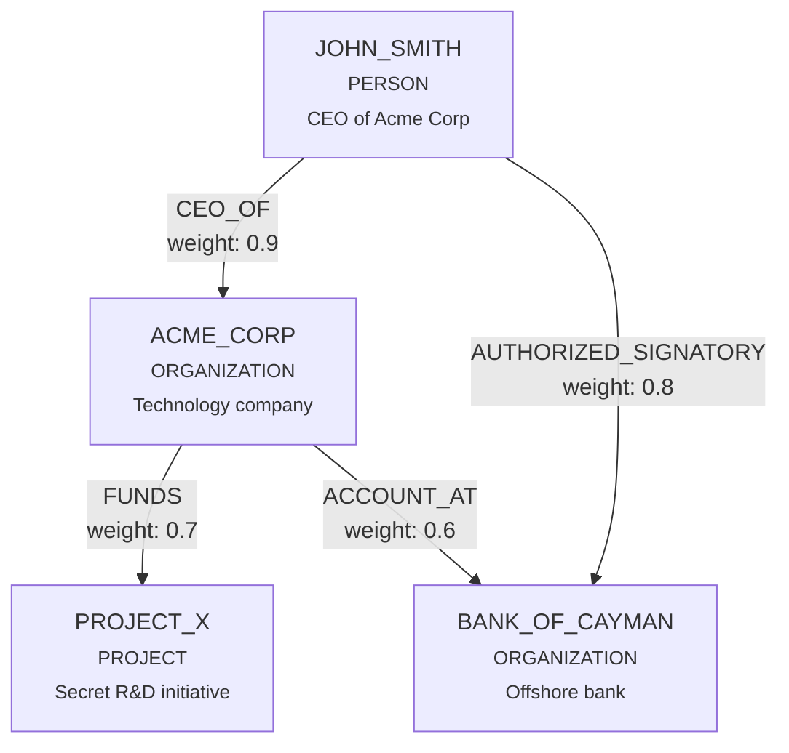

## 4.1 The Property Graph Model

A **property graph** is a directed graph in which both nodes and edges
can carry an arbitrary set of key-value properties. This is the most
popular model for knowledge representation because it balances
expressiveness with simplicity.

### Why Property Graphs?

There are several graph models to choose from:

| Model | Nodes | Edges | Properties | Used By |
|-------|-------|-------|-----------|---------|
| **Simple graph** | Labels only | Labels only | None | Academic algorithms |
| **RDF triple store** | URIs | Predicates | Limited (reification) | Semantic web, SPARQL |
| **Property graph** | Labels + key-value | Labels + key-value | Full | Neo4j, Neptune, AGE |

The property graph wins for knowledge bases because:

1. **Flexible schema** -- Different entity types carry different
   properties. A `PERSON` node might have `role` and `nationality`; an
   `ORGANIZATION` node might have `industry` and `founded_year`. No
   schema migration needed.

2. **Rich edge metadata** -- Relationships carry context: weight,
   keywords, source document ID, timestamps. This metadata powers
   scoring and provenance tracking.

3. **Database compatibility** -- The property graph model maps directly
   to Apache AGE (PostgreSQL), Neo4j, Amazon Neptune, and SurrealDB.
   This means the same trait can target multiple backends.

### EdgeQuake's Graph Types

EdgeQuake defines three core types in `edgequake-storage`:

#### GraphNode

A node represents an entity extracted from documents:

```rust
use serde::{Deserialize, Serialize};
use std::collections::HashMap;

/// A node in the knowledge graph.
#[derive(Debug, Clone, Serialize, Deserialize)]
pub struct GraphNode {
    /// Node identifier (typically the normalized entity name).
    pub id: String,
    /// Node properties (flexible key-value pairs).
    pub properties: HashMap<String, serde_json::Value>,
}
```

The `id` field is the **normalized entity name** -- always uppercase with
underscores (e.g., `"JOHN_SMITH"`). This normalization is critical for
deduplication, which we cover in Chapter 5.

The `properties` map holds everything else:

```rust
use serde_json::json;

let mut node = GraphNode::new("ACME_CORP");
node.set_property("entity_type", json!("ORGANIZATION"));
node.set_property("description", json!("A multinational technology company"));
node.set_property("source_id", json!("doc-001|doc-047"));
node.set_property("importance", json!(0.85));
```

Notice that `source_id` accumulates pipe-separated document references.
This enables cascade delete -- when you remove a document, you can find
and clean up all entities that originated from it.

#### GraphEdge

An edge represents a relationship between two entities:

```rust
/// An edge in the knowledge graph.
#[derive(Debug, Clone, Serialize, Deserialize)]
pub struct GraphEdge {
    /// Source node identifier.
    pub source: String,
    /// Target node identifier.
    pub target: String,
    /// Edge properties (flexible key-value pairs).
    pub properties: HashMap<String, serde_json::Value>,
}
```

Edges carry rich metadata that powers retrieval:

```rust
use serde_json::json;

let mut edge = GraphEdge::new("ACME_CORP", "JOHN_SMITH");
edge.set_property("relation_type", json!("EMPLOYS"));
edge.set_property("description", json!("John Smith is the CEO of Acme Corp"));
edge.set_property("weight", json!(0.9));
edge.set_property("keywords", json!(["employment", "executive", "leadership"]));
edge.set_property("source_id", json!("chunk-042"));
```

The `keywords` field is especially important -- these are the terms that
the query engine uses during **Global mode** retrieval (Chapter 6) to
find relevant relationship clusters.

#### KnowledgeGraph

A `KnowledgeGraph` is a subgraph -- a slice of the full graph returned
by traversal queries:

```rust
/// A subgraph extracted from the knowledge graph.
#[derive(Debug, Clone, Serialize, Deserialize)]
pub struct KnowledgeGraph {
    /// Nodes in the subgraph.
    pub nodes: Vec<GraphNode>,
    /// Edges in the subgraph.
    pub edges: Vec<GraphEdge>,
    /// Whether the result was truncated due to size limits.
    pub is_truncated: bool,
}
```

The `is_truncated` flag is a practical detail: when traversing a dense
graph, you must cap the result size to avoid overwhelming the LLM's
context window. The flag signals to upstream code that the full
neighborhood was not returned.

### The Property Graph in Practice

Here is how a document about a corporate investigation maps to a
property graph:



Each node and edge stores its own properties, so the graph is
self-describing. No external schema defines what a `PERSON` must look
like -- the properties emerge from extraction.

### Builder Pattern

EdgeQuake's types use the builder pattern for ergonomic construction:

```rust
let node = GraphNode::with_properties(
    "SARAH_CHEN",
    HashMap::from([
        ("entity_type".into(), json!("PERSON")),
        ("description".into(), json!("Lead researcher in quantum computing")),
        ("importance".into(), json!(0.75)),
    ]),
);

let edge = GraphEdge::with_properties(
    "SARAH_CHEN",
    "QUANTUM_LAB",
    HashMap::from([
        ("relation_type".into(), json!("WORKS_AT")),
        ("weight".into(), json!(0.85)),
        ("keywords".into(), json!(["employment", "research"])),
    ]),
);
```

### Comparing Property Graphs to Document Stores

You might wonder: could we just store entities as JSON documents in a
key-value store? Technically yes, but you lose **adjacency** -- the
ability to traverse from one entity to its neighbors in O(1) time.

| Operation | Property Graph | Document Store |
|-----------|---------------|----------------|
| Get entity | O(1) | O(1) |
| Get neighbors | O(degree) | O(N) scan or manual index |
| Multi-hop path | O(depth * avg_degree) | Requires application joins |
| Subgraph extraction | Single query | Multiple round trips |

For knowledge bases where relationship traversal is the primary value
proposition, the property graph is the natural choice.

### Key Takeaways

- A property graph stores both entities (nodes) and relationships (edges)
  with flexible key-value properties.
- EdgeQuake's `GraphNode` and `GraphEdge` types are simple but
  powerful -- all domain knowledge lives in the `properties` map.
- The `KnowledgeGraph` type represents traversal results, with a
  truncation flag for context management.
- This model maps directly to multiple graph database backends, making
  the storage layer pluggable.

---

*Next: [4.2 The LightRAG Insight](ch04-02-lightrag-insight.md)*
