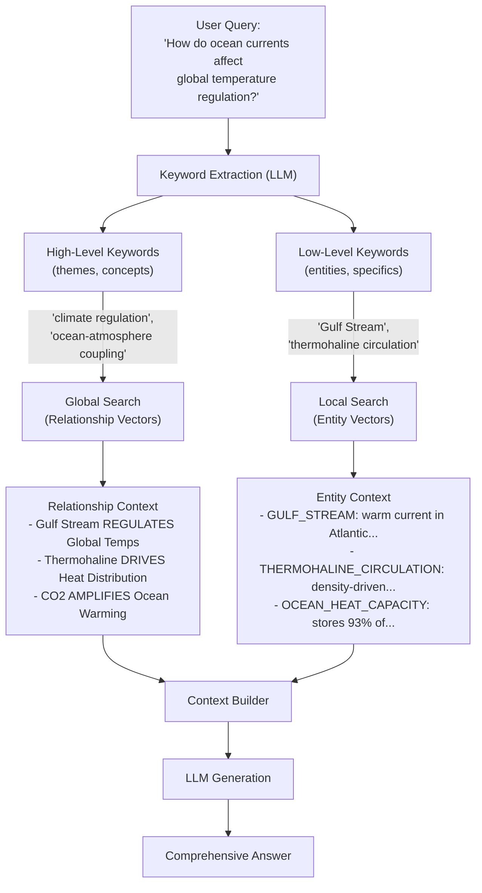

## 4.2 The LightRAG Insight

The **LightRAG** paper (2024) introduced a deceptively simple idea that
dramatically improves retrieval quality: instead of searching the
knowledge graph at a single level, search at **two levels** -- entities
for local context and relationships for global themes -- then combine the
results.

This section explains why this dual-level approach works, how it enables
multi-hop reasoning that pure vector search cannot achieve, and how
EdgeQuake implements it.

### The Problem with Single-Level Retrieval

Consider a knowledge base about climate science. A user asks:

> "How do ocean currents affect global temperature regulation?"

**Pure vector search** retrieves chunks containing similar terms. It
might find paragraphs about the Gulf Stream, thermohaline circulation,
and heat capacity -- but each chunk is an isolated fragment. The LLM must
stitch the narrative together from disconnected pieces.

**Entity-only graph search** finds nodes like `GULF_STREAM`,
`THERMOHALINE_CIRCULATION`, `OCEAN_HEAT_CAPACITY` and their immediate
neighbors. This gives structured local context but misses the broader
thematic connections.

**Relationship-only search** finds edges with keywords like "temperature
regulation" and "climate feedback" -- broad themes that connect multiple
entities. This captures the big picture but may lack specific factual
grounding.

**LightRAG's insight**: combine both. Use **low-level keywords** (entity
names) for local, specific retrieval and **high-level keywords** (themes
and concepts) for global, thematic retrieval.

### Dual-Level Retrieval Architecture

The following diagram shows how a single query produces two parallel
retrieval paths:



The key insight: **different keyword types retrieve different kinds of
context, and the combination is more powerful than either alone**.

### Why Pure Vector Search Fails at Multi-Hop

Multi-hop reasoning requires connecting information across a chain of
entities. Consider this three-hop question:

> "Which organizations funded the research that led to the discovery of
> the Higgs boson?"

The answer chain is:

```mermaid
graph LR
    CERN["CERN"] -->|"operated"| LHC["Large Hadron Collider"]
    LHC -->|"detected"| HB["Higgs Boson"]
    EU["European Union"] -->|"funded"| CERN
    US_DOE["US Dept of Energy"] -->|"contributed to"| CERN
    JAPAN["Japan (KEK)""] -->|"contributed to"| LHC
```

Pure vector search with the query "organizations funded Higgs boson
discovery" will retrieve chunks about the Higgs boson and possibly CERN,
but is unlikely to surface the funding relationships between EU/DOE/KEK
and CERN -- those details live in entirely different documents.

Graph traversal, starting from `HIGGS_BOSON` and walking edges backward,
discovers the full funding chain in a single operation:

```rust
// Pseudocode: graph traversal for multi-hop reasoning
let higgs = graph.get_node("HIGGS_BOSON").await?;
let neighbors_depth_1 = graph.get_neighbors("HIGGS_BOSON", 1).await?;
// Returns: [LHC, ATLAS_EXPERIMENT, CMS_EXPERIMENT, ...]

let neighbors_depth_2 = graph.get_neighbors("HIGGS_BOSON", 2).await?;
// Returns: [LHC, CERN, ATLAS, CMS, EU, US_DOE, KEK, ...]

let subgraph = graph.get_knowledge_graph("HIGGS_BOSON", 3, 50).await?;
// Returns full subgraph with nodes AND edges (including funding relationships)
```

### Local Mode vs Global Mode

EdgeQuake implements LightRAG's dual-level retrieval as two distinct
query modes that can be used independently or combined:

#### Local Mode (Entity-Centric)

Local mode answers questions about **specific entities and their
immediate context**.

1. Extract **low-level keywords** from the query (entity names, specific
   terms).
2. Search the **entity vector store** using these keywords.
3. For each matched entity, fetch its **graph neighborhood** (connected
   nodes and edges).
4. Build context from entity descriptions and neighbor descriptions.

**Best for**: "Tell me about Person X", "What does Company Y do?",
"How are A and B related?"

#### Global Mode (Relationship-Centric)

Global mode answers questions about **broad themes and patterns** across
the knowledge base.

1. Extract **high-level keywords** from the query (themes, concepts,
   abstract topics).
2. Search the **relationship vector store** using these keywords.
3. Retrieve matched relationship descriptions and their endpoint
   entities.
4. Build context from relationship clusters that share thematic keywords.

**Best for**: "What are the main themes in this dataset?", "Summarize
the financial patterns", "What trends emerge from these documents?"

#### Hybrid Mode (The Default)

Hybrid mode runs **both Local and Global** in parallel, then merges the
results:

```text
Hybrid = Local Context + Global Context
       = (Entity descriptions + neighbor subgraph)
       + (Relationship clusters + thematic summaries)
```

This is EdgeQuake's default mode because most real-world queries benefit
from both specific grounding (Local) and thematic breadth (Global).

### The Retrieval Quality Difference

Here is a concrete comparison using the same query across modes:

**Query**: "What role did financial institutions play in the scandal?"

| Mode | Retrieved Context | Quality |
|------|-------------------|---------|
| **Naive** | 5 chunks mentioning "financial institutions" or "scandal" | May miss entities only mentioned by name, not the phrase "financial institution" |
| **Local** | Entities: BANK_X, HEDGE_FUND_Y, REGULATOR_Z + their neighbors and descriptions | Good entity coverage but may miss the broader pattern |
| **Global** | Relationships with keywords "financial", "scandal", "fraud", "compliance" | Captures the thematic pattern but may lack specific entity details |
| **Hybrid** | All of the above, deduplicated and token-budgeted | Best coverage: specific entities AND thematic relationships |

### How EdgeQuake Implements It

The dual-level approach requires two separate vector stores:

1. **Entity vectors** -- embeddings of entity descriptions, stored with
   entity metadata. Searched using low-level keywords.

2. **Relationship vectors** -- embeddings of relationship descriptions
   and keywords, stored with edge metadata. Searched using high-level
   keywords.

Both are stored in the same `VectorStorage` backend but distinguished
by a **type filter**:

```rust
use edgequake_query::vector_filter::{filter_by_type, VectorType};

// Local mode: search entity vectors
let entity_results = vector_storage
    .search(&query_embedding, top_k)
    .await?;
let entities = filter_by_type(entity_results, VectorType::Entity);

// Global mode: search relationship vectors
let rel_results = vector_storage
    .search(&query_embedding, top_k)
    .await?;
let relationships = filter_by_type(rel_results, VectorType::Relationship);
```

The graph storage then enriches these vector results with structural
context:

```rust
// For each matched entity, get its graph neighborhood
for entity in &matched_entities {
    let neighbors = graph_storage
        .get_neighbors(&entity.id, depth)
        .await?;
    // Add neighbor descriptions to context
}

// For matched relationships, get both endpoint nodes
for rel in &matched_relationships {
    let source = graph_storage.get_node(&rel.source).await?;
    let target = graph_storage.get_node(&rel.target).await?;
    // Add source/target descriptions to context
}
```

### Key Takeaways

- LightRAG's core insight is **dual-level retrieval**: entity-level for
  local specificity, relationship-level for global themes.
- Multi-hop reasoning is only possible when entity connections are
  explicitly stored in a graph, not inferred from vector similarity.
- EdgeQuake implements this via separate entity and relationship vector
  spaces, combined with graph traversal for structural context.
- **Hybrid mode** (Local + Global) is the default because it captures
  both specific entities and broad thematic patterns.

---

*Next: [4.3 The GraphStorage Trait](ch04-03-graph-storage-trait.md)*
