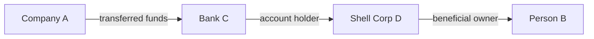

# Chapter 4: Knowledge Graphs for RAG

> **"A vector can tell you what is similar. A graph can tell you what is connected."**

In Part I we built increasingly sophisticated retrieval systems based on
vector similarity. We saw that naive RAG -- embed a query, retrieve the
top-k chunks, feed them to an LLM -- works well for direct factual
questions but breaks down when answers span multiple documents or require
reasoning about relationships between entities.

This chapter introduces the core data structure that solves this problem:
the **knowledge graph**. We will see how a property graph model maps
naturally onto the information extracted from documents, why the LightRAG
paper's dual-level retrieval insight is so powerful, and how EdgeQuake
abstracts graph operations behind a clean Rust trait.

## Learning Objectives

After completing this chapter you will be able to:

1. **Explain why knowledge graphs enhance RAG** -- the specific failure
   modes of pure vector search that graph structure addresses.
2. **Describe the property graph model** -- nodes with properties, edges
   with properties, and why this model was chosen over alternatives.
3. **Articulate the LightRAG dual-level insight** -- how entity-level
   and relationship-level retrieval combine for multi-hop reasoning.
4. **Read and implement the `GraphStorage` trait** -- understand every
   method signature and its role in the system.

## Chapter Outline

| Section | Topic |
|---------|-------|
| [4.1 The Property Graph Model](ch04-01-property-graph.md) | Nodes, edges, properties, and why this model |
| [4.2 The LightRAG Insight](ch04-02-lightrag-insight.md) | Dual-level retrieval and multi-hop reasoning |
| [4.3 The GraphStorage Trait](ch04-03-graph-storage-trait.md) | Full trait walkthrough with method signatures |

## Prerequisites

- Completed Part I (especially Chapter 3 on retrieval limitations)
- Familiar with Rust traits and `async_trait`
- Basic understanding of graph data structures (nodes and edges)

## Key Terminology

| Term | Definition |
|------|-----------|
| **Property graph** | A graph where both nodes and edges carry key-value properties |
| **Knowledge graph** | A property graph encoding domain knowledge (entities + relationships) |
| **Entity** | A real-world concept represented as a graph node (person, organization, event) |
| **Relationship** | A connection between entities, represented as a graph edge |
| **Multi-hop reasoning** | Following chains of relationships to connect distant entities |
| **Namespace** | An isolation boundary for graph data, enabling multi-tenancy |

## Why Graphs?

Consider a knowledge base about a corporate investigation. You ingest
hundreds of documents and a user asks:

> "What are the financial connections between Company A and Person B?"

With pure vector search, you retrieve chunks that mention Company A and
chunks that mention Person B separately. The LLM must infer any
connections from the retrieved text -- and if the connection passes
through intermediate entities (Company A -> Bank C -> Shell Corp D ->
Person B), pure vector search will almost certainly miss it.

A knowledge graph makes these connections **explicit and traversable**:

Graph traversal discovers this four-hop path in milliseconds, regardless
of how many documents the information spans.

Let us begin by understanding the data model that makes this possible.

---

*Next: [4.1 The Property Graph Model](ch04-01-property-graph.md)*

{{#quiz ../quizzes/ch04-knowledge-graphs.toml}}
