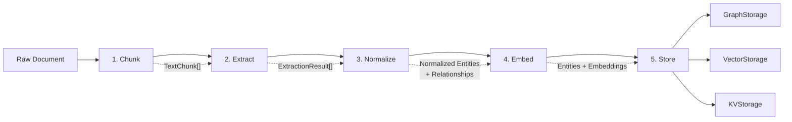

## 5.1 Pipeline Architecture

EdgeQuake's ingestion pipeline lives in the `edgequake-pipeline` crate
and processes documents through five sequential stages. Each stage can
be independently enabled or disabled via `PipelineConfig`.

### The Five Stages



Let us walk through each stage.

#### Stage 1: Chunk

The document is split into manageable segments. Chunking is covered in
detail in Chapter 2. The key parameters are `chunk_size` (in tokens)
and `chunk_overlap` (how much adjacent chunks share):

```rust
use edgequake_pipeline::chunker::{Chunker, ChunkerConfig, TextChunk};

let config = ChunkerConfig {
    chunk_size: 1200,     // Target tokens per chunk
    chunk_overlap: 200,   // Overlap between adjacent chunks
    ..Default::default()
};

let chunker = Chunker::new(config);
let chunks: Vec<TextChunk> = chunker.chunk(document_text);
```

Each `TextChunk` carries an ID, the text content, and positional
information:

```rust
pub struct TextChunk {
    pub id: String,
    pub content: String,
    pub start_offset: usize,
    pub end_offset: usize,
    pub token_count: usize,
}
```

#### Stage 2: Extract

Each chunk is sent to an LLM for entity and relationship extraction.
This is the most expensive and time-consuming stage. The result is an
`ExtractionResult` per chunk:

```rust
pub struct ExtractionResult {
    pub entities: Vec<ExtractedEntity>,
    pub relationships: Vec<ExtractedRelationship>,
    pub source_chunk_id: String,
    pub metadata: HashMap<String, serde_json::Value>,
    pub input_tokens: usize,
    pub output_tokens: usize,
    pub extraction_time_ms: u64,
}
```

Extraction runs in batches with concurrency control to respect LLM
rate limits. See Section 5.2 for the full extraction deep-dive.

#### Stage 3: Normalize

Extracted entity names are normalized to a canonical form. This stage
resolves aliases and ensures that "John Smith", "J. Smith", and
"john smith" all map to the same graph node `JOHN_SMITH`. See
Section 5.3 for normalization strategies.

#### Stage 4: Embed

Embeddings are generated for three types of content:

| Content | What is Embedded | Vector Use |
|---------|-----------------|------------|
| Chunks | Raw chunk text | Naive mode retrieval |
| Entities | Entity description | Local mode retrieval |
| Relationships | Relationship description + keywords | Global mode retrieval |

```rust
// Generate embeddings in batches
let chunk_embeddings = embedding_provider
    .embed_batch(&chunk_texts, batch_size)
    .await?;

let entity_embeddings = embedding_provider
    .embed_batch(&entity_descriptions, batch_size)
    .await?;

let relationship_embeddings = embedding_provider
    .embed_batch(&relationship_texts, batch_size)
    .await?;
```

The embedding batch size is configurable to balance throughput with
memory usage.

#### Stage 5: Store

The final stage persists everything across three storage backends:

- **KVStorage**: Chunk content and document metadata (for retrieval and
  citation).
- **VectorStorage**: Embeddings for chunks, entities, and relationships
  (for similarity search).
- **GraphStorage**: Nodes and edges with properties (for graph
  traversal).

```rust
// Store entities as graph nodes
for entity in &entities {
    graph_storage.upsert_node(&entity.name, entity_properties(&entity)).await?;
    vector_storage.upsert(&entity.name, &entity.embedding, entity_metadata(&entity)).await?;
}

// Store relationships as graph edges
for rel in &relationships {
    graph_storage.upsert_edge(&rel.source, &rel.target, edge_properties(&rel)).await?;
    vector_storage.upsert(&rel_id, &rel.embedding, rel_metadata(&rel)).await?;
}

// Store chunks
for chunk in &chunks {
    kv_storage.set(&chunk.id, &chunk.content).await?;
    vector_storage.upsert(&chunk.id, &chunk.embedding, chunk_metadata(&chunk)).await?;
}
```

### PipelineConfig

The entire pipeline is controlled by a single configuration struct:

```rust
pub struct PipelineConfig {
    /// Chunking configuration.
    pub chunker: ChunkerConfig,

    /// Batch size for LLM extraction (chunks per batch).
    pub extraction_batch_size: usize,

    /// Batch size for embedding generation.
    pub embedding_batch_size: usize,

    /// Toggle entity extraction on/off.
    pub enable_entity_extraction: bool,

    /// Toggle relationship extraction on/off.
    pub enable_relationship_extraction: bool,

    /// Toggle chunk embedding generation.
    pub enable_chunk_embeddings: bool,

    /// Toggle entity embedding generation.
    pub enable_entity_embeddings: bool,

    /// Toggle relationship embedding generation.
    pub enable_relationship_embeddings: bool,

    /// Maximum concurrent extraction tasks.
    pub max_concurrent_extractions: usize,

    /// Track which chunk produced which entity.
    pub enable_lineage_tracking: bool,

    /// Timeout per chunk extraction in seconds.
    pub chunk_extraction_timeout_secs: u64,

    /// Maximum retry attempts per chunk.
    pub chunk_max_retries: u32,

    /// Initial retry delay in milliseconds (exponential backoff).
    pub initial_retry_delay_ms: u64,
}
```

The default configuration enables everything and is suitable for most
use cases:

```rust
let config = PipelineConfig::default();
// extraction_batch_size: 10
// embedding_batch_size: 100
// max_concurrent_extractions: 4
// chunk_extraction_timeout_secs: 180
// chunk_max_retries: 3
// All features enabled
```

For development or testing, you can disable expensive stages:

```rust
let mut config = PipelineConfig::default();
config.enable_entity_extraction = false;     // Skip LLM calls
config.enable_entity_embeddings = false;     // Skip embedding
config.enable_relationship_extraction = false;
config.enable_relationship_embeddings = false;
// Only chunking + chunk embeddings remain
```

### Concurrency and Rate Limiting

The extraction stage uses bounded concurrency to respect LLM API rate
limits:

```rust
use futures::stream::{self, StreamExt};

let results: Vec<ExtractionResult> = stream::iter(chunks)
    .map(|chunk| async {
        extractor.extract(&chunk).await
    })
    .buffer_unordered(config.max_concurrent_extractions)
    .collect()
    .await;
```

`buffer_unordered` processes up to `max_concurrent_extractions` chunks
simultaneously. This is critical because:

- **Too low**: Pipeline is slow, underutilizes the LLM API.
- **Too high**: Rate limit errors, increased cost from retries.
- **Default (4)**: A reasonable balance for most LLM providers.

### Error Recovery

Each chunk extraction has timeout and retry logic:

```text
Attempt 1 ──> LLM Call ──> Success? ──> Parse result
                │                          │
                ├── Timeout (180s) ──> Retry with backoff
                ├── Rate limit ─────> Retry with backoff
                └── Parse error ────> Retry with increased max_tokens
                                         │
Attempt 2 ──> LLM Call ──> Success? ──> Parse result
                │
                └── (same retry logic)
                                         │
Attempt 3 ──> LLM Call ──> Success? ──> Parse result
                │
                └── All retries exhausted ──> Skip chunk, log error
```

Failed chunks are logged but do not block the pipeline. The rationale:
a partially-extracted knowledge graph is better than no graph at all.

### Lineage Tracking

When `enable_lineage_tracking` is true, the pipeline records provenance
for every extraction:

```rust
pub struct DocumentLineage {
    pub document_id: String,
    pub chunks: Vec<ChunkLineage>,
}

pub struct ChunkLineage {
    pub chunk_id: String,
    pub entities_extracted: Vec<String>,
    pub relationships_extracted: Vec<(String, String)>,
    pub extraction_metadata: ExtractionMetadata,
}
```

This enables cascade operations: when a document is deleted, all entities
and relationships that were *only* sourced from that document can be
cleaned up.

### Key Takeaways

- The pipeline has five stages: Chunk, Extract, Normalize, Embed, Store.
- Each stage can be independently enabled/disabled via `PipelineConfig`.
- Extraction is the bottleneck -- bounded concurrency and retry logic
  handle LLM rate limits and failures.
- Three storage backends receive the pipeline output: KV (chunks),
  Vector (embeddings), Graph (nodes and edges).
- Lineage tracking enables cascade delete when source documents are
  removed.

---

*Next: [5.2 Entity Extraction](ch05-02-entity-extraction.md)*
