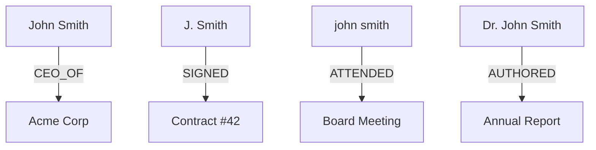
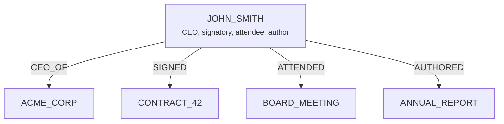

## 5.3 Entity Normalization

Entity extraction produces raw names: "John Smith", "J. Smith",
"john smith", "JOHN SMITH", "Dr. John Smith". Without normalization,
each of these would become a separate node in the knowledge graph,
fragmenting the information about a single real-world entity across
multiple disconnected nodes.

Normalization ensures that all references to the same entity converge
on a single canonical node ID.

### Why Normalization Matters

Consider a knowledge base built from corporate documents. Without
normalization:



Four separate nodes, four separate contexts. A query asking "What did
John Smith do?" would only find the relationships connected to whichever
variant the vector search happens to match.

With normalization, all four merge into a single node:



Now a single graph traversal from `JOHN_SMITH` reveals all four
relationships.

### EdgeQuake's Normalization Strategy

EdgeQuake applies normalization in layers, from simple string
transformations to LLM-assisted resolution:

#### Layer 1: String Normalization

The first layer is deterministic and fast:

```rust
/// Normalize an entity name to canonical form.
fn normalize_entity_name(name: &str) -> String {
    name.trim()
        // Remove common prefixes/suffixes
        .trim_start_matches("The ")
        .trim_start_matches("the ")
        // Convert to uppercase
        .to_uppercase()
        // Replace spaces and hyphens with underscores
        .replace(' ', "_")
        .replace('-', "_")
        // Collapse multiple underscores
        .replace("__", "_")
        // Remove trailing underscores
        .trim_end_matches('_')
        .to_string()
}
```

This handles the most common cases:

| Input | Normalized |
|-------|-----------|
| "John Smith" | `JOHN_SMITH` |
| "john smith" | `JOHN_SMITH` |
| "JOHN SMITH" | `JOHN_SMITH` |
| "The White House" | `WHITE_HOUSE` |
| "New York City" | `NEW_YORK_CITY` |

#### Layer 2: Title and Prefix Stripping

Honorifics and titles create false duplicates:

```rust
const TITLE_PREFIXES: &[&str] = &[
    "Dr. ", "Dr ", "Mr. ", "Mr ", "Mrs. ", "Mrs ",
    "Ms. ", "Ms ", "Prof. ", "Prof ", "Professor ",
    "Sir ", "Lord ", "Dame ", "President ", "CEO ",
];

fn strip_titles(name: &str) -> String {
    let mut result = name.to_string();
    for prefix in TITLE_PREFIXES {
        if result.starts_with(prefix) {
            result = result[prefix.len()..].to_string();
            break; // Only strip one prefix
        }
    }
    result
}
```

| Input | After Title Stripping | Final |
|-------|----------------------|-------|
| "Dr. Sarah Chen" | "Sarah Chen" | `SARAH_CHEN` |
| "Professor James Wilson" | "James Wilson" | `JAMES_WILSON` |
| "CEO John Smith" | "John Smith" | `JOHN_SMITH` |

#### Layer 3: Alias Resolution

Some entity pairs require explicit mapping. EdgeQuake supports
configurable alias tables:

```rust
use std::collections::HashMap;

let aliases: HashMap<String, String> = HashMap::from([
    ("USA".into(), "UNITED_STATES".into()),
    ("U.S.A.".into(), "UNITED_STATES".into()),
    ("U.S.".into(), "UNITED_STATES".into()),
    ("AMERICA".into(), "UNITED_STATES".into()),
    ("NYC".into(), "NEW_YORK_CITY".into()),
    ("NY".into(), "NEW_YORK".into()),
    ("MIT".into(), "MASSACHUSETTS_INSTITUTE_OF_TECHNOLOGY".into()),
]);

fn resolve_alias(name: &str, aliases: &HashMap<String, String>) -> String {
    let normalized = normalize_entity_name(name);
    aliases.get(&normalized).cloned().unwrap_or(normalized)
}
```

#### Layer 4: Fuzzy Matching

For entities that are similar but not identical after string
normalization, fuzzy matching catches near-duplicates:

```rust
/// Check if two entity names are likely the same entity.
fn is_fuzzy_match(name_a: &str, name_b: &str, threshold: f64) -> bool {
    // Levenshtein distance normalized by length
    let distance = levenshtein_distance(name_a, name_b);
    let max_len = name_a.len().max(name_b.len()) as f64;
    let similarity = 1.0 - (distance as f64 / max_len);

    similarity >= threshold
}
```

With a threshold of 0.85:

| Name A | Name B | Similarity | Match? |
|--------|--------|-----------|--------|
| `JOHN_SMITH` | `JON_SMITH` | 0.91 | Yes |
| `JOHN_SMITH` | `JOHN_SMYTH` | 0.82 | No |
| `ACME_CORP` | `ACME_CORPORATION` | 0.76 | No |

Fuzzy matching must be used carefully -- false positives merge
*different* entities into one node, which is worse than having
duplicates.

### The Merge Strategy

When two entities resolve to the same node ID, their properties must
be merged. EdgeQuake's `KnowledgeGraphMerger` handles this:

```rust
pub struct KnowledgeGraphMerger<G: GraphStorage, V: VectorStorage> {
    config: MergerConfig,
    graph_storage: Arc<G>,
    vector_storage: Arc<V>,
    summarizer: Option<Arc<LLMSummarizer>>,
}
```

The merge follows three rules:

**1. Descriptions accumulate and are summarized.**

When the same entity appears in multiple documents, descriptions are
combined. If the combined description exceeds `max_description_length`,
an LLM summarizes them:

```rust
// Document 1: "Sarah Chen is a researcher at MIT"
// Document 2: "Dr. Chen's quantum computing work won the Dirac Medal"
// Merged: "Sarah Chen is a quantum computing researcher at MIT whose
//          work won the Dirac Medal"
```

**2. Source IDs accumulate.**

The `source_id` property tracks all documents that contributed to an
entity. Sources are pipe-separated:

```rust
// After ingesting doc-001: source_id = "doc-001"
// After ingesting doc-047: source_id = "doc-001|doc-047"
// After ingesting doc-123: source_id = "doc-001|doc-047|doc-123"
```

This enables cascade delete: when `doc-047` is deleted, the pipeline
can check whether the entity has other sources before removing it.

**3. Importance scores are updated.**

The importance score reflects how often an entity appears. More
appearances generally indicate greater importance:

```rust
fn update_importance(existing: f32, new: f32) -> f32 {
    // Weighted average, biased toward higher values
    (existing * 0.6 + new * 0.4).clamp(0.0, 1.0)
}
```

### Normalization in the Extraction Prompt

EdgeQuake also encourages normalization at the LLM level. The extraction
prompt instructs the LLM to output entity names in uppercase:

```text
## Rules
- Entity names MUST be in UPPERCASE_WITH_UNDERSCORES format
- Use the most complete form of the name (e.g., "JOHN_SMITH" not "J_SMITH")
- Resolve common abbreviations (e.g., use "UNITED_STATES" not "US")
```

This reduces the normalization burden on the post-processing stage, but
LLMs do not always follow instructions perfectly, so programmatic
normalization remains necessary.

### Edge Normalization

Relationships also need normalization. The relationship `(source, target)`
pair is normalized so that both endpoints use canonical entity names:

```rust
fn normalize_relationship(rel: &ExtractedRelationship) -> ExtractedRelationship {
    ExtractedRelationship {
        source: normalize_entity_name(&rel.source),
        target: normalize_entity_name(&rel.target),
        relation_type: rel.relation_type.to_uppercase().replace(' ', "_"),
        ..rel.clone()
    }
}
```

EdgeQuake also enforces **BR0006**: self-referential relationships
(where source equals target after normalization) are discarded:

```rust
if normalized_rel.source == normalized_rel.target {
    tracing::warn!("Discarding self-referential edge: {}", normalized_rel.source);
    continue;
}
```

### Key Takeaways

- Normalization converts varied entity name forms into a single
  canonical ID (uppercase, underscored).
- Four layers provide progressive resolution: string normalization,
  title stripping, alias tables, and fuzzy matching.
- The merge strategy accumulates descriptions and sources while
  maintaining a single graph node per real-world entity.
- Both entity and relationship endpoints are normalized to prevent
  graph fragmentation.
- Self-referential relationships are automatically discarded.

---

*Next: [5.4 Gleaning for Quality](ch05-04-gleaning.md)*
