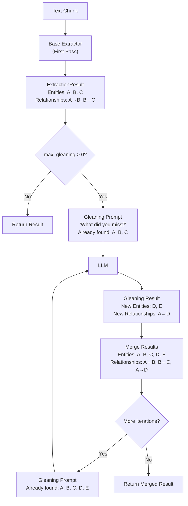

## 5.4 Gleaning for Quality

**Gleaning** is a second-pass extraction technique where the LLM is
asked to re-examine a chunk and identify entities and relationships that
were missed in the first pass. This is directly inspired by the LightRAG
paper, which found that 1-2 gleaning iterations improve entity recall by
15-25%.

### Why Entities Get Missed

LLMs miss entities in a single pass for several reasons:

1. **Attention limits** -- In long chunks, the LLM's attention is spread
   across many tokens. Entities mentioned once, briefly, or near the end
   of the chunk are more likely to be overlooked.

2. **Implicit references** -- "The company" referring to an
   earlier-mentioned organization, "she" referring to a person, or
   "the agreement" referring to a named contract. The LLM may not
   resolve these co-references on the first pass.

3. **Context overload** -- When a chunk contains many entities (10+),
   the LLM tends to focus on the most prominent ones and skip minor
   players.

4. **Nested entities** -- An entity embedded within another mention
   (e.g., "the MIT Quantum Computing Lab" contains both "MIT" and
   "Quantum Computing Lab" as separate entities).

### The GleaningExtractor

EdgeQuake implements gleaning as a wrapper extractor that delegates the
first pass to a base extractor and then performs additional iterations:

```rust
pub struct GleaningExtractor {
    /// The underlying LLM provider.
    llm_provider: Arc<dyn LLMProvider>,
    /// The base extractor for the first pass.
    base_extractor: Arc<dyn EntityExtractor>,
    /// Configuration for gleaning.
    config: GleaningConfig,
}

pub struct GleaningConfig {
    /// Maximum number of gleaning iterations (default: 1).
    pub max_gleaning: usize,
    /// Whether to always glean, even if the first pass found entities.
    pub always_glean: bool,
}
```

The extraction flow:



### The Gleaning Prompt

The key to effective gleaning is the prompt. It tells the LLM what was
already found and asks it to look harder:

```text
MANY entities and relationships were missed in the last extraction.
Please identify any ADDITIONAL entities and relationships that were
not already captured.

## Already Identified Entities
SARAH_CHEN, MIT, QUANTUM_COMPUTING, DARPA

## Instructions
Look for entities and relationships that were missed. Focus on:
- Implicit entities (mentioned indirectly)
- Additional relationships between known entities
- Contextual entities (dates, locations, concepts)

## Output Format
{same JSON format as initial extraction}

## Text to Re-Analyze
{original chunk text}
```

Notice the language: "MANY entities and relationships were **missed**."
This assertive framing encourages the LLM to look harder rather than
confirming that the first pass was complete.

### Merge Strategy

Gleaning results are merged with the original results using description
comparison:

```rust
fn merge_results(
    &self,
    original: &mut ExtractionResult,
    glean_entities: Vec<ExtractedEntity>,
    glean_relationships: Vec<ExtractedRelationship>,
) {
    for glean_entity in glean_entities {
        let existing = original.entities.iter_mut()
            .find(|e| e.name.to_uppercase() == glean_entity.name.to_uppercase());

        if let Some(existing) = existing {
            // Entity already found -- keep the longer description
            if glean_entity.description.len() > existing.description.len() {
                existing.description = glean_entity.description;
                existing.entity_type = glean_entity.entity_type;
            }
        } else {
            // Genuinely new entity from gleaning
            original.entities.push(glean_entity);
        }
    }

    // Same logic for relationships
    for glean_rel in glean_relationships {
        let existing = original.relationships.iter_mut().find(|r| {
            r.source.to_uppercase() == glean_rel.source.to_uppercase()
                && r.target.to_uppercase() == glean_rel.target.to_uppercase()
        });

        if let Some(existing) = existing {
            if glean_rel.description.len() > existing.description.len() {
                existing.description = glean_rel.description;
            }
        } else {
            original.relationships.push(glean_rel);
        }
    }
}
```

The merge is name-based (case-insensitive), and when duplicates are
found, the longer description wins. This biases toward more detailed
entity descriptions.

### Cost-Benefit Analysis

Gleaning doubles (or triples) the LLM cost of extraction. Here is how
to decide whether it is worth it:

| Factor | Use Gleaning | Skip Gleaning |
|--------|-------------|---------------|
| **Document type** | Dense legal/financial docs | Simple narrative text |
| **Entity density** | High (20+ entities per page) | Low (5-10 entities) |
| **Importance** | High-stakes domain (legal, medical) | General knowledge base |
| **Budget** | Ample LLM budget | Cost-constrained |
| **Chunk size** | Large chunks (1000+ tokens) | Small chunks (300-600 tokens) |

#### Diminishing Returns

The LightRAG research found a clear diminishing returns pattern:

```text
Pass 1 (base):      ~75% entity recall
Pass 2 (glean 1):   ~90% entity recall  (+15%)
Pass 3 (glean 2):   ~95% entity recall  (+5%)
Pass 4 (glean 3):   ~96% entity recall  (+1%)
```

Each additional pass costs one full LLM call per chunk. For a document
with 100 chunks at $0.01/chunk:

| Configuration | Cost | Recall |
|-------------|------|--------|
| No gleaning | $1.00 | ~75% |
| 1 glean iteration | $2.00 | ~90% |
| 2 glean iterations | $3.00 | ~95% |

The default (`max_gleaning: 1`) is a good balance for most use cases.

### Using the GleaningExtractor

```rust
use edgequake_pipeline::extractor::{
    GleaningExtractor, GleaningConfig, SOTAExtractor, EntityExtractor,
};
use std::sync::Arc;

// Create the base extractor
let base = Arc::new(SOTAExtractor::new(Arc::clone(&llm_provider)));

// Wrap with gleaning
let extractor = GleaningExtractor::new(
    Arc::clone(&llm_provider),
    base,
)
.with_config(GleaningConfig {
    max_gleaning: 1,      // One gleaning pass
    always_glean: false,  // Skip gleaning if first pass found entities
});

// Use like any other EntityExtractor
let result = extractor.extract(&chunk).await?;

// Metadata includes gleaning info
let iterations = result.metadata.get("gleaning_iterations");
println!("Gleaning iterations: {:?}", iterations);
```

The `always_glean: false` option skips gleaning when the first pass
already finds entities. This optimization avoids wasting LLM calls on
chunks that are already well-extracted (e.g., simple text with obvious
entities).

### Token Usage Tracking

The `GleaningExtractor` accumulates token usage across all passes:

```rust
// After base extraction:
// result.input_tokens = 1200, result.output_tokens = 800

// After gleaning:
result.input_tokens += response.prompt_tokens;   // += 1400
result.output_tokens += response.completion_tokens; // += 400

// Final: input_tokens = 2600, output_tokens = 1200
```

This accurate tracking is essential for cost monitoring. The API layer
surfaces these totals so operators can see exactly how much each
document costs to ingest.

### When Not to Glean

Gleaning should be disabled when:

- **Cost is the primary constraint**: Each gleaning iteration doubles
  the extraction cost per chunk.
- **Latency matters**: Gleaning adds one full LLM round-trip per chunk
  per iteration.
- **Entity density is low**: Simple documents with few entities gain
  little from a second pass.
- **Using small chunks**: Smaller chunks (300-600 tokens) naturally
  have fewer entities, so the first pass captures most of them.

You disable gleaning either via config:

```rust
let config = GleaningConfig {
    max_gleaning: 0,       // Disable gleaning entirely
    always_glean: false,
};
```

Or by using the base extractor directly without the gleaning wrapper.

### Key Takeaways

- Gleaning performs a second-pass extraction to catch entities the LLM
  missed on the first pass.
- The gleaning prompt includes already-found entities and uses assertive
  language to encourage deeper analysis.
- Merge strategy keeps the longer description when duplicates are found.
- One gleaning iteration improves recall by ~15% but doubles cost.
- Diminishing returns set in quickly -- more than 2 iterations is
  rarely worthwhile.
- Default configuration: 1 gleaning iteration, skipped when the first
  pass already found entities.

---

*Next: [Chapter 6: Multi-Mode Query Engine](ch06-query-engine.md)*
