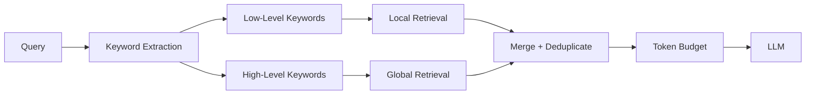

## 6.2 Query Modes

EdgeQuake's query engine supports five retrieval modes, each optimized
for a different class of question. The `QueryMode` enum determines which
combination of vector search and graph traversal is used to build
context for the LLM.

### The QueryMode Enum

```rust
#[derive(Debug, Clone, Copy, PartialEq, Eq, Serialize, Deserialize, Default)]
#[serde(rename_all = "lowercase")]
pub enum QueryMode {
    /// Vector similarity search on chunks only.
    Naive,
    /// Entity-centric search with graph neighborhood.
    Local,
    /// Relationship-centric search using graph clusters.
    Global,
    /// Combines Local and Global approaches (default).
    #[default]
    Hybrid,
    /// Weighted combination of naive and graph-based retrieval.
    Mix,
}
```

Each mode can be queried for its capabilities:

```rust
impl QueryMode {
    /// Whether this mode uses vector search.
    pub fn uses_vector_search(&self) -> bool {
        matches!(self, Self::Naive | Self::Local | Self::Hybrid | Self::Mix)
    }

    /// Whether this mode uses graph traversal.
    pub fn uses_graph(&self) -> bool {
        matches!(self, Self::Local | Self::Global | Self::Hybrid | Self::Mix)
    }
}
```

### Mode-by-Mode Breakdown

#### Naive Mode

**Strategy**: Embed the query and retrieve the most similar text chunks
via vector search. No graph involvement.

**How it works**:
1. Embed the raw query string.
2. Search the chunk vector store for top-k matches.
3. Return chunk content as context.

```rust
// Naive mode pseudocode
let query_embedding = embedding_provider.embed(&query).await?;
let chunks = vector_storage.search(&query_embedding, top_k).await?;
let context = chunks.iter()
    .map(|c| c.content.clone())
    .collect::<Vec<_>>()
    .join("\n\n");
```

**Strengths**: Fast, simple, no graph dependency.
**Weaknesses**: Cannot follow relationships, misses entities not
mentioned in similar chunks, no multi-hop reasoning.

**Best for**: Simple factual questions where the answer is likely
contained in a single chunk. "What is machine learning?" or
"Define photosynthesis."

---

#### Local Mode

**Strategy**: Use low-level keywords to find relevant entities in the
graph, then expand each entity's neighborhood for rich context.

**How it works**:
1. Extract low-level keywords (entity names) from the query.
2. Embed each keyword and search the entity vector store.
3. For each matched entity, fetch its graph neighbors (1-2 hops).
4. Collect entity descriptions and relationship descriptions as context.

```rust
// Local mode pseudocode
let keywords = keyword_extractor.extract(&query).await?;

for keyword in &keywords.low_level {
    let kw_embedding = embedding_provider.embed(keyword).await?;
    let entity_matches = entity_vector_store.search(&kw_embedding, top_k).await?;

    for entity in entity_matches {
        let node = graph_storage.get_node(&entity.id).await?;
        let neighbors = graph_storage.get_neighbors(&entity.id, 2).await?;
        let edges = graph_storage.get_node_edges(&entity.id).await?;
        // Add all descriptions to context
    }
}
```

**Strengths**: Leverages graph structure, discovers related entities,
enables multi-hop reasoning.
**Weaknesses**: Depends on keyword extraction quality, may miss
broad thematic context.

**Best for**: Entity-specific questions. "How does Alice work with
Bob?", "What is Company X's organizational structure?", "Tell me
about the relationship between entities A and B."

---

#### Global Mode

**Strategy**: Use high-level keywords to find relevant relationships
and their associated entity clusters.

**How it works**:
1. Extract high-level keywords (themes and concepts) from the query.
2. Embed each keyword and search the relationship vector store.
3. For each matched relationship, fetch both endpoint entities.
4. Build context from relationship descriptions and cluster summaries.

```rust
// Global mode pseudocode
let keywords = keyword_extractor.extract(&query).await?;

for keyword in &keywords.high_level {
    let kw_embedding = embedding_provider.embed(keyword).await?;
    let rel_matches = relationship_vector_store.search(&kw_embedding, top_k).await?;

    for rel in rel_matches {
        let source = graph_storage.get_node(&rel.source).await?;
        let target = graph_storage.get_node(&rel.target).await?;
        // Add relationship description + endpoint descriptions to context
    }
}
```

**Strengths**: Captures broad thematic patterns, finds connections
across the knowledge base.
**Weaknesses**: May lack specific entity detail, depends on
relationship keyword quality.

**Best for**: Broad thematic questions. "What are the main themes in
this dataset?", "Summarize the financial patterns", "What trends
emerge across these documents?"

---

#### Hybrid Mode (Default)

**Strategy**: Run Local and Global in parallel, then merge the results.

**How it works**:
1. Extract both high-level and low-level keywords.
2. Run Local mode retrieval with low-level keywords.
3. Run Global mode retrieval with high-level keywords.
4. Merge and deduplicate the combined context.
5. Apply token budgeting to fit within the LLM window.



**Strengths**: Best overall quality, captures both specific entities
and broad themes.
**Weaknesses**: Slowest mode (two parallel retrieval paths), highest
token usage.

**Best for**: Most real-world queries. This is the default because most
questions benefit from both specific entity context and thematic breadth.

---

#### Mix Mode

**Strategy**: Weighted combination of Naive (vector-only) and
graph-based retrieval. Configurable weights let you tune the balance.

**How it works**:
1. Run Naive mode retrieval (chunk vectors).
2. Run graph-based retrieval (Local/Global).
3. Combine results with configurable weights.
4. Score and rank by weighted relevance.

**Strengths**: Most flexible, tunable per deployment.
**Weaknesses**: Requires weight tuning, more complex configuration.

**Best for**: Custom deployments where you want precise control over the
vector-vs-graph balance.

### Decision Table

Use this table to select the appropriate mode for your use case:

| Question Type | Example | Recommended Mode | Why |
|--------------|---------|-----------------|-----|
| Simple factual | "What is X?" | Naive | Direct lookup, fast |
| Entity-specific | "Tell me about Person A" | Local | Needs graph neighbors |
| Relationship query | "How are A and B connected?" | Local | Multi-hop traversal |
| Thematic overview | "Main themes in dataset?" | Global | Broad patterns |
| Complex multi-part | "Analyze X's impact on Y" | Hybrid | Needs both specifics and themes |
| Cost-sensitive | Any (budget limited) | Naive | No graph traversal cost |
| Maximum quality | Any (quality priority) | Hybrid | Comprehensive retrieval |
| Custom tuning | Deployment-specific | Mix | Configurable weights |

### Performance vs Quality Tradeoffs

```text
Mode     Speed    Accuracy   Token Usage   LLM Calls
──────   ──────   ────────   ───────────   ─────────
Naive    Fast     Good       Low           1 (query embed)
Local    Medium   High       Medium        1 + N (keyword embeds)
Global   Medium   High       Medium        1 + N (keyword embeds)
Hybrid   Slow     Best       High          1 + 2N (both paths)
Mix      Medium   High       Configurable  1 + N
```

### Using Query Modes in Code

The query mode is specified per request:

```rust
use edgequake_query::{QueryMode, QueryRequest};

// Explicit mode selection
let request = QueryRequest {
    query: "What financial connections exist between A and B?".into(),
    mode: QueryMode::Hybrid,
    top_k: 10,
    ..Default::default()
};

// Or parse from string (e.g., from HTTP request)
let mode = QueryMode::parse("hybrid").unwrap_or_default();
assert_eq!(mode, QueryMode::Hybrid);

// Check capabilities
assert!(mode.uses_vector_search());
assert!(mode.uses_graph());
```

### Mode Routing in the SOTA Engine

The `SOTAQueryEngine` routes queries based on mode:

```rust
match request.mode {
    QueryMode::Naive => {
        // Vector search only, no keyword extraction needed
        self.execute_naive(&request).await
    }
    QueryMode::Local => {
        let keywords = self.extract_keywords(&request.query).await?;
        self.execute_local(&request, &keywords).await
    }
    QueryMode::Global => {
        let keywords = self.extract_keywords(&request.query).await?;
        self.execute_global(&request, &keywords).await
    }
    QueryMode::Hybrid => {
        let keywords = self.extract_keywords(&request.query).await?;
        let local = self.execute_local(&request, &keywords).await?;
        let global = self.execute_global(&request, &keywords).await?;
        self.merge_contexts(local, global).await
    }
    QueryMode::Mix => {
        let keywords = self.extract_keywords(&request.query).await?;
        self.execute_mix(&request, &keywords).await
    }
}
```

Notice that Naive mode skips keyword extraction entirely -- one less LLM
call, which makes it the fastest mode.

### Key Takeaways

- Five query modes cover the full spectrum from simple vector search
  (Naive) to comprehensive graph+vector retrieval (Hybrid).
- **Hybrid** is the default because it provides the best quality for
  most queries by combining entity-specific and thematic retrieval.
- **Naive** is the fallback for cost-sensitive deployments or when graph
  storage is unavailable.
- Mode selection can be explicit (user-specified) or adaptive (based on
  query intent classification).
- Each mode has clear performance vs quality tradeoffs that inform
  deployment decisions.

---

*Next: [6.3 Token Budgeting](ch06-03-token-budgeting.md)*
