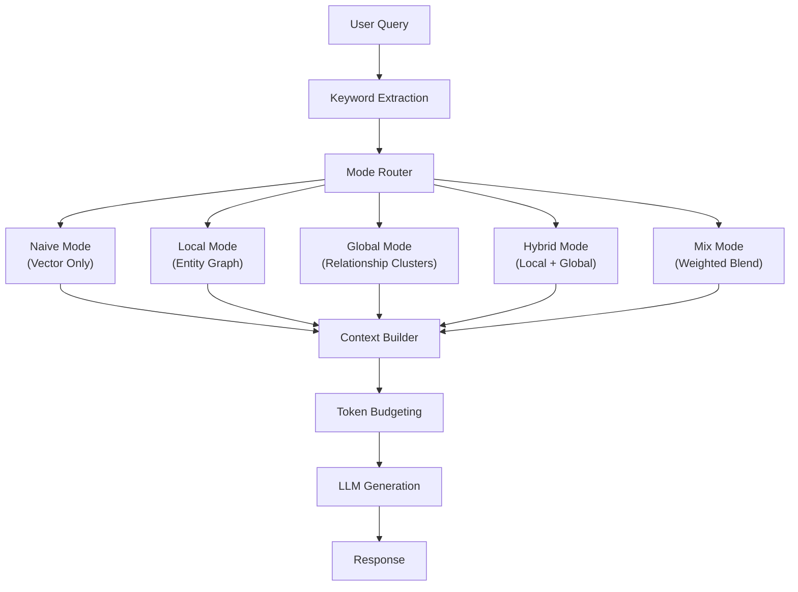

# Chapter 6: Multi-Mode Query Engine

> **"The right retrieval strategy depends on the question being asked."**

Not all questions are created equal. A factual lookup ("What is
Company X's headquarters?") requires a different retrieval strategy
than a thematic exploration ("What are the main financial patterns in
this dataset?"). Forcing every query through the same retrieval path
guarantees suboptimal results for most query types.

This chapter introduces EdgeQuake's multi-mode query engine, implemented
in the `edgequake-query` crate. Inspired by the LightRAG paper, the
engine extracts keywords from the query, routes to the appropriate
retrieval mode, and manages token budgets to fit context within the
LLM's window.

## Learning Objectives

After completing this chapter you will be able to:

1. **Explain LLM-based keyword extraction** -- how the engine separates
   high-level (thematic) from low-level (entity) keywords and why
   this separation matters for retrieval routing.
2. **Choose the right query mode** -- understand Naive, Local, Global,
   Hybrid, and Mix modes and when each is appropriate.
3. **Implement token budgeting** -- allocate context window space across
   entities, relationships, and chunks while preserving the most
   relevant information.

## Chapter Outline

| Section | Topic |
|---------|-------|
| [6.1 Keyword Extraction](ch06-01-keyword-extraction.md) | LLM-based keyword extraction, caching, the KeywordExtractor trait |
| [6.2 Query Modes](ch06-02-query-modes.md) | Naive, Local, Global, Hybrid, Mix -- when and why |
| [6.3 Token Budgeting](ch06-03-token-budgeting.md) | Fitting context within LLM limits, priority ordering, TruncationConfig |

## Prerequisites

- Chapter 4 (Knowledge Graphs) -- `GraphStorage`, graph traversal
- Chapter 5 (Ingestion) -- entity/relationship embeddings in vector store
- Understanding of LLM context windows and token limits

## Key Terminology

| Term | Definition |
|------|-----------|
| **High-level keywords** | Themes and concepts extracted from a query (e.g., "climate change", "financial risk") |
| **Low-level keywords** | Specific entities extracted from a query (e.g., "Gulf Stream", "CERN") |
| **Query mode** | The retrieval strategy used to build context for the LLM |
| **Token budget** | The maximum number of tokens allocated to context |
| **Context window** | The LLM's total capacity for input tokens |
| **Truncation** | Cutting context to fit within the token budget |

## The Query Engine Architecture

Each component is a separate module in the `edgequake-query` crate,
enabling independent testing and replacement. Let us examine each
stage in detail.

---

*Next: [6.1 Keyword Extraction](ch06-01-keyword-extraction.md)*

{{#quiz ../quizzes/ch06-query-engine.toml}}
