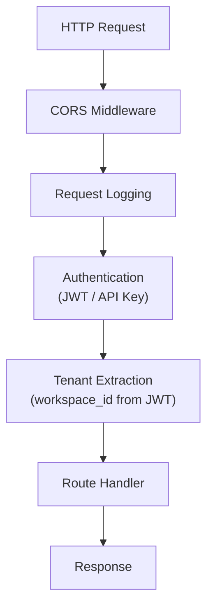

## 7.2 The Axum API Layer

The `edgequake-api` crate exposes the orchestrator as a REST API using
[Axum](https://github.com/tokio-rs/axum), a Rust web framework built
on top of `tokio` and `tower`. This section covers the route structure,
middleware stack, and streaming response patterns.

### Route Structure

The API follows RESTful conventions with versioned endpoints:

```text
/                           # Root
├── health                  # Health check (GET)
├── ready                   # Kubernetes readiness probe (GET)
├── live                    # Kubernetes liveness probe (GET)
├── ws/                     # WebSocket endpoints
│   └── pipeline/progress   # Real-time pipeline updates
└── api/v1/                 # Versioned API
    ├── documents/          # Document ingestion
    │   ├── POST            # Upload document
    │   ├── GET             # List documents
    │   └── {document_id}/  # CRUD per document
    ├── query/              # RAG queries
    │   ├── POST            # Execute query
    │   └── stream POST     # Stream query response
    ├── chat/               # Chat completions
    │   └── completions/    # POST + stream
    └── graph/              # Knowledge graph
        ├── GET             # Get graph data
        ├── nodes/{id}      # Node operations
        ├── entities/       # Entity CRUD
        └── relationships/  # Relationship CRUD
```

### Building the Router

Axum routes are defined in `edgequake-api::routes`:

```rust
use axum::{
    routing::{delete, get, post, put},
    Router,
};

pub fn create_router(state: AppState) -> Router {
    Router::new()
        // Health probes (no auth required)
        .route("/health", get(handlers::health_check))
        .route("/ready", get(handlers::readiness_check))
        .route("/live", get(handlers::liveness_check))

        // WebSocket for pipeline progress
        .route("/ws/pipeline/progress", get(handlers::ws_pipeline_progress))

        // API v1 (auth + tenant middleware applied)
        .nest("/api/v1", api_v1_routes())

        // Shared application state
        .with_state(state)
}

fn api_v1_routes() -> Router<AppState> {
    Router::new()
        // Documents
        .route("/documents", post(handlers::upload_document))
        .route("/documents", get(handlers::list_documents))
        .route("/documents/{document_id}", get(handlers::get_document))
        .route("/documents/{document_id}", delete(handlers::delete_document))

        // Query
        .route("/query", post(handlers::execute_query))
        .route("/query/stream", post(handlers::stream_query))

        // Graph
        .route("/graph", get(handlers::get_graph))
        .route("/graph/nodes/{node_id}", get(handlers::get_node))
        .route("/graph/entities", get(handlers::list_entities))
        .route("/graph/entities/{entity_name}", get(handlers::get_entity))
        .route("/graph/relationships", get(handlers::list_relationships))
}
```

### Application State

The `AppState` struct holds the orchestrator and shared resources:

```rust
use std::sync::Arc;

#[derive(Clone)]
pub struct AppState {
    /// The EdgeQuake orchestrator.
    pub orchestrator: Arc<EdgeQuake>,

    /// Provider resolver (for workspace-specific LLM/embedding selection).
    pub provider_resolver: Arc<WorkspaceProviderResolver>,

    /// Configuration.
    pub config: Arc<ApiConfig>,
}
```

Because `AppState` implements `Clone` (all fields are `Arc`), Axum can
share it across handler tasks safely.

### Route Handlers

A typical handler extracts state and request data, delegates to the
orchestrator, and returns a JSON response:

```rust
/// Execute a RAG query with multi-mode retrieval.
pub async fn execute_query(
    State(state): State<AppState>,
    tenant: TenantContext,  // Extracted by middleware
    Json(request): Json<QueryRequest>,
) -> ApiResult<Json<QueryResponse>> {
    // 1. Validate the query
    validate_query(&request.query)?;

    // 2. Parse query mode (default: hybrid)
    let mode = request.mode
        .as_deref()
        .and_then(QueryMode::parse)
        .unwrap_or_default();

    // 3. Build engine request with tenant context
    let engine_request = EngineQueryRequest {
        query: request.query.clone(),
        mode,
        top_k: request.top_k.unwrap_or(10),
        workspace_id: tenant.workspace_id,
        conversation_history: request.conversation_history.clone(),
        ..Default::default()
    };

    // 4. Execute via orchestrator
    let result = state.orchestrator
        .query(&engine_request)
        .await
        .map_err(ApiError::from)?;

    // 5. Build response with sources
    Ok(Json(QueryResponse {
        response: result.response,
        sources: result.sources,
        mode: mode.as_str().to_string(),
        stats: QueryStats {
            entities_used: result.context.entities.len(),
            relationships_used: result.context.relationships.len(),
            chunks_used: result.context.chunks.len(),
            total_tokens: result.token_usage.total,
        },
    }))
}
```

Note how the handler is thin -- it validates input, maps types, and
delegates to the orchestrator. Business logic stays in `edgequake-core`.

### The Middleware Stack

Requests pass through several middleware layers before reaching handlers:



#### Authentication Middleware

Extracts and validates JWT tokens or API keys:

```rust
pub struct AuthMiddleware;

impl AuthMiddleware {
    pub async fn authenticate(
        headers: &HeaderMap,
        state: &AppState,
    ) -> Result<AuthContext, ApiError> {
        // Try Bearer token first
        if let Some(token) = extract_bearer_token(headers) {
            return validate_jwt(token, &state.config.jwt_secret);
        }

        // Try API key
        if let Some(key) = headers.get("X-API-Key") {
            return validate_api_key(key, &state.kv_storage).await;
        }

        Err(ApiError::Unauthorized("No credentials provided".into()))
    }
}
```

#### Tenant Context Middleware

Extracts workspace and tenant information for multi-tenant isolation:

```rust
pub struct TenantContext {
    pub tenant_id: Option<uuid::Uuid>,
    pub workspace_id: Option<uuid::Uuid>,
    pub user_id: Option<uuid::Uuid>,
}
```

The tenant context flows from JWT claims into every handler, ensuring
that queries and ingestion are scoped to the correct workspace.

### Streaming Responses

For the query endpoint, EdgeQuake supports streaming -- sending LLM
output token-by-token as Server-Sent Events (SSE):

```rust
pub async fn stream_query(
    State(state): State<AppState>,
    tenant: TenantContext,
    Json(request): Json<QueryRequest>,
) -> Sse<impl Stream<Item = Result<Event, Infallible>>> {
    let (tx, rx) = tokio::sync::mpsc::channel(32);

    // Spawn the query execution in a background task
    tokio::spawn(async move {
        let result = state.orchestrator
            .query_streaming(&request, tx.clone())
            .await;

        if let Err(e) = result {
            let _ = tx.send(StreamEvent::Error(e.to_string())).await;
        }
        let _ = tx.send(StreamEvent::Done).await;
    });

    // Convert channel receiver to SSE stream
    Sse::new(ReceiverStream::new(rx).map(|event| {
        Ok(Event::default()
            .event(event.event_type())
            .data(event.to_json()))
    }))
}
```

The client receives events like:

```text
event: token
data: {"content": "Based"}

event: token
data: {"content": " on"}

event: token
data: {"content": " the"}

event: token
data: {"content": " knowledge"}

...

event: sources
data: {"sources": [{"chunk_id": "c1", "score": 0.92}]}

event: done
data: {}
```

This provides immediate feedback to the user instead of waiting for the
full response to generate.

### Document Upload Handler

The document ingestion endpoint shows the pipeline integration:

```rust
pub async fn upload_document(
    State(state): State<AppState>,
    tenant: TenantContext,
    Json(request): Json<UploadRequest>,
) -> ApiResult<Json<UploadResponse>> {
    // Validate document
    if request.content.is_empty() {
        return Err(ApiError::BadRequest("Empty content".into()));
    }

    // Run the ingestion pipeline
    let result = state.orchestrator.insert(
        &request.content,
        request.document_id.as_deref(),
    ).await?;

    Ok(Json(UploadResponse {
        document_id: result.document_id,
        chunks_created: result.chunks.len(),
        entities_extracted: result.entity_count(),
        relationships_extracted: result.relationship_count(),
        processing_time_ms: result.processing_time_ms,
    }))
}
```

### Error Handling

The API uses a unified error type that maps to HTTP status codes:

```rust
pub enum ApiError {
    BadRequest(String),          // 400
    Unauthorized(String),        // 401
    Forbidden(String),           // 403
    NotFound(String),            // 404
    Conflict(String),            // 409
    InternalError(String),       // 500
}

impl IntoResponse for ApiError {
    fn into_response(self) -> Response {
        let (status, message) = match &self {
            ApiError::BadRequest(msg) => (StatusCode::BAD_REQUEST, msg),
            ApiError::Unauthorized(msg) => (StatusCode::UNAUTHORIZED, msg),
            // ...
        };

        (status, Json(json!({"error": message}))).into_response()
    }
}
```

Storage errors, pipeline errors, and query errors all map through this
type, providing consistent JSON error responses to clients.

### Key Takeaways

- The API layer is a thin translation between HTTP and the orchestrator.
- Axum's `State`, `Json`, and extractor patterns keep handlers clean and
  testable.
- Middleware handles cross-cutting concerns: authentication, tenant
  extraction, logging.
- Streaming responses use SSE via Axum's `Sse` type with a `tokio`
  channel bridge.
- All endpoints follow RESTful conventions under `/api/v1/`.
- Unified error handling maps domain errors to appropriate HTTP status
  codes.

---

*Next: [7.3 End-to-End Request Flow](ch07-03-request-flow.md)*
