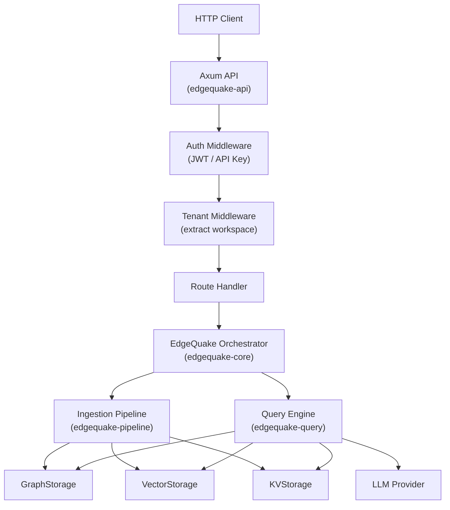

# Chapter 7: The EdgeQuake Orchestrator

> **"A good orchestrator makes complex systems feel simple."**

Over the past three chapters we have built up the individual components:
a knowledge graph with property-graph storage (Chapter 4), a multi-stage
ingestion pipeline (Chapter 5), and a multi-mode query engine
(Chapter 6). Individually, each is useful. Together, they form a
complete knowledge base system.

This chapter shows how `edgequake-core` ties everything together into a
single `EdgeQuake` orchestrator, how the `edgequake-api` crate exposes
it as a REST API with Axum, and how a query flows end-to-end from HTTP
request to LLM-generated response.

## Learning Objectives

After completing this chapter you will be able to:

1. **Describe the orchestrator's role** -- how `edgequake-core`
   coordinates storage, pipeline, and query engine into a unified API.
2. **Read Axum route handlers** -- understand the REST API design,
   middleware stack, and streaming response patterns.
3. **Trace an end-to-end request** -- follow a query from HTTP arrival
   through keyword extraction, graph traversal, context building, LLM
   generation, and response serialization.

## Chapter Outline

| Section | Topic |
|---------|-------|
| [7.1 Core Architecture](ch07-01-core-architecture.md) | The `EdgeQuake` struct, initialization, dependency wiring |
| [7.2 The Axum API Layer](ch07-02-axum-api.md) | REST endpoints, middleware, streaming responses |
| [7.3 End-to-End Request Flow](ch07-03-request-flow.md) | Full request trace with sequence diagram |

## Prerequisites

- Chapters 4-6 (all Part II concepts)
- Basic familiarity with Axum web framework (routes, extractors, state)
- Understanding of async Rust patterns (`Arc`, `tokio::spawn`)

## Key Terminology

| Term | Definition |
|------|-----------|
| **Orchestrator** | The central coordinator that wires together storage, pipeline, and query engine |
| **AppState** | Axum shared state containing the orchestrator and configuration |
| **Middleware** | Request/response processing layers (auth, logging, tenant context) |
| **Streaming response** | Sending LLM output token-by-token as server-sent events |

## The Big Picture

The orchestrator is the glue. It owns references to all storage backends
and providers, and exposes high-level operations (`insert`, `query`,
`delete`) that the API handlers call.

---

*Next: [7.1 Core Architecture](ch07-01-core-architecture.md)*

{{#quiz ../quizzes/ch07-orchestrator.toml}}
