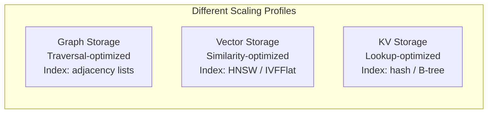

## 8.1 The Trait Abstraction

EdgeQuake's storage layer is built on three async traits defined in
`edgequake-storage::traits`. Each trait maps to a different data access pattern:

| Trait | Purpose | Data Model |
|-------|---------|------------|
| `GraphStorage` | Entity and relationship management | Property graph (nodes + edges with metadata) |
| `VectorStorage` | Embedding similarity search | Dense vectors with metadata |
| `KVStorage` | Document and metadata storage | Key-value with JSON values |

All three traits share a common design philosophy: they are **async**, **Send +
Sync** (safe to share across threads), and **namespace-aware** (supporting
tenant isolation).

### Why Three Separate Traits?

A natural question is: why not one `Storage` trait that handles everything? The
answer is that each data access pattern has fundamentally different scaling
characteristics and optimization strategies.



- **Graph queries** benefit from adjacency list indexes and graph-native engines
  (Apache AGE, Neptune).
- **Vector queries** require specialized indexes like HNSW (Hierarchical
  Navigable Small World) that are fundamentally different from B-trees.
- **KV queries** are simple point lookups and scans, best served by hash indexes
  or DynamoDB-style partition+sort keys.

By separating the traits, EdgeQuake allows you to pick the best backend for each
workload -- for example, Neptune for graphs, S3 Vectors for embeddings, and
DynamoDB for metadata -- without forcing all three through a single database.

### The GraphStorage Trait

`GraphStorage` models a property graph: nodes (entities) and edges
(relationships) with arbitrary JSON properties. Here is the core signature
(simplified for clarity):

```rust
use async_trait::async_trait;
use std::collections::HashMap;

#[async_trait]
pub trait GraphStorage: Send + Sync {
    /// Logical partition for tenant isolation.
    fn namespace(&self) -> &str;

    /// Create tables/indexes on first use.
    async fn initialize(&self) -> Result<()>;

    /// Flush pending writes.
    async fn finalize(&self) -> Result<()>;

    // --- Node operations ---
    async fn has_node(&self, node_id: &str) -> Result<bool>;
    async fn get_node(&self, node_id: &str) -> Result<Option<GraphNode>>;
    async fn upsert_node(
        &self,
        node_id: &str,
        properties: HashMap<String, serde_json::Value>,
    ) -> Result<()>;
    async fn delete_node(&self, node_id: &str) -> Result<()>;
    async fn node_degree(&self, node_id: &str) -> Result<usize>;
    async fn get_all_nodes(&self) -> Result<Vec<GraphNode>>;

    // --- Edge operations ---
    async fn has_edge(&self, source: &str, target: &str) -> Result<bool>;
    async fn get_edge(&self, source: &str, target: &str) -> Result<Option<GraphEdge>>;
    async fn upsert_edge(
        &self,
        source: &str,
        target: &str,
        properties: HashMap<String, serde_json::Value>,
    ) -> Result<()>;
    async fn delete_edge(&self, source: &str, target: &str) -> Result<()>;
    async fn get_node_edges(&self, node_id: &str) -> Result<Vec<GraphEdge>>;

    // --- Graph queries ---
    async fn get_knowledge_graph(
        &self,
        start_node: &str,
        max_depth: usize,
        max_nodes: usize,
    ) -> Result<KnowledgeGraph>;
    async fn get_neighbors(&self, node_id: &str, depth: usize) -> Result<Vec<GraphNode>>;
    async fn search_nodes(
        &self,
        query: &str,
        limit: usize,
        entity_type: Option<&str>,
        tenant_id: Option<&str>,
        workspace_id: Option<&str>,
    ) -> Result<Vec<(GraphNode, usize)>>;

    // --- Utility ---
    async fn node_count(&self) -> Result<usize>;
    async fn edge_count(&self) -> Result<usize>;
    async fn clear(&self) -> Result<()>;
}
```

Notice several design choices:

1. **`&self` not `&mut self`** -- all methods take shared references. Interior
   mutability (via `RwLock` or database connections) handles concurrent writes.
   This is essential for sharing storage across Axum handlers.

2. **Batch methods with default implementations** -- methods like
   `upsert_nodes_batch` have a default that calls the single-item method in a
   loop. Backends override these for performance (e.g., PostgreSQL uses
   `UNNEST` for bulk inserts).

3. **`Result<T>` uses `StorageError`** -- the `Result` type alias is
   `std::result::Result<T, StorageError>`, keeping error handling uniform
   across all backends.

### The VectorStorage Trait

`VectorStorage` handles dense vector embeddings and similarity search:

```rust
#[async_trait]
pub trait VectorStorage: Send + Sync {
    fn namespace(&self) -> &str;
    fn dimension(&self) -> usize;

    async fn initialize(&self) -> Result<()>;
    async fn finalize(&self) -> Result<()>;

    /// Similarity search: returns top_k most similar vectors.
    async fn query(
        &self,
        query_embedding: &[f32],
        top_k: usize,
        filter_ids: Option<&[String]>,
    ) -> Result<Vec<VectorSearchResult>>;

    /// Batch upsert: (id, embedding, metadata) tuples.
    async fn upsert(
        &self,
        data: &[(String, Vec<f32>, serde_json::Value)],
    ) -> Result<()>;

    async fn delete(&self, ids: &[String]) -> Result<()>;
    async fn delete_entity(&self, entity_name: &str) -> Result<()>;
    async fn delete_entity_relations(&self, entity_name: &str) -> Result<()>;
    async fn get_by_id(&self, id: &str) -> Result<Option<Vec<f32>>>;
    async fn count(&self) -> Result<usize>;
    async fn clear(&self) -> Result<()>;
}
```

The `dimension()` method is critical: it lets callers validate embedding
dimensions before attempting an upsert. A dimension mismatch (e.g., sending
a 768-dimensional embedding to a 1536-dimensional index) is a common source of
silent failures.

### The KVStorage Trait

`KVStorage` provides key-value access to JSON documents:

```rust
#[async_trait]
pub trait KVStorage: Send + Sync {
    fn namespace(&self) -> &str;

    async fn initialize(&self) -> Result<()>;
    async fn finalize(&self) -> Result<()>;

    async fn get_by_id(&self, id: &str) -> Result<Option<serde_json::Value>>;
    async fn get_by_ids(&self, ids: &[String]) -> Result<Vec<serde_json::Value>>;
    async fn filter_keys(&self, keys: HashSet<String>) -> Result<HashSet<String>>;
    async fn upsert(&self, data: &[(String, serde_json::Value)]) -> Result<()>;
    async fn delete(&self, ids: &[String]) -> Result<()>;
    async fn count(&self) -> Result<usize>;
    async fn keys(&self) -> Result<Vec<String>>;
    async fn clear(&self) -> Result<()>;

    /// Atomic compare-and-swap for status transitions.
    async fn transition_if_status(
        &self,
        key: &str,
        expected_status: &str,
        new_status: &str,
    ) -> Result<bool>;
}
```

The `transition_if_status` method deserves special attention. It provides atomic
compare-and-swap semantics for document status transitions, preventing TOCTOU
(time-of-check-time-of-use) race conditions. Without this, concurrent requests
could corrupt document state during re-ingestion.

### Using Trait Objects in Business Logic

The power of these traits becomes clear when you look at how EdgeQuake's
orchestrator consumes them:

```rust
use std::sync::Arc;
use edgequake_storage::{GraphStorage, VectorStorage, KVStorage};

pub struct EdgeQuakeCore {
    graph: Arc<dyn GraphStorage>,
    vectors: Arc<dyn VectorStorage>,
    kv: Arc<dyn KVStorage>,
}

impl EdgeQuakeCore {
    pub fn new(
        graph: Arc<dyn GraphStorage>,
        vectors: Arc<dyn VectorStorage>,
        kv: Arc<dyn KVStorage>,
    ) -> Self {
        Self { graph, vectors, kv }
    }

    pub async fn query(&self, question: &str) -> Result<String> {
        // This code works identically whether the backends are
        // in-memory, PostgreSQL, or AWS services.
        let embedding = self.embed(question).await?;
        let similar = self.vectors.query(&embedding, 10, None).await?;
        let graph_context = self.graph
            .get_knowledge_graph(&similar[0].id, 2, 50)
            .await?;
        // ... generate answer using LLM ...
        Ok(answer)
    }
}
```

The `Arc<dyn GraphStorage>` pattern gives us dynamic dispatch with shared
ownership. Because all trait methods take `&self`, multiple Axum request
handlers can query the same storage concurrently without locking.

### The StorageError Type

All three traits share a single error type with variants covering common
failure modes:

```rust
#[derive(Error, Debug)]
pub enum StorageError {
    #[error("Connection failed: {0}")]
    Connection(String),

    #[error("Record not found: {0}")]
    NotFound(String),

    #[error("Record already exists: {0}")]
    AlreadyExists(String),

    #[error("Serialization error: {0}")]
    Serialization(String),

    #[error("Database error: {0}")]
    Database(String),

    #[error("Storage not initialized")]
    NotInitialized,

    // ... additional variants
}
```

AWS-specific errors (`AwsStorageError`) automatically convert to
`StorageError` via a `From` implementation, so callers never need to know
which backend produced the error.

### Re-exports for Ergonomics

The `edgequake-storage` crate re-exports all traits and key types from
its root:

```rust
// In your code, import directly:
use edgequake_storage::{
    GraphStorage, VectorStorage, KVStorage,
    GraphNode, GraphEdge, KnowledgeGraph,
    VectorSearchResult,
    MemoryGraphStorage, MemoryVectorStorage, MemoryKVStorage,
    StorageError,
};
```

This flat re-export pattern means you rarely need to dig into
`edgequake_storage::traits::graph` directly.

### Summary

The trait abstraction layer is the foundation of EdgeQuake's storage
architecture. Three traits (`GraphStorage`, `VectorStorage`, `KVStorage`)
define the contract; concrete adapters fulfil it. Business logic depends only
on the traits, enabling backend swapping without code changes.

---

*Next: [8.2 Memory and PostgreSQL Adapters](ch08-02-memory-postgres.md)*
