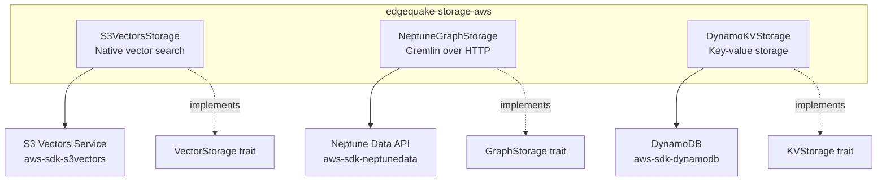
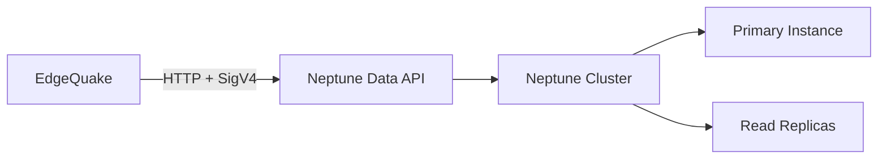

## 8.3 AWS Storage Adapters

The `edgequake-storage-aws` crate provides storage adapters backed by fully
managed AWS services. These adapters implement the same `GraphStorage`,
`VectorStorage`, and `KVStorage` traits as the memory and PostgreSQL
implementations, but trade self-managed infrastructure for pay-per-use cloud
services.

### Adapter Overview

| Adapter | Trait | AWS Service | Feature Flag |
|---------|-------|-------------|--------------|
| `S3VectorsStorage` | `VectorStorage` | S3 Vectors | `s3vectors` |
| `NeptuneGraphStorage` | `GraphStorage` | Amazon Neptune | `neptune` |
| `DynamoKVStorage` | `KVStorage` | Amazon DynamoDB | `dynamodb` |



### Constructor Patterns: `new()` vs `new_with_client()`

Every AWS adapter provides two constructors. This dual pattern solves a real
problem: in production you might want the adapter to manage its own AWS client,
but in testing or batch processing you need to inject a pre-configured client
(e.g., with a custom endpoint URL for LocalStack).

#### Pattern 1: `new(config)` -- Self-Managed Client

```rust
use edgequake_storage_aws::{S3VectorsConfig, S3VectorsStorage};

let config = S3VectorsConfig {
    vector_bucket_name: "my-vectors".to_string(),
    index_name: "embeddings".to_string(),
    dimension: 1536,
};

// Loads AWS credentials from environment, creates its own client.
let storage = S3VectorsStorage::new(config).await?;
```

This constructor calls `aws_config::load_defaults()` internally, creating an
AWS SDK client configured from environment variables (`AWS_REGION`,
`AWS_ACCESS_KEY_ID`, etc.) or instance profiles.

#### Pattern 2: `new_with_client(config, client)` -- Injected Client

```rust
use aws_sdk_s3vectors::Client;
use edgequake_storage_aws::{S3VectorsConfig, S3VectorsStorage};

// Caller controls the client configuration.
let aws_config = aws_config::from_env()
    .endpoint_url("http://localhost:4566")  // LocalStack
    .load()
    .await;
let client = Client::new(&aws_config);

let config = S3VectorsConfig {
    vector_bucket_name: "test-vectors".to_string(),
    index_name: "test-index".to_string(),
    dimension: 1536,
};

// No async -- client is already configured.
let storage = S3VectorsStorage::new_with_client(config, client);
```

Notice that `new_with_client` is **synchronous** (not async) because it does
not need to load AWS configuration. This is a deliberate design choice that
makes testing simpler.

### S3VectorsStorage: Native Vector Search

`S3VectorsStorage` uses the AWS S3 Vectors service via `aws-sdk-s3vectors`.
Unlike the older `S3VectorStorage` (which stored vectors as JSON files and
managed its own HNSW index), S3 Vectors provides native cosine similarity
search with automatic indexing.

#### Configuration

```rust
#[derive(Debug, Clone)]
pub struct S3VectorsConfig {
    /// Name of the S3 vector bucket.
    pub vector_bucket_name: String,
    /// Name of the vector index within the bucket.
    pub index_name: String,
    /// Expected embedding dimension (e.g., 1536 for text-embedding-3-small).
    pub dimension: usize,
}
```

Environment variables used in practice:

| Variable | Purpose | Example |
|----------|---------|---------|
| `VECTOR_BUCKET` | Vector bucket name | `edgequake-vectors-prod` |
| `VECTOR_INDEX` | Index name within the bucket | `embeddings-1536` |

#### Score Conversion

S3 Vectors returns **cosine distance** (lower = more similar), but EdgeQuake's
`VectorSearchResult` uses **similarity score** (higher = more similar). The
conversion is straightforward:

```rust
// S3 Vectors cosine distance: 0.0 = identical, 2.0 = opposite
// EdgeQuake similarity score: 1.0 = identical, -1.0 = opposite
let score = 1.0 - distance;
```

This conversion happens inside the `query()` implementation, so callers
always see normalized similarity scores regardless of which backend is active.

#### Batch Operations

S3 Vectors has API limits that the adapter handles transparently:

| Operation | Batch Limit | Adapter Behavior |
|-----------|-------------|------------------|
| `put_vectors` | 500 per call | Auto-chunks into 500-item batches |
| `get_vectors` | 100 per call | Auto-chunks into 100-item batches |
| `delete_vectors` | 500 per call | Auto-chunks into 500-item batches |
| `query_vectors` | top_k max 100 | Requests up to 100, truncates to requested top_k |

```rust
// The adapter transparently batches 2000 vectors into 4 API calls.
let data: Vec<(String, Vec<f32>, serde_json::Value)> = generate_embeddings();
storage.upsert(&data).await?; // Handles chunking internally
```

### NeptuneGraphStorage: Managed Graph Database

`NeptuneGraphStorage` executes Gremlin queries over HTTP using the Neptune
Data API (`aws-sdk-neptunedata`). This replaces the older WebSocket-based
approach that could not use IAM authentication.



#### Configuration

```rust
let config = NeptuneConfig::new(
    "my-cluster.cluster-xxx.us-east-1.neptune.amazonaws.com:8182"
)
.with_namespace("workspace-1")
.with_timeout(30);

let storage = NeptuneGraphStorage::new(config).await?;
```

#### Gremlin Query Translation

Each `GraphStorage` trait method translates to Gremlin traversals. For example,
`upsert_node` generates:

```groovy
g.V('ALICE').has('namespace', 'workspace-1')
  .fold()
  .coalesce(
    unfold().sideEffect(__.properties().drop())
      .property('entity_type', 'PERSON')
      .property('namespace', 'workspace-1'),
    addV('Entity').property(id, 'ALICE')
      .property('entity_type', 'PERSON')
      .property('namespace', 'workspace-1')
  )
```

The `coalesce` pattern implements upsert: if the vertex exists, update its
properties; otherwise create it. The `sideEffect(__.properties().drop())`
ensures stale properties are removed before setting new ones.

#### GraphSON Unwrapping

The Neptune Data API returns results in GraphSON format, where every value is
wrapped in `{"@type": "g:Int64", "@value": 42}` envelopes. The adapter
includes a recursive `unwrap_graphson()` function that strips these wrappers
to produce clean JSON:

```rust
// Before unwrapping:
{"@type": "g:Map", "@value": [
    {"@type": "g:T", "@value": "id"}, "ALICE",
    {"@type": "g:T", "@value": "label"}, "Entity"
]}

// After unwrapping:
{"id": "ALICE", "label": "Entity"}
```

### DynamoKVStorage: Serverless Key-Value

`DynamoKVStorage` implements `KVStorage` using DynamoDB's on-demand mode for
true pay-per-request pricing.

#### Table Design

```text
Primary Key:
  Partition Key: namespace (String)  -- tenant isolation
  Sort Key:      id (String)         -- record identifier

Attributes:
  data       (String)  -- JSON-serialized value
  status     (String)  -- optional status tracking
  created_at (Number)  -- epoch timestamp
  updated_at (Number)  -- epoch timestamp
```

#### Configuration

```rust
use edgequake_storage_aws::{DynamoKVConfig, DynamoKVStorage};

let config = DynamoKVConfig::new("edgequake-kv", "documents")
    .with_on_demand(true)
    .with_pitr(true);  // Point-in-time recovery

// Self-managed client:
let storage = DynamoKVStorage::new(config.clone()).await?;

// Or inject a client:
let client = aws_sdk_dynamodb::Client::new(&aws_config);
let storage = DynamoKVStorage::new_with_client(config, client);
```

#### Atomic Status Transitions

The `transition_if_status` implementation uses DynamoDB's conditional update
expression for atomic compare-and-swap:

```rust
self.client
    .update_item()
    .table_name(&self.config.table_name)
    .set_key(Some(key))
    .update_expression("SET #status = :new_status, updated_at = :ts")
    .condition_expression("#status = :expected_status")
    .expression_attribute_names("#status", "status")
    .expression_attribute_values(":expected_status", /* ... */)
    .expression_attribute_values(":new_status", /* ... */)
    .send()
    .await;
```

If the condition fails (status has changed), DynamoDB returns a
`ConditionalCheckFailedException`, which the adapter catches and converts to
`Ok(false)`.

### AWS SDK Re-exports

The `edgequake-storage-aws` crate re-exports AWS SDK crates for convenience,
so downstream code does not need to add them as direct dependencies:

```rust
// These are re-exported from edgequake-storage-aws:
use edgequake_storage_aws::aws_sdk_s3;
use edgequake_storage_aws::aws_sdk_s3vectors;
use edgequake_storage_aws::aws_sdk_dynamodb;
use edgequake_storage_aws::aws_config;
```

This avoids version conflicts between the SDK version used by the adapter and
the version used by your application code.

### Error Handling: AwsStorageError

AWS adapters use their own error type that automatically converts to
`StorageError`:

```rust
#[derive(Error, Debug)]
pub enum AwsStorageError {
    #[error("S3 error: {0}")]
    S3Error(String),
    #[error("S3 Vectors error: {0}")]
    S3VectorsError(String),
    #[error("DynamoDB error: {0}")]
    DynamoDbError(String),
    #[error("Neptune error: {0}")]
    NeptuneError(String),
    // ...
}

// Automatic conversion:
impl From<AwsStorageError> for StorageError { /* ... */ }
```

Each adapter also includes a helper function (e.g., `s3v_err`, `neptune_err`,
`dynamo_err`) that extracts meaningful error messages from AWS SDK errors,
which often return unhelpful "service error" strings from their `Display`
implementation.

### Feature Flags

```toml
[features]
default = ["s3vectors", "neptune", "dynamodb"]
s3vectors = ["aws-sdk-s3vectors"]
neptune = ["aws-sdk-neptunedata"]
dynamodb = ["aws-sdk-dynamodb"]
athena = ["aws-sdk-athena"]
full = ["s3vectors", "neptune", "dynamodb", "athena"]
```

Enable only the adapters you need to keep compile times and binary sizes
reasonable. A Lambda function that only uses S3 Vectors and DynamoDB can
skip the Neptune dependency entirely.

### Summary

The AWS adapters implement the same storage traits as the memory and PostgreSQL
adapters, but target fully managed services. The dual constructor pattern
(`new` vs `new_with_client`) supports both production and testing scenarios.
S3 Vectors provides native vector search, Neptune handles graph traversal via
Gremlin, and DynamoDB offers serverless key-value storage with atomic
compare-and-swap. AWS SDK re-exports and automatic error conversion keep the
integration ergonomic.

---

*Next: [Chapter 9: Local Development Environment](ch09-local-dev.md)*
