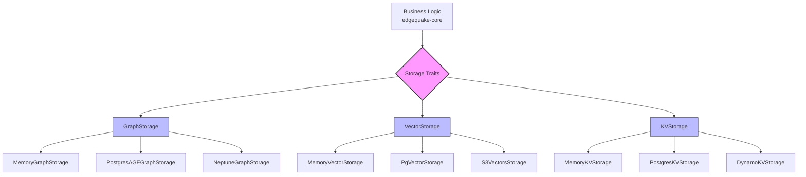

# Chapter 8: Pluggable Storage Backends

> **"Write the business logic once, swap the storage underneath."**

A production knowledge base must support multiple deployment scenarios: in-memory
storage for unit tests, PostgreSQL for local development, and fully managed AWS
services for cloud deployment. EdgeQuake solves this with trait-based storage
abstraction -- three async traits that define **what** storage does, without
dictating **how** it is implemented.

In this chapter we dissect the storage layer of `edgequake-storage` and
`edgequake-storage-aws`. You will learn how Rust traits enable a clean adapter
pattern, examine the concrete implementations, and understand the constructor
conventions that make dependency injection ergonomic.

## Learning Objectives

After completing this chapter you will be able to:

1. **Explain the three storage traits** -- `GraphStorage`, `VectorStorage`, and
   `KVStorage` -- and articulate why each exists as a separate abstraction.
2. **Implement the adapter pattern** -- write code that accepts trait objects
   and works with any backend.
3. **Compare memory vs PostgreSQL adapters** -- know when each is appropriate
   and how connection pooling works with `sqlx`.
4. **Use the AWS adapters** -- construct `S3VectorsStorage`,
   `NeptuneGraphStorage`, and `DynamoKVStorage` with both `new()` and
   `new_with_client()` patterns.

## Chapter Outline

| Section | Topic |
|---------|-------|
| [8.1 The Trait Abstraction](ch08-01-trait-abstraction.md) | GraphStorage, VectorStorage, KVStorage trait signatures and design rationale |
| [8.2 Memory and PostgreSQL Adapters](ch08-02-memory-postgres.md) | MemoryGraphStorage for testing, PostgresAGEStorage for production |
| [8.3 AWS Storage Adapters](ch08-03-aws-adapters.md) | S3VectorsStorage, NeptuneGraphStorage, DynamoKVStorage |

## Key Terminology

| Term | Definition |
|------|-----------|
| **Storage trait** | An async Rust trait defining storage operations (graph, vector, or KV) |
| **Adapter** | A concrete struct that implements a storage trait for a specific backend |
| **Namespace** | A logical partition key for tenant isolation within a single storage backend |
| **`async_trait`** | A macro that enables async methods in traits (required until Rust stabilizes AFIT) |
| **Connection pool** | A pre-allocated set of database connections shared across requests |

## Architecture Overview

The key insight is that `edgequake-core` never imports a specific adapter. It
receives trait objects (`Arc<dyn GraphStorage>`, `Arc<dyn VectorStorage>`,
`Arc<dyn KVStorage>`) and interacts purely through the trait interface. This is
the adapter pattern applied to async Rust.

Let us begin by examining the trait definitions themselves.

---

*Next: [8.1 The Trait Abstraction](ch08-01-trait-abstraction.md)*

{{#quiz ../quizzes/ch08-storage-backends.toml}}
