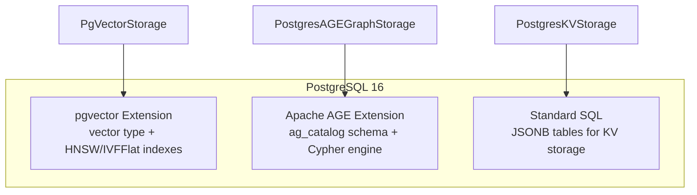
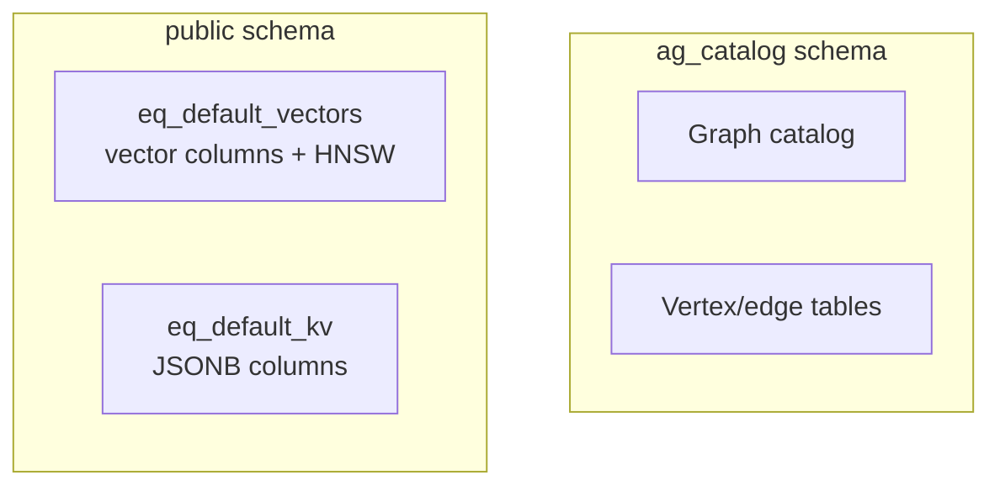

## 9.2 PostgreSQL with pgvector and AGE

One of EdgeQuake's most practical design decisions is running both vector search
and graph queries inside a single PostgreSQL instance. This section explains
how pgvector and Apache AGE coexist, what SQL schemas they create, and how
EdgeQuake's storage adapters interact with each.

### Two Extensions, One Database



Each extension operates in its own namespace:

| Extension | Schema | Key Objects |
|-----------|--------|-------------|
| pgvector | `public` | `vector` type, `<=>` operator, `hnsw`/`ivfflat` index types |
| Apache AGE | `ag_catalog` | `cypher()` function, `agtype` type, graph catalog |
| Standard | `public` | KV tables, migration tracking |

### pgvector: Vector Similarity Search

pgvector adds a `vector(N)` column type to PostgreSQL, where `N` is the
dimensionality. It also provides specialized index types for approximate
nearest neighbor (ANN) search.

#### Creating the Extension

```sql
CREATE EXTENSION IF NOT EXISTS vector;
```

This is a one-line operation that makes the `vector` type available across
all databases in the instance.

#### Table Schema for Vectors

EdgeQuake's `PgVectorStorage` creates tables via SQLx migrations:

```sql
CREATE TABLE IF NOT EXISTS eq_default_vectors (
    id TEXT PRIMARY KEY,
    embedding vector(1536) NOT NULL,
    metadata JSONB DEFAULT '{}',
    workspace_id UUID,
    created_at TIMESTAMPTZ DEFAULT NOW(),
    updated_at TIMESTAMPTZ DEFAULT NOW()
);
```

The `vector(1536)` column stores 1536-dimensional float32 embeddings. The
dimension is fixed at table creation time -- attempting to insert a vector
with a different dimension raises a runtime error.

#### HNSW Index

EdgeQuake defaults to HNSW (Hierarchical Navigable Small World) indexing,
which provides excellent recall with sub-linear query time:

```sql
CREATE INDEX IF NOT EXISTS eq_default_vectors_hnsw_idx
    ON eq_default_vectors
    USING hnsw (embedding vector_cosine_ops)
    WITH (m = 16, ef_construction = 64);
```

| Parameter | Default | Effect |
|-----------|---------|--------|
| `m` | 16 | Maximum connections per node. Higher = better recall, more memory |
| `ef_construction` | 64 | Build-time search width. Higher = better index quality, slower build |

At query time, pgvector uses a separate `ef_search` parameter (default 40)
that controls recall vs speed tradeoff:

```sql
-- Increase for better recall at the cost of latency
SET hnsw.ef_search = 100;
```

#### Similarity Queries

pgvector provides three distance operators:

| Operator | Distance | Use Case |
|----------|----------|----------|
| `<=>` | Cosine | Normalized embeddings (most common) |
| `<->` | L2 (Euclidean) | Raw embeddings |
| `<#>` | Inner product | When embeddings are not normalized |

EdgeQuake uses cosine distance exclusively:

```sql
SELECT id,
       1 - (embedding <=> $1::vector) AS score,
       metadata
FROM eq_default_vectors
WHERE workspace_id = $2
ORDER BY embedding <=> $1::vector
LIMIT $3;
```

The `1 - distance` conversion produces a similarity score where 1.0 is
identical and -1.0 is maximally dissimilar.

### Apache AGE: Graph Queries

Apache AGE (A Graph Extension) adds graph database capabilities to PostgreSQL,
supporting the Cypher query language used by Neo4j.

#### Creating the Extension

```sql
CREATE EXTENSION IF NOT EXISTS age CASCADE;

-- AGE requires its catalog in the search path
SET search_path = ag_catalog, "$user", public;
```

The `CASCADE` option installs any dependencies AGE needs. After installation,
the `ag_catalog` schema must be added to the search path for Cypher functions
to be accessible.

#### Graph Structure

AGE stores graphs in a catalog. Each graph has a name and contains vertices
and edges:

```sql
-- Create a graph namespace
SELECT create_graph('edgequake');

-- Query the graph using Cypher
SELECT * FROM cypher('edgequake', $$
    MATCH (n:Entity {id: 'ALICE'})-[r]->(m:Entity)
    RETURN n.id, type(r), m.id
$$) as (source agtype, rel_type agtype, target agtype);
```

#### Vertex and Edge Storage

Under the hood, AGE stores vertices and edges in PostgreSQL tables within the
`ag_catalog` schema:

```text
ag_catalog.edgequake._ag_label_vertex  -- All vertices
ag_catalog.edgequake._ag_label_edge    -- All edges
ag_catalog.edgequake."Entity"          -- Vertex label table
ag_catalog.edgequake."relates_to"      -- Edge label table
```

EdgeQuake uses a single vertex label (`Entity`) and a single edge label
(`relates_to`), with `entity_type` and `relationship_type` stored as
properties. This simplifies the schema while maintaining full expressiveness
through the property graph model.

#### Cypher Query Examples

Creating entities and relationships:

```sql
-- Upsert a node
SELECT * FROM cypher('edgequake', $$
    MERGE (n:Entity {id: 'ALICE'})
    SET n.entity_type = 'PERSON',
        n.description = 'A researcher studying graph databases',
        n.namespace = 'workspace-1'
    RETURN n
$$) as (v agtype);

-- Create a relationship
SELECT * FROM cypher('edgequake', $$
    MATCH (a:Entity {id: 'ALICE'}), (b:Entity {id: 'GRAPH_DB_LAB'})
    MERGE (a)-[r:relates_to]->(b)
    SET r.description = 'works at',
        r.weight = 0.9,
        r.namespace = 'workspace-1'
    RETURN r
$$) as (e agtype);
```

Graph traversal:

```sql
-- Find 2-hop neighbors
SELECT * FROM cypher('edgequake', $$
    MATCH (start:Entity {id: 'ALICE'})-[*1..2]-(neighbor:Entity)
    WHERE neighbor.namespace = 'workspace-1'
    RETURN DISTINCT neighbor.id, neighbor.entity_type
$$) as (id agtype, entity_type agtype);
```

### How Both Extensions Coexist

pgvector and Apache AGE are independent PostgreSQL extensions that share the
same database instance without interference:



Key points about coexistence:

1. **No schema conflicts** -- pgvector operates in the `public` schema while
   AGE uses `ag_catalog`.
2. **Shared connection pool** -- both extensions use the same `sqlx::PgPool`.
   EdgeQuake's `PostgresPool` sets the search path to include both schemas.
3. **Independent indexes** -- HNSW indexes on vector columns do not interfere
   with AGE's graph indexes.
4. **Single backup** -- a standard `pg_dump` captures everything: vectors,
   graph data, and KV tables.

#### The Search Path

The search path must include `ag_catalog` for Cypher queries to work:

```sql
SET search_path = ag_catalog, "$user", public;
```

EdgeQuake's `PostgresPool` sets this during initialization:

```rust
async fn setup_extensions(&self, pool: &PgPool) -> Result<()> {
    sqlx::query("CREATE EXTENSION IF NOT EXISTS vector")
        .execute(pool).await?;

    match sqlx::query("CREATE EXTENSION IF NOT EXISTS age CASCADE")
        .execute(pool).await
    {
        Ok(_) => {
            sqlx::query("SET search_path = ag_catalog, \"$user\", public")
                .execute(pool).await?;
        }
        Err(e) => {
            tracing::warn!("Apache AGE not available: {}", e);
            // Graceful degradation -- graph features use fallback
        }
    }
    Ok(())
}
```

### Schema Setup SQL

Here is the complete initialization script that runs on first database creation:

```sql
-- 1. Set default search path for the application user
ALTER USER edgequake SET search_path TO public;

-- 2. UUID generation (used for workspace IDs)
CREATE EXTENSION IF NOT EXISTS "uuid-ossp";

-- 3. Vector similarity search
CREATE EXTENSION IF NOT EXISTS "vector";

-- 4. Graph database (optional -- graceful fallback if unavailable)
DO $$
BEGIN
    CREATE EXTENSION IF NOT EXISTS "age" CASCADE;
    RAISE NOTICE 'Apache AGE extension enabled successfully';
EXCEPTION WHEN OTHERS THEN
    RAISE NOTICE 'Apache AGE not available: %. Using fallback.', SQLERRM;
END $$;
```

Table creation is handled separately by SQLx migrations (not by this init
script), ensuring schema versioning and rollback support.

### Verifying the Setup

After starting the Docker Compose stack, verify both extensions are working:

```bash
# Connect to the database
docker exec -it edgequake-postgres psql -U edgequake -d edgequake

# Check installed extensions
edgequake=# \dx
                     List of installed extensions
   Name   | Version |   Schema   |         Description
----------+---------+------------+-----------------------------
 age      | 1.6.0   | ag_catalog | Apache AGE graph extension
 plpgsql  | 1.0     | pg_catalog | PL/pgSQL procedural language
 uuid-ossp| 1.1     | public     | UUID generation functions
 vector   | 0.7.4   | public     | vector data type and ivfflat
                                    and hnsw access methods

# Test pgvector
edgequake=# SELECT '[1,2,3]'::vector <=> '[1,2,4]'::vector AS distance;
     distance
------------------
 0.00853986601633

# Test Apache AGE
edgequake=# SELECT create_graph('test_graph');
edgequake=# SELECT * FROM cypher('test_graph', $$ CREATE (n:Test {name: 'hello'}) RETURN n $$) as (v agtype);
```

### Summary

pgvector and Apache AGE coexist harmoniously in a single PostgreSQL instance.
pgvector provides the `vector` type and HNSW indexes for similarity search in
the `public` schema, while AGE adds Cypher-based graph queries in the
`ag_catalog` schema. EdgeQuake's connection pool initialization enables both
extensions and sets the correct search path. A single `pg_dump` backs up
everything, and a single connection pool serves all storage adapters.

---

*Next: [9.3 LLM Provider Configuration](ch09-03-llm-providers.md)*
