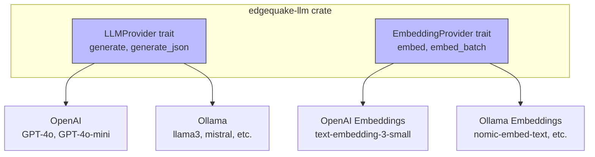

## 9.3 LLM Provider Configuration

EdgeQuake's pipeline requires two LLM capabilities: **text generation** (for
entity extraction, query keyword expansion, and answer synthesis) and
**embedding** (for converting text chunks and entities into vectors). Both
capabilities are abstracted behind provider traits, allowing you to switch
between cloud APIs and local models without changing application code.

### Provider Architecture



### Environment Variables

All LLM configuration is driven by environment variables. No code changes are
needed to switch providers:

| Variable | Default | Purpose |
|----------|---------|---------|
| `OPENAI_API_KEY` | (required for OpenAI) | OpenAI API authentication |
| `OPENAI_MODEL` | `gpt-4o-mini` | Model for text generation |
| `OPENAI_EMBEDDING_MODEL` | `text-embedding-3-small` | Model for embeddings |
| `OLLAMA_HOST` | `http://localhost:11434` | Ollama server URL |
| `OLLAMA_MODEL` | `llama3` | Default Ollama model for generation |
| `OLLAMA_EMBEDDING_MODEL` | `nomic-embed-text` | Default Ollama embedding model |
| `LLM_PROVIDER` | `openai` | Which provider to use: `openai` or `ollama` |
| `EMBEDDING_PROVIDER` | `openai` | Which embedding provider: `openai` or `ollama` |

### OpenAI Configuration

OpenAI is the default provider and requires only an API key:

```bash
export OPENAI_API_KEY="sk-proj-..."
export LLM_PROVIDER="openai"
export EMBEDDING_PROVIDER="openai"
```

#### Model Selection

Choose models based on your quality/cost/speed requirements:

| Model | Use Case | Cost | Speed |
|-------|----------|------|-------|
| `gpt-4o` | High-quality extraction | $$$ | Medium |
| `gpt-4o-mini` | Default extraction | $ | Fast |
| `text-embedding-3-small` | Embeddings (1536 dim) | $ | Fast |
| `text-embedding-3-large` | High-quality embeddings (3072 dim) | $$ | Medium |

```bash
# Use GPT-4o for better extraction quality
export OPENAI_MODEL="gpt-4o"

# Use the small embedding model (best cost/quality tradeoff)
export OPENAI_EMBEDDING_MODEL="text-embedding-3-small"
```

#### Embedding Dimensions

The embedding dimension must match your vector storage configuration. If you
change embedding models, you must also update the storage dimension:

```rust
// text-embedding-3-small produces 1536-dimensional vectors
let vectors = PgVectorStorage::new(pool.clone(), 1536);

// text-embedding-3-large produces 3072-dimensional vectors
// let vectors = PgVectorStorage::new(pool.clone(), 3072);
```

A dimension mismatch will produce a runtime error when the first vector is
inserted.

### Ollama for Local Development

Ollama runs open-source LLMs locally, enabling fully offline development.
This is invaluable when you want to iterate on pipeline logic without incurring
API costs or needing an internet connection.

#### Installing Ollama

```bash
# macOS
brew install ollama

# Linux
curl -fsSL https://ollama.com/install.sh | sh

# Start the server
ollama serve
```

#### Pulling Models

```bash
# Text generation model
ollama pull llama3

# Embedding model
ollama pull nomic-embed-text

# Verify models are available
ollama list
```

#### Configuring EdgeQuake for Ollama

```bash
export LLM_PROVIDER="ollama"
export EMBEDDING_PROVIDER="ollama"
export OLLAMA_HOST="http://localhost:11434"
export OLLAMA_MODEL="llama3"
export OLLAMA_EMBEDDING_MODEL="nomic-embed-text"
```

#### Dimension Considerations

Different embedding models produce different vector dimensions. When switching
between OpenAI and Ollama embeddings, the dimensions will differ:

| Model | Provider | Dimension |
|-------|----------|-----------|
| `text-embedding-3-small` | OpenAI | 1536 |
| `text-embedding-3-large` | OpenAI | 3072 |
| `nomic-embed-text` | Ollama | 768 |
| `mxbai-embed-large` | Ollama | 1024 |

If you switch embedding providers, you must either:
1. Rebuild your vector index with the new dimension, or
2. Use a separate vector table per provider.

In practice, most teams use OpenAI embeddings for production and only switch
to Ollama for pipeline development where embedding quality is not critical.

### Runtime Provider Switching

EdgeQuake's provider construction happens at application startup based on
environment variables:

```rust
use edgequake_llm::{LLMProvider, EmbeddingProvider};

/// Build LLM provider from environment configuration.
fn build_llm_provider() -> Box<dyn LLMProvider> {
    let provider = std::env::var("LLM_PROVIDER")
        .unwrap_or_else(|_| "openai".to_string());

    match provider.as_str() {
        "ollama" => {
            let host = std::env::var("OLLAMA_HOST")
                .unwrap_or_else(|_| "http://localhost:11434".to_string());
            let model = std::env::var("OLLAMA_MODEL")
                .unwrap_or_else(|_| "llama3".to_string());
            Box::new(OllamaProvider::new(&host, &model))
        }
        _ => {
            let api_key = std::env::var("OPENAI_API_KEY")
                .expect("OPENAI_API_KEY required for OpenAI provider");
            let model = std::env::var("OPENAI_MODEL")
                .unwrap_or_else(|_| "gpt-4o-mini".to_string());
            Box::new(OpenAIProvider::new(&api_key, &model))
        }
    }
}

/// Build embedding provider from environment configuration.
fn build_embedding_provider() -> Box<dyn EmbeddingProvider> {
    let provider = std::env::var("EMBEDDING_PROVIDER")
        .unwrap_or_else(|_| "openai".to_string());

    match provider.as_str() {
        "ollama" => {
            let host = std::env::var("OLLAMA_HOST")
                .unwrap_or_else(|_| "http://localhost:11434".to_string());
            let model = std::env::var("OLLAMA_EMBEDDING_MODEL")
                .unwrap_or_else(|_| "nomic-embed-text".to_string());
            Box::new(OllamaEmbeddings::new(&host, &model))
        }
        _ => {
            let api_key = std::env::var("OPENAI_API_KEY")
                .expect("OPENAI_API_KEY required for OpenAI provider");
            let model = std::env::var("OPENAI_EMBEDDING_MODEL")
                .unwrap_or_else(|_| "text-embedding-3-small".to_string());
            Box::new(OpenAIEmbeddings::new(&api_key, &model))
        }
    }
}
```

### Mixed Provider Configurations

You can mix providers -- for example, using OpenAI for embeddings (better
quality) and Ollama for text generation (faster iteration, no cost):

```bash
# Use Ollama for generation, OpenAI for embeddings
export LLM_PROVIDER="ollama"
export EMBEDDING_PROVIDER="openai"
export OPENAI_API_KEY="sk-..."
export OLLAMA_HOST="http://localhost:11434"
```

This is a useful configuration during development: entity extraction quality
from local models is acceptable for testing pipeline logic, while embedding
quality from OpenAI ensures your vector search results are meaningful.

### Testing Without Any LLM

For unit tests that only exercise storage or query logic, you can use mock
providers that return deterministic results:

```rust
#[cfg(test)]
mod tests {
    use super::*;

    struct MockEmbedding;

    #[async_trait]
    impl EmbeddingProvider for MockEmbedding {
        async fn embed(&self, _text: &str) -> Result<Vec<f32>> {
            // Return a deterministic 1536-dim vector
            Ok(vec![0.1; 1536])
        }

        async fn embed_batch(&self, texts: &[String]) -> Result<Vec<Vec<f32>>> {
            Ok(texts.iter().map(|_| vec![0.1; 1536]).collect())
        }

        fn dimension(&self) -> usize {
            1536
        }
    }
}
```

### Complete Local Dev .env Example

Here is a complete `.env` file for local development with Docker Compose:

```bash
# Database
POSTGRES_PASSWORD=edgequake_secret
POSTGRES_PORT=5432

# API
EDGEQUAKE_PORT=8080

# LLM Providers
LLM_PROVIDER=openai
EMBEDDING_PROVIDER=openai
OPENAI_API_KEY=sk-proj-your-key-here
OPENAI_MODEL=gpt-4o-mini
OPENAI_EMBEDDING_MODEL=text-embedding-3-small

# For fully offline development, uncomment:
# LLM_PROVIDER=ollama
# EMBEDDING_PROVIDER=ollama
# OLLAMA_HOST=http://host.docker.internal:11434
# OLLAMA_MODEL=llama3
# OLLAMA_EMBEDDING_MODEL=nomic-embed-text

# Logging
RUST_LOG=info,edgequake=debug
```

Note the `host.docker.internal` hostname when running Ollama on the host while
EdgeQuake runs in Docker -- this is Docker's special DNS name for reaching the
host machine from inside a container.

### Summary

EdgeQuake supports both cloud (OpenAI) and local (Ollama) LLM providers,
configured entirely through environment variables. The provider traits abstract
away the implementation details, and runtime switching requires no code changes.
Mixed configurations (e.g., Ollama for generation, OpenAI for embeddings) are
supported. For testing, mock providers eliminate the LLM dependency entirely.

---

*Next: [Chapter 10: Cloud Deployment with AWS](ch10-aws-deployment.md)*
