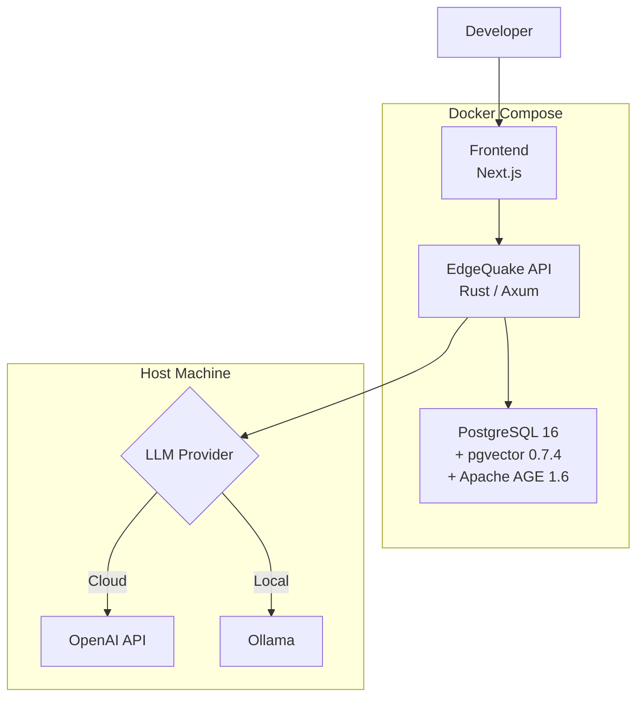

# Chapter 9: Local Development Environment

> **"If it takes more than `make dev` to get started, your developer experience
> needs work."**

A production knowledge base system has real dependencies: a database with graph
and vector extensions, an LLM provider for extraction and embedding, and
configuration glue to wire it all together. Getting these running locally --
reproducibly, on every developer's machine -- is a prerequisite for effective
development.

In this chapter we build a complete local development environment for EdgeQuake.
You will set up a Docker Compose stack with PostgreSQL (including pgvector and
Apache AGE), configure the database extensions for graph and vector operations,
and wire up LLM providers for both cloud and fully-local inference.

## Learning Objectives

After completing this chapter you will be able to:

1. **Launch the full local stack** with a single `docker compose up` command
   that provides PostgreSQL with pgvector and Apache AGE extensions.
2. **Understand the PostgreSQL extension architecture** -- how pgvector and
   Apache AGE coexist in a single instance and what SQL schemas each creates.
3. **Configure LLM providers** -- switch between OpenAI API and local Ollama
   models using environment variables, enabling offline development.
4. **Run integration tests** against the local stack with realistic storage
   backends.

## Chapter Outline

| Section | Topic |
|---------|-------|
| [9.1 Docker Compose Stack](ch09-01-docker-compose.md) | Service definitions, volumes, health checks, networking |
| [9.2 PostgreSQL with pgvector and AGE](ch09-02-pgvector-age.md) | Extension installation, schema setup, coexistence |
| [9.3 LLM Provider Configuration](ch09-03-llm-providers.md) | OpenAI, Ollama, environment variables, runtime switching |

## Key Terminology

| Term | Definition |
|------|-----------|
| **pgvector** | PostgreSQL extension adding vector column types and similarity search indexes |
| **Apache AGE** | PostgreSQL extension adding graph database capabilities with Cypher query support |
| **Docker Compose** | Tool for defining multi-container Docker applications via YAML |
| **Health check** | A periodic probe that verifies a container is ready to accept connections |
| **Ollama** | Local inference server that runs open-source LLMs on consumer hardware |

## The Local Development Stack



The stack has three containers (PostgreSQL, the EdgeQuake API, and the
frontend) plus an LLM provider that runs on the host. This separation keeps
the Docker configuration simple while giving you flexibility to choose between
cloud and local inference.

## Environment Variables

Before we dive into the Docker Compose file, here are the environment variables
that configure the stack:

| Variable | Default | Purpose |
|----------|---------|---------|
| `POSTGRES_PASSWORD` | `edgequake_secret` | Database password |
| `POSTGRES_PORT` | `5432` | Host-mapped PostgreSQL port |
| `EDGEQUAKE_PORT` | `8080` | Host-mapped API port |
| `FRONTEND_PORT` | `3000` | Host-mapped frontend port |
| `OPENAI_API_KEY` | (none) | OpenAI API key for embeddings and extraction |
| `OLLAMA_HOST` | `http://localhost:11434` | Ollama server URL for local models |
| `DATABASE_URL` | (auto) | Full PostgreSQL connection string |

Create a `.env` file at the project root to override defaults:

```bash
# .env
POSTGRES_PASSWORD=my_secure_password
OPENAI_API_KEY=sk-...
```

Let us start by examining the Docker Compose configuration.

---

*Next: [9.1 Docker Compose Stack](ch09-01-docker-compose.md)*

{{#quiz ../quizzes/ch09-local-dev.toml}}
