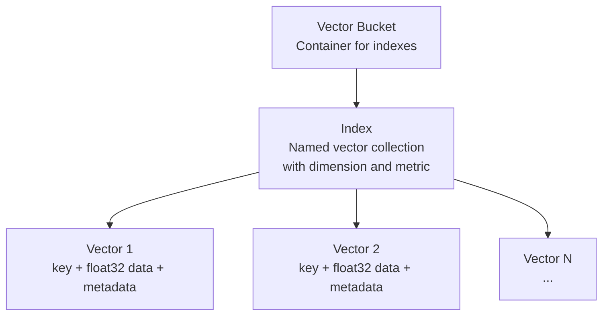
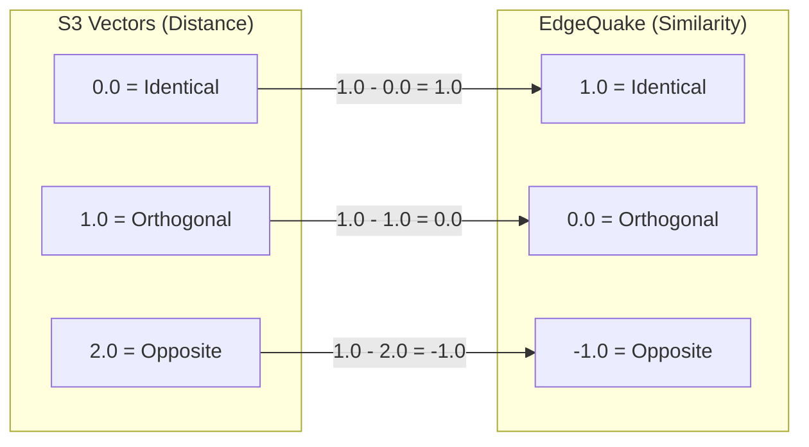

## 10.1 S3 Vectors for Embeddings

S3 Vectors is an AWS service that provides native vector storage and similarity
search built on top of Amazon S3. Unlike pgvector (which adds vector support to
PostgreSQL) or standalone vector databases (Pinecone, Weaviate), S3 Vectors is
a first-party AWS service that integrates directly with the S3 ecosystem --
IAM permissions, encryption, and billing.

### Concepts

S3 Vectors introduces two new resources:



| Resource | Description | Analogy |
|----------|-------------|---------|
| **Vector Bucket** | A container that holds one or more indexes | Like an S3 bucket |
| **Index** | A named collection of vectors with fixed dimension and distance metric | Like a pgvector table |
| **Vector** | A single entry: key + float32 array + metadata | Like a row in pgvector |

### Configuration in EdgeQuake

EdgeQuake's `S3VectorsConfig` maps directly to these concepts:

```rust
#[derive(Debug, Clone)]
pub struct S3VectorsConfig {
    /// Name of the S3 vector bucket.
    pub vector_bucket_name: String,
    /// Name of the vector index within the bucket.
    pub index_name: String,
    /// Expected embedding dimension (e.g., 1536).
    pub dimension: usize,
}
```

In practice, these are configured from environment variables:

```bash
export VECTOR_BUCKET="edgequake-vectors-prod"
export VECTOR_INDEX="embeddings-1536"
```

### Initialization: Bucket and Index Creation

When `S3VectorsStorage::initialize()` is called, it verifies (or creates) both
the vector bucket and the index:

```rust
async fn initialize(&self) -> Result<()> {
    // 1. Check if bucket exists, create if not
    match self.client
        .get_vector_bucket()
        .vector_bucket_name(&self.config.vector_bucket_name)
        .send().await
    {
        Ok(_) => { /* bucket exists */ }
        Err(_) => {
            self.client
                .create_vector_bucket()
                .vector_bucket_name(&self.config.vector_bucket_name)
                .send().await?;
        }
    }

    // 2. Check if index exists, create if not
    match self.client
        .get_index()
        .vector_bucket_name(&self.config.vector_bucket_name)
        .index_name(&self.config.index_name)
        .send().await
    {
        Ok(_) => { /* index exists */ }
        Err(_) => {
            self.client
                .create_index()
                .vector_bucket_name(&self.config.vector_bucket_name)
                .index_name(&self.config.index_name)
                .data_type(DataType::Float32)
                .dimension(self.config.dimension as i32)
                .distance_metric(DistanceMetric::Cosine)
                .send().await?;
        }
    }

    Ok(())
}
```

Key parameters for index creation:

| Parameter | Value | Rationale |
|-----------|-------|-----------|
| `data_type` | `Float32` | Standard precision for embeddings |
| `dimension` | 1536 (configurable) | Matches `text-embedding-3-small` |
| `distance_metric` | `Cosine` | Standard for normalized text embeddings |

### Cosine Distance to Similarity Score

S3 Vectors returns **cosine distance** in query results: 0.0 means identical
vectors, 2.0 means opposite vectors. EdgeQuake's `VectorSearchResult` uses
**similarity score**: 1.0 means identical, -1.0 means opposite.

The conversion is:

```
similarity_score = 1.0 - cosine_distance
```



In the query implementation:

```rust
let score = v.distance()
    .map(|d| 1.0 - d as f32)
    .unwrap_or(0.0);
```

This conversion happens transparently inside the adapter. Callers always
receive similarity scores, regardless of which vector backend is active.

### Querying Vectors

The `query()` method wraps the S3 Vectors `query_vectors` API:

```rust
async fn query(
    &self,
    query_embedding: &[f32],
    top_k: usize,
    filter_ids: Option<&[String]>,
) -> Result<Vec<VectorSearchResult>> {
    let resp = self.client
        .query_vectors()
        .vector_bucket_name(&self.config.vector_bucket_name)
        .index_name(&self.config.index_name)
        .query_vector(VectorData::Float32(query_embedding.to_vec()))
        .top_k(top_k.min(100) as i32)  // API limit: max 100
        .return_distance(true)
        .return_metadata(true)
        .send()
        .await?;

    let results = resp.vectors().iter().filter_map(|v| {
        let key = v.key().to_string();
        let score = v.distance().map(|d| 1.0 - d).unwrap_or(0.0);
        let metadata = v.metadata()
            .map(|d| Self::document_to_json(d))
            .unwrap_or(serde_json::Value::Null);

        Some(VectorSearchResult { id: key, score, metadata })
    }).collect();

    Ok(results)
}
```

Note the `top_k.min(100)` -- S3 Vectors limits each query to 100 results. If
you need more, you must implement pagination or post-filtering.

### Metadata Conversion

S3 Vectors uses `aws_smithy_types::Document` for metadata, while EdgeQuake
uses `serde_json::Value`. The adapter includes bidirectional conversion:

```rust
// serde_json::Value -> aws_smithy_types::Document
fn json_to_document(value: &serde_json::Value) -> Document {
    match value {
        serde_json::Value::Null => Document::Null,
        serde_json::Value::Bool(b) => Document::Bool(*b),
        serde_json::Value::String(s) => Document::String(s.clone()),
        serde_json::Value::Number(n) => {
            if let Some(i) = n.as_i64() {
                Document::Number(aws_smithy_types::Number::NegInt(i))
            } else if let Some(f) = n.as_f64() {
                Document::Number(aws_smithy_types::Number::Float(f))
            } else {
                Document::Null
            }
        }
        serde_json::Value::Array(arr) => {
            Document::Array(arr.iter().map(Self::json_to_document).collect())
        }
        serde_json::Value::Object(obj) => {
            let map = obj.iter()
                .map(|(k, v)| (k.clone(), Self::json_to_document(v)))
                .collect();
            Document::Object(map)
        }
    }
}
```

This conversion is necessary because the AWS SDK uses its own type system
rather than serde's. The round-trip is lossless for all JSON-compatible values.

### CDK Constructs for S3 Vectors

S3 Vectors resources are provisioned using CDK's L1 (CloudFormation) constructs:

```typescript
import { CfnVectorBucket, CfnIndex } from 'aws-cdk-lib/aws-s3vectors';

// Create the vector bucket
const vectorBucket = new CfnVectorBucket(this, 'VectorBucket', {
  vectorBucketName: `${props.prefix}-vectors`,
});

// Create the index within the bucket
const vectorIndex = new CfnIndex(this, 'VectorIndex', {
  vectorBucketName: vectorBucket.vectorBucketName!,
  indexName: 'embeddings',
  dimension: 1536,
  distanceMetric: 'cosine',
  dataType: 'float32',
});

// Ensure index is created after bucket
vectorIndex.addDependency(vectorBucket);
```

The CDK constructs map directly to the CloudFormation resources:

| CDK Construct | CloudFormation Type | Purpose |
|---------------|-------------------|---------|
| `CfnVectorBucket` | `AWS::S3Vectors::VectorBucket` | Container for indexes |
| `CfnIndex` | `AWS::S3Vectors::Index` | Vector collection with dimension and metric |

### Clearing and Rebuilding

The fastest way to clear all vectors is to delete and recreate the index:

```rust
async fn clear(&self) -> Result<()> {
    // Delete the index
    self.client
        .delete_index()
        .vector_bucket_name(&self.config.vector_bucket_name)
        .index_name(&self.config.index_name)
        .send().await?;

    // Recreate with same configuration
    self.client
        .create_index()
        .vector_bucket_name(&self.config.vector_bucket_name)
        .index_name(&self.config.index_name)
        .data_type(DataType::Float32)
        .dimension(self.config.dimension as i32)
        .distance_metric(DistanceMetric::Cosine)
        .send().await?;

    Ok(())
}
```

This is significantly faster than iterating through all vectors and deleting
them individually, especially for indexes with millions of entries.

### Entity Deletion

Deleting an entity's vectors requires querying by metadata filter, then
deleting the matching keys:

```rust
async fn delete_entity(&self, entity_name: &str) -> Result<()> {
    let filter = Document::Object(HashMap::from([
        ("type".to_string(), Document::String("entity".to_string())),
        ("entity_name".to_string(), Document::String(entity_name.to_string())),
    ]));

    let resp = self.client
        .query_vectors()
        .vector_bucket_name(&self.config.vector_bucket_name)
        .index_name(&self.config.index_name)
        .query_vector(VectorData::Float32(vec![0.0; self.config.dimension]))
        .top_k(10_000)
        .filter(filter)
        .return_metadata(false)
        .send().await?;

    let keys: Vec<String> = resp.vectors().iter()
        .map(|v| v.key().to_string())
        .collect();

    if !keys.is_empty() {
        self.delete(&keys).await?;
    }

    Ok(())
}
```

Note the dummy zero vector used as the query -- we are filtering purely by
metadata, but the API requires a query vector.

### Summary

S3 Vectors provides native vector storage and similarity search as an AWS
service. EdgeQuake's `S3VectorsStorage` adapter handles bucket/index creation,
cosine distance-to-similarity conversion, batch operation chunking, and
metadata format conversion. CDK constructs (`CfnVectorBucket` and `CfnIndex`)
provision the infrastructure, and the clear operation uses index
delete-and-recreate for speed.

---

*Next: [10.2 Neptune and DynamoDB](ch10-02-neptune-dynamodb.md)*
