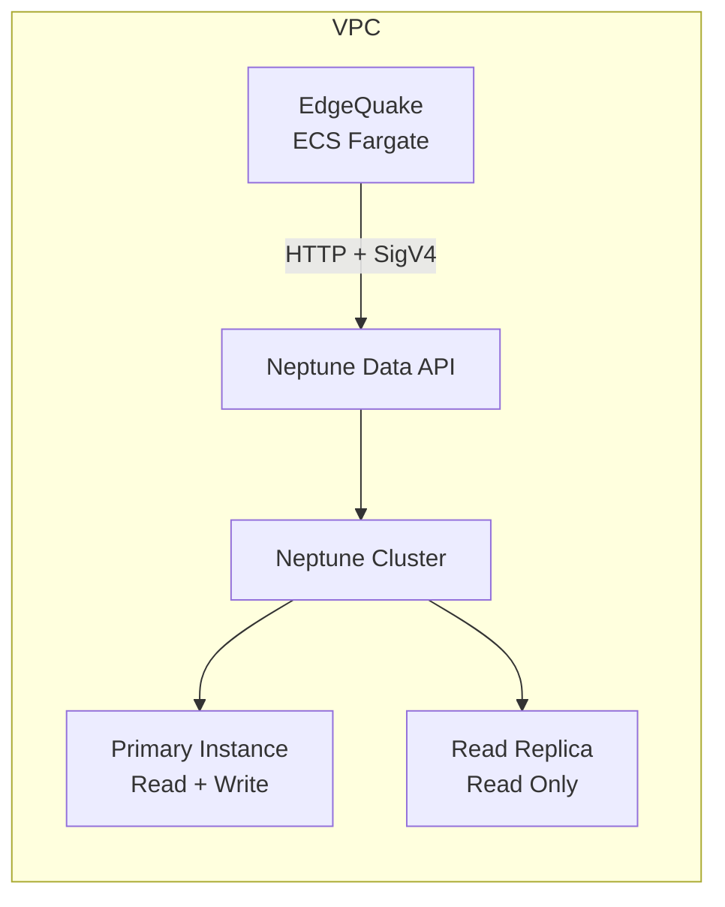
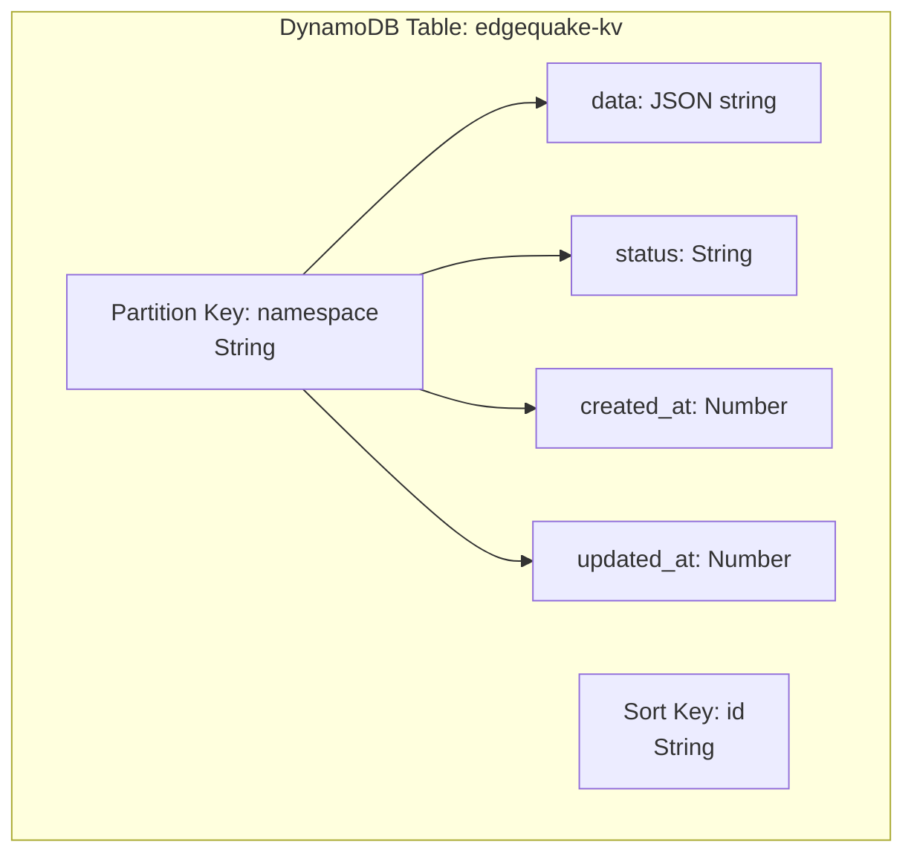
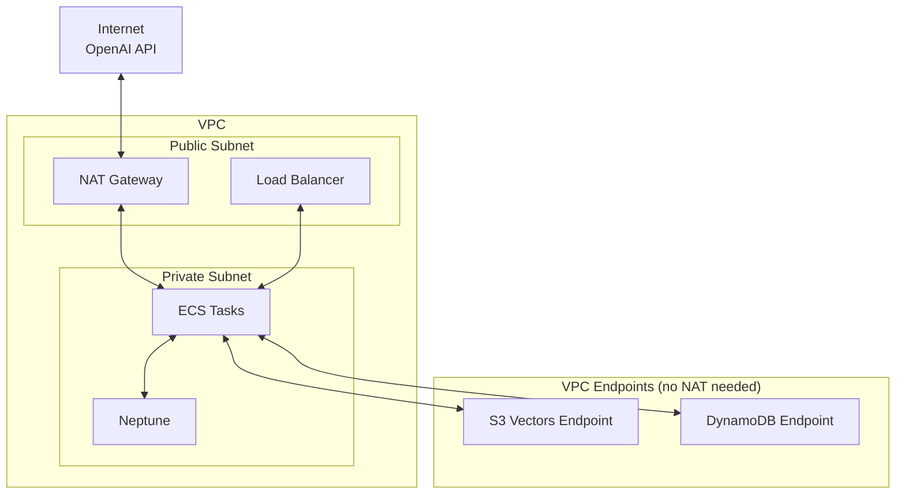

## 10.2 Neptune and DynamoDB

While S3 Vectors handles embedding storage, the knowledge graph and metadata
layers need their own managed services. Amazon Neptune provides a fully managed
graph database for entity and relationship storage, and DynamoDB provides
serverless key-value storage for document metadata and pipeline state.

### Amazon Neptune for Graph Storage

Neptune is AWS's managed graph database supporting two query languages: Gremlin
(Apache TinkerPop) and SPARQL. EdgeQuake uses Gremlin because it maps naturally
to the property graph model used by `GraphStorage`.

#### Architecture



EdgeQuake communicates with Neptune via the **Neptune Data API**, which accepts
Gremlin queries over HTTP with IAM SigV4 authentication. This replaces the
older WebSocket-based approach, which could not use IAM auth and required
managing long-lived connections.

#### NeptuneConfig

```rust
use edgequake_storage_aws::{NeptuneConfig, NeptuneGraphStorage};

let config = NeptuneConfig::new(
    "my-cluster.cluster-xxx.us-east-1.neptune.amazonaws.com:8182"
)
.with_namespace("workspace-1")
.with_iam_auth(true)
.with_timeout(30);

let storage = NeptuneGraphStorage::new(config).await?;
storage.initialize().await?;
```

| Config Field | Default | Purpose |
|-------------|---------|---------|
| `endpoint` | (required) | Neptune cluster endpoint (host:port) |
| `namespace` | `"default"` | Workspace isolation key |
| `use_iam_auth` | `true` | IAM SigV4 authentication |
| `timeout_secs` | 30 | Query timeout |
| `use_ssl` | `true` | TLS encryption |

#### Gremlin Query Execution

All GraphStorage methods translate to Gremlin traversals executed via the
Neptune Data API:

```rust
async fn execute(&self, query: &str) -> Result<Vec<JsonValue>> {
    let result = self.client
        .execute_gremlin_query()
        .gremlin_query(query)
        .send()
        .await
        .map_err(neptune_err)?;

    // Parse GraphSON response and unwrap typed values
    let json = document_to_json(result.result().unwrap());
    let unwrapped = unwrap_graphson(&json);
    // Extract data array from response envelope
    // ...
}
```

The Neptune Data API returns results in GraphSON format with type wrappers.
The `unwrap_graphson()` function strips these to produce clean JSON.

#### Namespace Isolation

Neptune does not natively support multi-tenancy. EdgeQuake achieves tenant
isolation by adding a `namespace` property to every vertex and filtering all
queries by it:

```groovy
// Every query includes namespace filtering
g.V('ALICE').has('namespace', 'workspace-1').elementMap()

// Every mutation sets the namespace
g.addV('Entity').property(id, 'ALICE')
    .property('namespace', 'workspace-1')
    .property('entity_type', 'PERSON')
```

This is a property-level isolation strategy. For stronger isolation, you
could use separate Neptune clusters per tenant, though this increases cost.

#### Gremlin Injection Prevention

User-provided values are escaped before interpolation into Gremlin strings:

```rust
fn gremlin_escape(s: &str) -> String {
    s.replace('\\', "\\\\").replace('\'', "\\'")
}

// Usage:
let query = format!(
    "g.V('{}').has('namespace', '{}').elementMap()",
    gremlin_escape(node_id),
    self.config.namespace
);
```

This prevents injection attacks where a malicious entity name like
`ALICE').drop().V('` could destroy graph data.

#### IAM Policies for Neptune

The EdgeQuake service needs the following IAM permissions:

```json
{
    "Version": "2012-10-17",
    "Statement": [
        {
            "Effect": "Allow",
            "Action": [
                "neptune-db:ReadDataViaQuery",
                "neptune-db:WriteDataViaQuery",
                "neptune-db:DeleteDataViaQuery",
                "neptune-db:GetQueryStatus",
                "neptune-db:CancelQuery"
            ],
            "Resource": "arn:aws:neptune-db:us-east-1:123456789:cluster-xxx/*"
        }
    ]
}
```

These are Neptune-specific IAM actions (not EC2 or RDS actions). The resource
ARN must match your Neptune cluster.

### DynamoDB for Key-Value Storage

DynamoDB implements the `KVStorage` trait with single-digit millisecond latency
and fully serverless operation. It stores document metadata, chunk content,
cache entries, and pipeline state.

#### Table Design



| Attribute | Type | Role |
|-----------|------|------|
| `namespace` | String | Partition key (tenant/workspace isolation) |
| `id` | String | Sort key (record identifier) |
| `data` | String | JSON-serialized value |
| `status` | String | Optional status tracking |
| `created_at` | Number | Epoch timestamp |
| `updated_at` | Number | Epoch timestamp |

The composite primary key (`namespace` + `id`) provides natural multi-tenancy:
each workspace's data is in its own partition, and queries within a namespace
are efficient due to DynamoDB's partition-based architecture.

#### DynamoKVConfig

```rust
use edgequake_storage_aws::{DynamoKVConfig, DynamoKVStorage};

let config = DynamoKVConfig::new("edgequake-kv", "documents")
    .with_on_demand(true)     // Pay-per-request billing
    .with_pitr(true);         // Point-in-time recovery

let storage = DynamoKVStorage::new(config).await?;
storage.initialize().await?;
```

| Config Field | Default | Purpose |
|-------------|---------|---------|
| `table_name` | (required) | DynamoDB table name |
| `namespace` | (required) | Partition key value |
| `on_demand` | `true` | Pay-per-request billing |
| `enable_pitr` | `true` | Continuous backup |
| `region` | (from env) | AWS region |

#### Batch Operations

DynamoDB has strict batch operation limits that the adapter handles
transparently:

| Operation | API Limit | Adapter Behavior |
|-----------|-----------|------------------|
| `BatchWriteItem` (upsert) | 25 items per call | Auto-chunks |
| `BatchWriteItem` (delete) | 25 items per call | Auto-chunks |
| `BatchGetItem` | 100 items per call | Auto-chunks |

```rust
async fn upsert(&self, data: &[(String, JsonValue)]) -> Result<()> {
    for chunk in data.chunks(25) {
        let mut write_requests = Vec::new();
        for (id, value) in chunk {
            let json_str = serde_json::to_string(value)?;
            let mut item = HashMap::new();
            item.insert("namespace".into(), AttributeValue::S(self.config.namespace.clone()));
            item.insert("id".into(), AttributeValue::S(id.clone()));
            item.insert("data".into(), AttributeValue::S(json_str));
            item.insert("updated_at".into(), AttributeValue::N(timestamp().to_string()));
            // ... build PutRequest and WriteRequest
            write_requests.push(write_request);
        }
        self.client.batch_write_item()
            .request_items(&self.config.table_name, write_requests)
            .send().await?;
    }
    Ok(())
}
```

#### Atomic Status Transitions

DynamoDB's conditional expressions provide native compare-and-swap semantics,
which EdgeQuake uses for the `transition_if_status` trait method:

```rust
self.client
    .update_item()
    .table_name(&self.config.table_name)
    .set_key(Some(key))
    .update_expression("SET #status = :new_status, updated_at = :ts")
    .condition_expression("#status = :expected_status")
    .expression_attribute_names("#status", "status")
    .expression_attribute_values(":expected_status", AttributeValue::S(expected.into()))
    .expression_attribute_values(":new_status", AttributeValue::S(new_status.into()))
    .send()
    .await;
```

If the condition fails (status has changed since we checked), DynamoDB returns
`ConditionalCheckFailedException`, which the adapter catches and converts to
`Ok(false)`.

#### IAM Policies for DynamoDB

```json
{
    "Version": "2012-10-17",
    "Statement": [
        {
            "Effect": "Allow",
            "Action": [
                "dynamodb:GetItem",
                "dynamodb:BatchGetItem",
                "dynamodb:Query",
                "dynamodb:PutItem",
                "dynamodb:BatchWriteItem",
                "dynamodb:UpdateItem",
                "dynamodb:DeleteItem",
                "dynamodb:DescribeTable"
            ],
            "Resource": "arn:aws:dynamodb:us-east-1:123456789:table/edgequake-kv"
        }
    ]
}
```

### VPC Networking Considerations

Neptune requires VPC placement -- it cannot be accessed from the public
internet. This has implications for your architecture:



Key networking decisions:

| Resource | Network Access | Cost Implication |
|----------|---------------|-----------------|
| Neptune | Private subnet only | VPC is free; NAT Gateway needed for internet |
| DynamoDB | VPC endpoint (Gateway) | Free -- no NAT costs |
| S3 Vectors | VPC endpoint (Gateway) | Free -- no NAT costs |
| OpenAI API | NAT Gateway to internet | ~$0.045/hr + data transfer |

The NAT Gateway is the most expensive networking component. Minimize its usage
by routing AWS service traffic through VPC endpoints.

### Putting It Together

Here is how you would construct all three AWS storage backends for a production
deployment:

```rust
use edgequake_storage_aws::{
    S3VectorsConfig, S3VectorsStorage,
    NeptuneConfig, NeptuneGraphStorage,
    DynamoKVConfig, DynamoKVStorage,
};
use std::sync::Arc;

async fn build_aws_storage() -> Result<(
    Arc<dyn GraphStorage>,
    Arc<dyn VectorStorage>,
    Arc<dyn KVStorage>,
)> {
    // Graph storage: Neptune
    let graph_config = NeptuneConfig::new(
        std::env::var("NEPTUNE_ENDPOINT")?
    ).with_namespace(&std::env::var("WORKSPACE_ID")?);
    let graph = Arc::new(NeptuneGraphStorage::new(graph_config).await?);

    // Vector storage: S3 Vectors
    let vector_config = S3VectorsConfig {
        vector_bucket_name: std::env::var("VECTOR_BUCKET")?,
        index_name: std::env::var("VECTOR_INDEX")?,
        dimension: 1536,
    };
    let vectors = Arc::new(S3VectorsStorage::new(vector_config).await?);

    // KV storage: DynamoDB
    let kv_config = DynamoKVConfig::new(
        std::env::var("DYNAMODB_TABLE")?,
        std::env::var("WORKSPACE_ID")?,
    );
    let kv = Arc::new(DynamoKVStorage::new(kv_config).await?);

    // Initialize all backends
    graph.initialize().await?;
    vectors.initialize().await?;
    kv.initialize().await?;

    Ok((graph, vectors, kv))
}
```

### Summary

Neptune provides managed graph storage with Gremlin queries over HTTP and IAM
authentication. DynamoDB provides serverless key-value storage with atomic
compare-and-swap for status transitions. Both services integrate with IAM for
fine-grained access control and require VPC endpoints for cost-efficient
networking. The namespace property on every record provides tenant isolation
across all three storage backends.

---

*Next: [10.3 CDK Infrastructure](ch10-03-cdk-infrastructure.md)*
