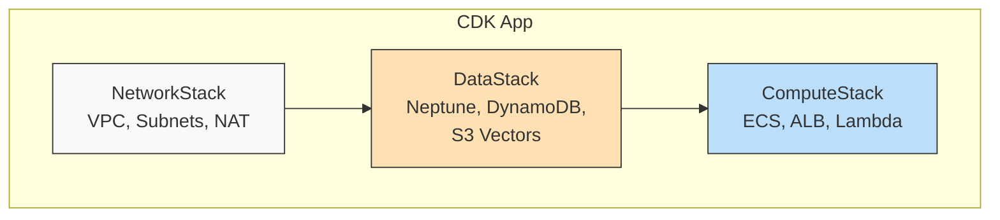

## 10.3 CDK Infrastructure

AWS CDK (Cloud Development Kit) lets you define cloud infrastructure in
TypeScript (or Python, Java, Go, C#). EdgeQuake uses TypeScript CDK to
provision the complete storage layer: S3 Vectors, Neptune, DynamoDB, VPC
networking, and IAM roles. This section walks through the CDK stack design.

### Why CDK Over CloudFormation or Terraform?

| Tool | Language | State Management | AWS Integration |
|------|----------|-----------------|-----------------|
| CloudFormation | YAML/JSON | Managed by AWS | Native |
| Terraform | HCL | External state file | Plugin-based |
| CDK | TypeScript/Python | Managed by AWS (via CFN) | Native + higher-level constructs |

CDK compiles to CloudFormation under the hood, so you get the reliability of
CloudFormation with the expressiveness of a real programming language.
Loops, conditionals, and abstractions are all available.

### Multi-Stack Architecture

EdgeQuake's infrastructure is split into multiple CDK stacks to separate
resources with different lifecycles:



| Stack | Contains | Lifecycle |
|-------|----------|-----------|
| `NetworkStack` | VPC, subnets, NAT Gateway, VPC endpoints | Rarely changes |
| `DataStack` | Neptune, DynamoDB, S3 Vectors | Changes when adding new storage |
| `ComputeStack` | ECS services, Lambda functions, ALB | Changes on every deployment |

This separation means you can deploy new application code (ComputeStack)
without risking changes to your database infrastructure (DataStack).

### The Data Stack

The data stack provisions all storage resources. Here is a complete example:

```typescript
import * as cdk from 'aws-cdk-lib';
import { Construct } from 'constructs';
import * as ec2 from 'aws-cdk-lib/aws-ec2';
import * as neptune from 'aws-cdk-lib/aws-neptune';
import * as dynamodb from 'aws-cdk-lib/aws-dynamodb';
import { CfnVectorBucket, CfnIndex } from 'aws-cdk-lib/aws-s3vectors';

interface DataStackProps extends cdk.StackProps {
  vpc: ec2.IVpc;
  prefix: string;
}

export class DataStack extends cdk.Stack {
  public readonly neptuneEndpoint: string;
  public readonly dynamoTableName: string;
  public readonly vectorBucketName: string;
  public readonly vectorIndexName: string;

  constructor(scope: Construct, id: string, props: DataStackProps) {
    super(scope, id, props);

    // ========== S3 Vectors ==========
    const vectorBucket = new CfnVectorBucket(this, 'VectorBucket', {
      vectorBucketName: `${props.prefix}-vectors`,
    });

    const vectorIndex = new CfnIndex(this, 'VectorIndex', {
      vectorBucketName: vectorBucket.vectorBucketName!,
      indexName: 'embeddings-1536',
      dimension: 1536,
      distanceMetric: 'cosine',
      dataType: 'float32',
    });
    vectorIndex.addDependency(vectorBucket);

    this.vectorBucketName = `${props.prefix}-vectors`;
    this.vectorIndexName = 'embeddings-1536';

    // ========== DynamoDB ==========
    const kvTable = new dynamodb.Table(this, 'KVTable', {
      tableName: `${props.prefix}-kv`,
      partitionKey: {
        name: 'namespace',
        type: dynamodb.AttributeType.STRING,
      },
      sortKey: {
        name: 'id',
        type: dynamodb.AttributeType.STRING,
      },
      billingMode: dynamodb.BillingMode.PAY_PER_REQUEST,
      pointInTimeRecovery: true,
      removalPolicy: cdk.RemovalPolicy.RETAIN,
    });

    this.dynamoTableName = kvTable.tableName;

    // ========== Neptune ==========
    const neptuneSubnetGroup = new neptune.CfnDBSubnetGroup(
      this, 'NeptuneSubnetGroup', {
        dbSubnetGroupDescription: 'EdgeQuake Neptune subnets',
        subnetIds: props.vpc.privateSubnets.map(s => s.subnetId),
      }
    );

    const neptuneSG = new ec2.SecurityGroup(this, 'NeptuneSG', {
      vpc: props.vpc,
      description: 'Neptune cluster security group',
      allowAllOutbound: false,
    });

    // Allow inbound from private subnets on port 8182
    neptuneSG.addIngressRule(
      ec2.Peer.ipv4(props.vpc.vpcCidrBlock),
      ec2.Port.tcp(8182),
      'Neptune access from VPC'
    );

    const neptuneCluster = new neptune.CfnDBCluster(
      this, 'NeptuneCluster', {
        dbSubnetGroupName: neptuneSubnetGroup.ref,
        vpcSecurityGroupIds: [neptuneSG.securityGroupId],
        iamAuthEnabled: true,
        storageEncrypted: true,
        serverlessScalingConfiguration: {
          minCapacity: 1.0,   // Scale to near-zero
          maxCapacity: 32.0,  // Scale up under load
        },
      }
    );
    neptuneCluster.addDependency(neptuneSubnetGroup);

    this.neptuneEndpoint = neptuneCluster.attrEndpoint;

    // ========== Outputs ==========
    new cdk.CfnOutput(this, 'NeptuneEndpointOutput', {
      value: neptuneCluster.attrEndpoint,
      exportName: `${props.prefix}-neptune-endpoint`,
    });

    new cdk.CfnOutput(this, 'DynamoTableOutput', {
      value: kvTable.tableName,
      exportName: `${props.prefix}-dynamo-table`,
    });

    new cdk.CfnOutput(this, 'VectorBucketOutput', {
      value: this.vectorBucketName,
      exportName: `${props.prefix}-vector-bucket`,
    });
  }
}
```

### S3 Vectors CDK Details

S3 Vectors uses L1 (CloudFormation-level) constructs because it is a newer
service without higher-level L2 constructs yet:

```typescript
// L1 construct -- maps directly to CloudFormation
const vectorBucket = new CfnVectorBucket(this, 'VectorBucket', {
  vectorBucketName: `${props.prefix}-vectors`,
});

const vectorIndex = new CfnIndex(this, 'VectorIndex', {
  vectorBucketName: vectorBucket.vectorBucketName!,
  indexName: 'embeddings-1536',
  dimension: 1536,
  distanceMetric: 'cosine',
  dataType: 'float32',
});
```

Key configuration parameters:

| Parameter | Value | Notes |
|-----------|-------|-------|
| `dimension` | 1536 | Must match your embedding model output |
| `distanceMetric` | `cosine` | Standard for text embeddings |
| `dataType` | `float32` | Standard precision |

The `addDependency` call ensures the index is created after the bucket:

```typescript
vectorIndex.addDependency(vectorBucket);
```

### Neptune CDK Details

Neptune uses serverless scaling configuration to minimize costs during low
usage and scale up under load:

```typescript
const neptuneCluster = new neptune.CfnDBCluster(this, 'NeptuneCluster', {
  serverlessScalingConfiguration: {
    minCapacity: 1.0,    // Minimum Neptune Capacity Units
    maxCapacity: 32.0,   // Maximum NCUs
  },
  iamAuthEnabled: true,   // Required for Neptune Data API
  storageEncrypted: true, // Encryption at rest
});
```

Neptune Capacity Units (NCUs) determine compute power:

| NCUs | Approximate Memory | Cost |
|------|--------------------|------|
| 1.0 | 2 GB | Minimal |
| 8.0 | 16 GB | Medium workloads |
| 32.0 | 64 GB | Large graph traversals |

### DynamoDB CDK Details

DynamoDB uses pay-per-request billing with point-in-time recovery:

```typescript
const kvTable = new dynamodb.Table(this, 'KVTable', {
  partitionKey: { name: 'namespace', type: dynamodb.AttributeType.STRING },
  sortKey: { name: 'id', type: dynamodb.AttributeType.STRING },
  billingMode: dynamodb.BillingMode.PAY_PER_REQUEST,
  pointInTimeRecovery: true,
  removalPolicy: cdk.RemovalPolicy.RETAIN,
});
```

The `RETAIN` removal policy prevents accidental data loss if the stack is
deleted -- the table will be orphaned rather than destroyed.

### IAM Role for EdgeQuake Service

The compute stack creates an IAM role with permissions for all three storage
services:

```typescript
import * as iam from 'aws-cdk-lib/aws-iam';

const taskRole = new iam.Role(this, 'EdgeQuakeTaskRole', {
  assumedBy: new iam.ServicePrincipal('ecs-tasks.amazonaws.com'),
});

// S3 Vectors permissions
taskRole.addToPolicy(new iam.PolicyStatement({
  actions: [
    's3vectors:CreateVectorBucket',
    's3vectors:GetVectorBucket',
    's3vectors:CreateIndex',
    's3vectors:GetIndex',
    's3vectors:DeleteIndex',
    's3vectors:PutVectors',
    's3vectors:GetVectors',
    's3vectors:DeleteVectors',
    's3vectors:QueryVectors',
    's3vectors:ListVectors',
  ],
  resources: [`arn:aws:s3vectors:*:${this.account}:vector-bucket/${props.prefix}-vectors/*`],
}));

// Neptune permissions
taskRole.addToPolicy(new iam.PolicyStatement({
  actions: [
    'neptune-db:ReadDataViaQuery',
    'neptune-db:WriteDataViaQuery',
    'neptune-db:DeleteDataViaQuery',
  ],
  resources: [props.neptuneClusterArn + '/*'],
}));

// DynamoDB permissions
taskRole.addToPolicy(new iam.PolicyStatement({
  actions: [
    'dynamodb:GetItem',
    'dynamodb:BatchGetItem',
    'dynamodb:Query',
    'dynamodb:PutItem',
    'dynamodb:BatchWriteItem',
    'dynamodb:UpdateItem',
    'dynamodb:DeleteItem',
    'dynamodb:DescribeTable',
  ],
  resources: [props.dynamoTableArn],
}));
```

### Environment Configuration

The compute stack passes storage configuration as environment variables to ECS
tasks:

```typescript
const taskDefinition = new ecs.FargateTaskDefinition(this, 'Task', {
  taskRole: taskRole,
});

taskDefinition.addContainer('edgequake', {
  image: ecs.ContainerImage.fromAsset('../'),
  environment: {
    NEPTUNE_ENDPOINT: props.neptuneEndpoint,
    VECTOR_BUCKET: props.vectorBucketName,
    VECTOR_INDEX: props.vectorIndexName,
    DYNAMODB_TABLE: props.dynamoTableName,
    LLM_PROVIDER: 'openai',
    EMBEDDING_PROVIDER: 'openai',
    RUST_LOG: 'info,edgequake=debug',
  },
  secrets: {
    OPENAI_API_KEY: ecs.Secret.fromSsmParameter(
      ssm.StringParameter.fromSecureStringParameterAttributes(
        this, 'OpenAIKey', { parameterName: '/edgequake/openai-api-key' }
      )
    ),
  },
});
```

Notice that the OpenAI API key is stored in AWS Systems Manager Parameter
Store (SSM) as a SecureString, not as a plaintext environment variable. ECS
resolves it at container start time.

### Deploying the Stacks

```bash
# Install CDK dependencies
cd infrastructure && npm install

# Bootstrap CDK (first time only)
cdk bootstrap

# Deploy all stacks in order
cdk deploy NetworkStack DataStack ComputeStack

# Or deploy everything at once (CDK resolves dependencies)
cdk deploy --all
```

### VPC Endpoints

To avoid routing AWS service traffic through the NAT Gateway, add VPC
endpoints for DynamoDB and S3:

```typescript
// Gateway endpoint for DynamoDB (free)
props.vpc.addGatewayEndpoint('DynamoEndpoint', {
  service: ec2.GatewayVpcEndpointAwsService.DYNAMODB,
});

// Gateway endpoint for S3 (free, covers S3 Vectors)
props.vpc.addGatewayEndpoint('S3Endpoint', {
  service: ec2.GatewayVpcEndpointAwsService.S3,
});
```

Gateway endpoints are free and route traffic directly within the AWS network,
bypassing the NAT Gateway entirely.

### Summary

CDK infrastructure is organized into three stacks: NetworkStack (VPC),
DataStack (S3 Vectors, Neptune, DynamoDB), and ComputeStack (ECS, Lambda).
S3 Vectors uses L1 `CfnVectorBucket` and `CfnIndex` constructs. Neptune uses
serverless scaling to minimize costs. DynamoDB uses pay-per-request billing
with RETAIN removal policy. IAM roles provide least-privilege access to all
three services, and VPC endpoints eliminate NAT Gateway costs for AWS service
traffic.

---

*Next: [Chapter 11: Security and Multi-Tenancy](../part4-enterprise/ch11-security.md)*
