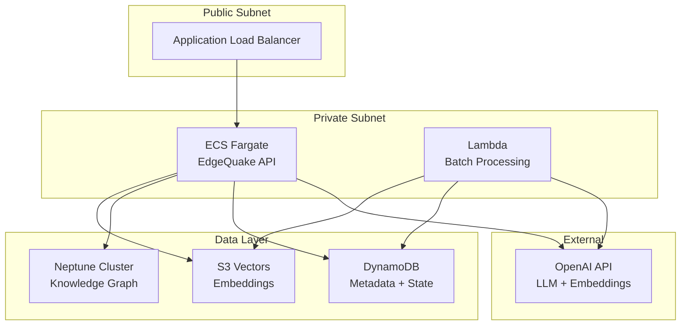
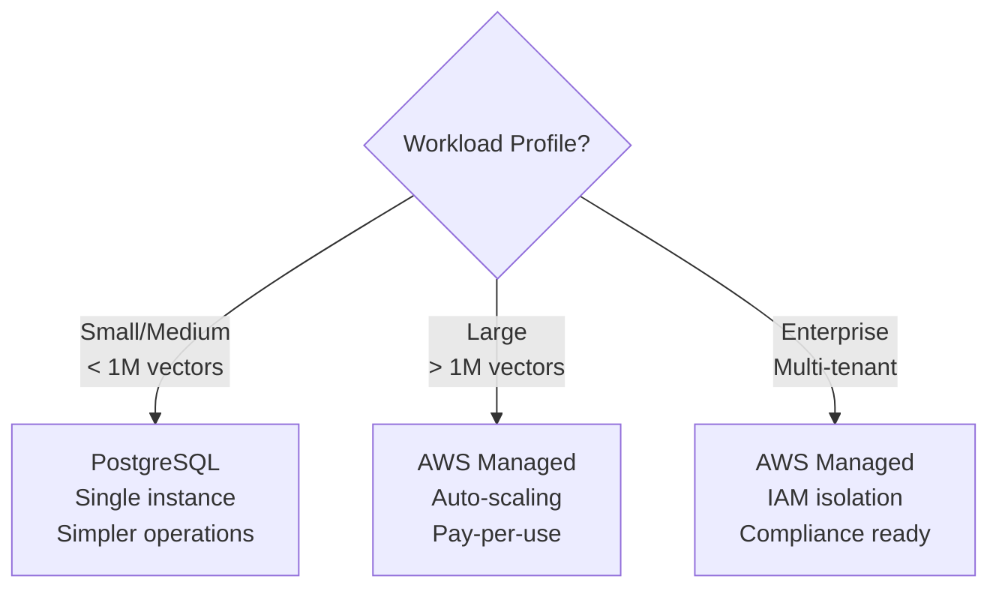

# Chapter 10: Cloud Deployment with AWS

> **"Local development proves your logic works. Cloud deployment proves it
> scales."**

Moving from a single PostgreSQL instance to AWS managed services fundamentally
changes the operational characteristics of your knowledge base. Instead of
managing a database server, you configure services that auto-scale, pay only
for what you use, and integrate with AWS security primitives like IAM and VPC.

In this chapter we deploy EdgeQuake to AWS using three managed services --
S3 Vectors for embeddings, Amazon Neptune for graph storage, and DynamoDB for
key-value data -- and tie them together with a CDK infrastructure stack.

## Learning Objectives

After completing this chapter you will be able to:

1. **Configure S3 Vectors** for native vector similarity search, including
   bucket creation, index setup, and the cosine distance-to-similarity
   conversion.
2. **Deploy Neptune and DynamoDB** for graph and KV storage, with proper IAM
   roles and VPC networking.
3. **Write CDK infrastructure** that provisions the complete storage layer,
   including multi-stack architecture for separating stateful and stateless
   resources.

## Chapter Outline

| Section | Topic |
|---------|-------|
| [10.1 S3 Vectors for Embeddings](ch10-01-s3-vectors.md) | S3 Vectors service, CDK constructs, configuration, score conversion |
| [10.2 Neptune and DynamoDB](ch10-02-neptune-dynamodb.md) | Graph storage, KV storage, IAM, VPC networking |
| [10.3 CDK Infrastructure](ch10-03-cdk-infrastructure.md) | TypeScript CDK stack, resource creation, multi-stack architecture |

## Key Terminology

| Term | Definition |
|------|-----------|
| **S3 Vectors** | AWS service providing native vector storage and similarity search on S3 |
| **Neptune** | Fully managed graph database supporting Gremlin and SPARQL |
| **DynamoDB** | Serverless NoSQL key-value database with single-digit ms latency |
| **CDK** | AWS Cloud Development Kit -- infrastructure as code in TypeScript/Python |
| **VPC** | Virtual Private Cloud -- isolated network for AWS resources |
| **IAM** | Identity and Access Management -- fine-grained AWS permission control |

## AWS Architecture Overview

### Cost Comparison

One of the primary motivations for the AWS architecture is cost reduction at
scale:

| Component | PostgreSQL (RDS) | AWS Managed |
|-----------|-----------------|-------------|
| Vector storage | pgvector on r6g.xlarge: ~$400/mo | S3 Vectors: ~$5-20/mo |
| Graph storage | AGE on r6g.xlarge: ~$400/mo | Neptune Serverless: ~$50-200/mo |
| KV storage | Same RDS instance | DynamoDB On-Demand: ~$5-30/mo |
| **Total** | **~$400/mo** (shared instance) | **~$60-250/mo** (usage-dependent) |

The AWS architecture also eliminates idle costs: S3 Vectors charges per
request, DynamoDB uses on-demand pricing, and Neptune Serverless scales to
zero during inactivity.

### When to Use Each Architecture

| Criterion | PostgreSQL | AWS Managed |
|-----------|-----------|-------------|
| Setup complexity | Low (Docker Compose) | Medium (CDK) |
| Operational burden | You manage backups, scaling | AWS manages everything |
| Cost at small scale | Fixed ~$50/mo (small RDS) | Variable, potentially lower |
| Cost at large scale | Grows linearly | Sub-linear (pay per use) |
| Multi-tenancy | Schema-based isolation | IAM-based isolation |
| Compliance | You manage encryption | Built-in HIPAA/SOC2/ISO |

Let us start with S3 Vectors, the cornerstone of the cloud vector storage
strategy.

---

*Next: [10.1 S3 Vectors for Embeddings](ch10-01-s3-vectors.md)*

{{#quiz ../quizzes/ch10-aws-deployment.toml}}
