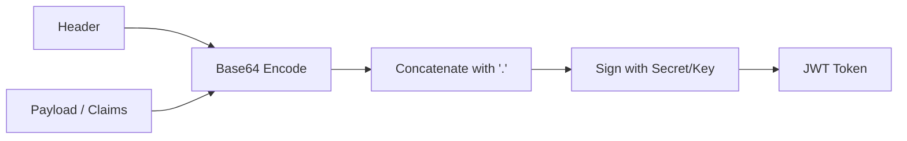
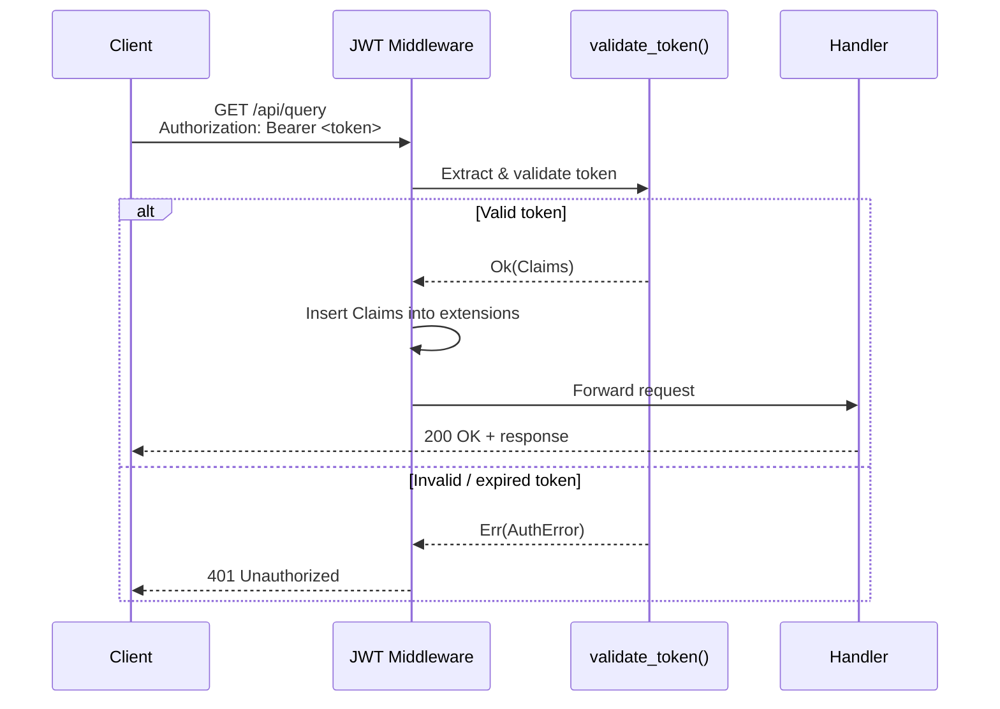

## 11.1 JWT Authentication

JSON Web Tokens are the standard mechanism for authenticating API requests in
modern web services. A JWT is a self-contained, cryptographically signed token
that carries claims about the caller -- their identity, role, tenant, and token
expiration. The server validates the signature and claims without needing to
query a database on every request, making JWTs well-suited for stateless,
high-throughput APIs.

### How JWTs Work

A JWT consists of three Base64-encoded parts separated by dots:

```text
eyJhbGciOiJIUzI1NiJ9.eyJzdWIiOiJ1c2VyXzQyIiwid29ya3NwYWNlX2lkIjoiYWNtZSJ9.signature
|---- Header ----|       |------------- Payload -------------|       |-- Sig --|
```



The **header** declares the algorithm (e.g., HS256, RS256). The **payload**
contains claims -- standard ones like `sub` (subject), `exp` (expiration), and
custom ones like `workspace_id` and `role`. The **signature** is computed over
the header and payload using a secret key (HMAC) or private key (RSA/ECDSA).

### Defining the Claims Struct

In EdgeQuake, every JWT must carry claims that identify both the user and their
tenant workspace:

```rust
use serde::{Deserialize, Serialize};

/// Claims extracted from a validated JWT.
///
/// These claims drive both RBAC decisions and tenant isolation.
#[derive(Debug, Clone, Serialize, Deserialize)]
pub struct Claims {
    /// Subject -- the unique user identifier.
    pub sub: String,

    /// The workspace (tenant) this token is scoped to.
    pub workspace_id: String,

    /// The user's role within the workspace.
    pub role: String,

    /// Token expiration as a Unix timestamp.
    pub exp: u64,

    /// Token issued-at as a Unix timestamp.
    pub iat: u64,
}
```

The `workspace_id` claim is critical -- it becomes the namespace for all
storage operations during the request. The `role` claim feeds into the RBAC
layer covered in section 11.2.

### Validating JWTs with the `jsonwebtoken` Crate

The [`jsonwebtoken`](https://crates.io/crates/jsonwebtoken) crate is the
standard Rust library for JWT validation. It handles signature verification,
expiration checking, and claim deserialization in a single call.

Add it to your `Cargo.toml`:

```toml
[dependencies]
jsonwebtoken = "9"
serde = { version = "1", features = ["derive"] }
```

Here is the core validation function:

```rust
use jsonwebtoken::{decode, Algorithm, DecodingKey, Validation};

/// Configuration for JWT validation.
pub struct JwtConfig {
    /// The secret key for HMAC-based signatures (HS256).
    /// In production, prefer RS256 with a public key.
    pub secret: String,

    /// Expected audience claim (optional but recommended).
    pub audience: Option<String>,

    /// Expected issuer claim (optional but recommended).
    pub issuer: Option<String>,
}

/// Errors that can occur during JWT validation.
#[derive(Debug, thiserror::Error)]
pub enum AuthError {
    #[error("missing authorization header")]
    MissingHeader,

    #[error("invalid authorization header format")]
    InvalidFormat,

    #[error("token validation failed: {0}")]
    ValidationFailed(#[from] jsonwebtoken::errors::Error),
}

/// Validate a JWT and extract its claims.
///
/// This function verifies the signature, checks expiration,
/// and deserializes the payload into our Claims struct.
pub fn validate_token(token: &str, config: &JwtConfig) -> Result<Claims, AuthError> {
    let mut validation = Validation::new(Algorithm::HS256);

    // Configure audience validation if specified.
    if let Some(ref aud) = config.audience {
        validation.set_audience(&[aud]);
    }

    // Configure issuer validation if specified.
    if let Some(ref iss) = config.issuer {
        validation.set_issuer(&[iss]);
    }

    // exp is validated by default -- no need to enable it.
    // The library rejects expired tokens automatically.

    let token_data = decode::<Claims>(
        token,
        &DecodingKey::from_secret(config.secret.as_bytes()),
        &validation,
    )?;

    Ok(token_data.claims)
}
```

Key points about this implementation:

- **Expiration is checked automatically** -- `jsonwebtoken` rejects tokens
  where `exp` is in the past. You do not need to check this manually.
- **Algorithm must be explicit** -- never use `Algorithm::default()` or accept
  the algorithm from the token header. This prevents algorithm confusion
  attacks where an attacker switches from RS256 to HS256.
- **Audience and issuer** are optional but strongly recommended in production
  to prevent tokens issued for other services from being accepted.

### Building the Axum Middleware

With the validation function in place, you can build an Axum middleware that
runs before every handler. The middleware extracts the `Authorization: Bearer
<token>` header, validates the JWT, and injects the `Claims` into the request
extensions so handlers can access them.

```rust
use axum::{
    extract::Request,
    http::{header::AUTHORIZATION, StatusCode},
    middleware::Next,
    response::{IntoResponse, Response},
    Extension,
};
use std::sync::Arc;

/// Axum middleware that validates JWT tokens on every request.
///
/// On success, injects `Claims` into request extensions.
/// On failure, returns 401 Unauthorized.
pub async fn jwt_auth_middleware(
    Extension(config): Extension<Arc<JwtConfig>>,
    mut request: Request,
    next: Next,
) -> Result<Response, AuthError> {
    // Extract the Authorization header.
    let auth_header = request
        .headers()
        .get(AUTHORIZATION)
        .and_then(|v| v.to_str().ok())
        .ok_or(AuthError::MissingHeader)?;

    // Strip the "Bearer " prefix.
    let token = auth_header
        .strip_prefix("Bearer ")
        .ok_or(AuthError::InvalidFormat)?;

    // Validate the token and extract claims.
    let claims = validate_token(token, &config)?;

    // Inject claims into request extensions for downstream handlers.
    request.extensions_mut().insert(claims);

    // Continue to the next middleware or handler.
    Ok(next.run(request).await)
}

// Make AuthError return proper HTTP status codes.
impl IntoResponse for AuthError {
    fn into_response(self) -> Response {
        let status = match &self {
            AuthError::MissingHeader => StatusCode::UNAUTHORIZED,
            AuthError::InvalidFormat => StatusCode::UNAUTHORIZED,
            AuthError::ValidationFailed(_) => StatusCode::UNAUTHORIZED,
        };
        (status, self.to_string()).into_response()
    }
}
```

### Wiring the Middleware into the Router

The middleware must wrap every route that requires authentication. You can
apply it globally or selectively using Axum's nested router pattern:

```rust
use axum::{middleware, Router, routing::get};

pub fn create_router(jwt_config: JwtConfig) -> Router {
    let config = Arc::new(jwt_config);

    // Public routes -- no authentication required.
    let public_routes = Router::new()
        .route("/health", get(health_check));

    // Protected routes -- JWT middleware applied.
    let protected_routes = Router::new()
        .route("/api/query", get(handle_query))
        .route("/api/ingest", axum::routing::post(handle_ingest))
        .layer(middleware::from_fn(jwt_auth_middleware))
        .layer(Extension(config));

    Router::new()
        .merge(public_routes)
        .merge(protected_routes)
}
```

### Extracting Claims in Handlers

Once the middleware has validated the token and injected the `Claims`, any
handler can retrieve them from the request extensions:

```rust
use axum::Extension;

async fn handle_query(
    Extension(claims): Extension<Claims>,
) -> impl IntoResponse {
    // claims.workspace_id -> used for namespace isolation
    // claims.role         -> used for RBAC checks
    // claims.sub          -> used for audit logging

    tracing::info!(
        user = %claims.sub,
        workspace = %claims.workspace_id,
        role = %claims.role,
        "processing query request"
    );

    // The workspace_id from the claims drives storage namespace selection.
    // See section 11.3 for how this becomes tenant isolation.
    format!("Hello, {} from workspace {}", claims.sub, claims.workspace_id)
}
```

### Token Validation Flow

The complete flow from HTTP request to authenticated handler:



### Production Considerations

In a production deployment, you should harden this implementation further:

| Concern | Recommendation |
|---------|---------------|
| Algorithm | Use RS256 (RSA) instead of HS256 so you only need the public key on API servers |
| Key rotation | Support multiple decoding keys and rotate regularly |
| Token refresh | Issue short-lived access tokens (15 min) with longer-lived refresh tokens |
| Revocation | Maintain a small in-memory blocklist for revoked tokens, refreshed from a central store |
| Clock skew | Set `Validation::leeway` to a few seconds to tolerate minor clock differences |

### Key Takeaways

- JWTs provide stateless authentication -- the server does not need a database
  lookup to validate every request.
- The `jsonwebtoken` crate handles signature verification, expiration, and
  claim deserialization.
- Always fix the algorithm in your `Validation` -- never trust the token's
  `alg` header blindly.
- The `Claims` struct carries `workspace_id` and `role`, which feed directly
  into tenant isolation and RBAC in the following sections.

---

*Next: [11.2 Role-Based Access Control](ch11-02-rbac.md)*
