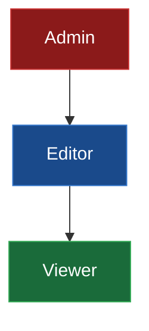
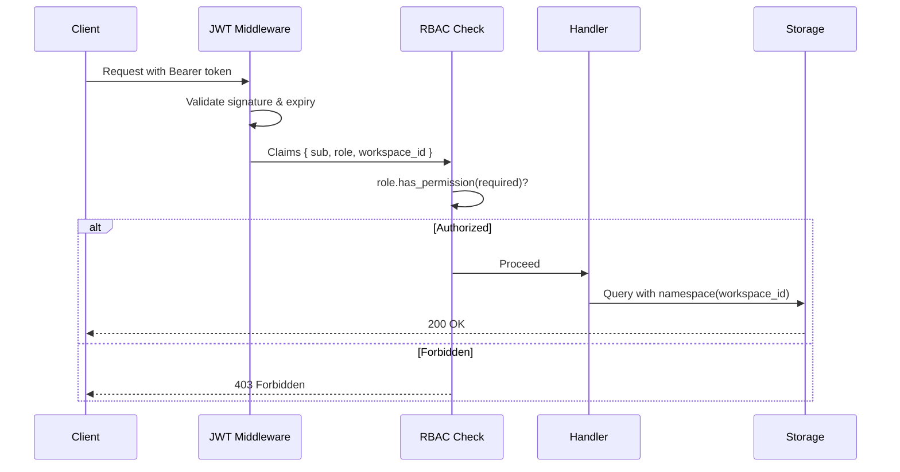

## 11.2 Role-Based Access Control

Authentication tells you **who** is making a request. Authorization tells you
**what** they are allowed to do. Role-Based Access Control (RBAC) is the most
widely adopted authorization model for enterprise APIs because it is simple to
reason about, easy to audit, and maps naturally to organizational structures.

In EdgeQuake, every authenticated user has a `role` claim in their JWT. The
RBAC layer checks this role against the required permission before any
operation proceeds. If the role lacks the necessary permission, the request
is rejected with a 403 Forbidden response -- the user is authenticated but
not authorized.

### The Role Hierarchy

EdgeQuake defines three roles in a strict hierarchy. Higher roles inherit all
permissions of lower roles:



| Role | Permissions | Typical User |
|------|------------|-------------|
| **Viewer** | Query the knowledge base, read entities and relationships | Analysts, stakeholders |
| **Editor** | All Viewer permissions + ingest documents, update entities | Data engineers, content authors |
| **Admin** | All Editor permissions + manage workspaces, delete data, manage users | Platform administrators |

### Defining Roles and Permissions

Start by defining the role and permission types as enums. Using enums instead
of strings gives you compile-time safety and exhaustive matching:

```rust
use serde::{Deserialize, Serialize};
use std::fmt;

/// Roles supported by EdgeQuake's RBAC system.
///
/// Roles form a hierarchy: Admin > Editor > Viewer.
#[derive(Debug, Clone, Copy, PartialEq, Eq, PartialOrd, Ord, Serialize, Deserialize)]
#[serde(rename_all = "lowercase")]
pub enum Role {
    Viewer = 0,
    Editor = 1,
    Admin = 2,
}

impl Role {
    /// Parse a role from a string claim value.
    pub fn from_claim(s: &str) -> Option<Self> {
        match s {
            "viewer" => Some(Role::Viewer),
            "editor" => Some(Role::Editor),
            "admin" => Some(Role::Admin),
            _ => None,
        }
    }

    /// Check whether this role has at least the given permission level.
    pub fn has_permission(&self, required: Permission) -> bool {
        let required_role = required.minimum_role();
        *self >= required_role
    }
}

impl fmt::Display for Role {
    fn fmt(&self, f: &mut fmt::Formatter<'_>) -> fmt::Result {
        match self {
            Role::Viewer => write!(f, "viewer"),
            Role::Editor => write!(f, "editor"),
            Role::Admin => write!(f, "admin"),
        }
    }
}
```

Notice the derived `PartialOrd` and `Ord` traits. Because the enum variants
are ordered (`Viewer = 0`, `Editor = 1`, `Admin = 2`), you can compare roles
with standard comparison operators. `Admin >= Editor` is `true`, which makes
the hierarchy check trivial.

### Defining Permissions

Permissions map operations to the minimum role required to perform them:

```rust
/// Permissions that can be checked against a user's role.
#[derive(Debug, Clone, Copy)]
pub enum Permission {
    /// Read entities, relationships, and query results.
    Read,

    /// Ingest documents and create/update entities.
    Write,

    /// Delete data, manage workspaces, administer users.
    Manage,
}

impl Permission {
    /// Return the minimum role required for this permission.
    pub fn minimum_role(&self) -> Role {
        match self {
            Permission::Read => Role::Viewer,
            Permission::Write => Role::Editor,
            Permission::Manage => Role::Admin,
        }
    }
}
```

### The Permission Check Function

The core authorization check is a single function that combines the JWT claims
with a required permission:

```rust
use crate::auth::{AuthError, Claims};

/// Verify that the authenticated user has the required permission.
///
/// Returns `Ok(())` if authorized, or `Err(AuthError::Forbidden)` if not.
pub fn require_permission(claims: &Claims, required: Permission) -> Result<(), AuthError> {
    let role = Role::from_claim(&claims.role).ok_or_else(|| {
        tracing::warn!(
            user = %claims.sub,
            role = %claims.role,
            "unknown role in JWT claims"
        );
        AuthError::Forbidden("unknown role".into())
    })?;

    if role.has_permission(required) {
        tracing::debug!(
            user = %claims.sub,
            role = %role,
            permission = ?required,
            "permission granted"
        );
        Ok(())
    } else {
        tracing::warn!(
            user = %claims.sub,
            role = %role,
            required_permission = ?required,
            "insufficient permissions"
        );
        Err(AuthError::Forbidden(format!(
            "role '{}' lacks {:?} permission",
            role, required
        )))
    }
}
```

### Protecting API Endpoints

With the permission check in place, you can guard each handler with a single
line of authorization logic:

```rust
use axum::{Extension, Json, http::StatusCode, response::IntoResponse};

/// Handler: query the knowledge base.
/// Requires: Read permission (Viewer, Editor, or Admin).
async fn handle_query(
    Extension(claims): Extension<Claims>,
    Json(query): Json<QueryRequest>,
) -> Result<impl IntoResponse, AuthError> {
    require_permission(&claims, Permission::Read)?;

    // Proceed with query using claims.workspace_id for namespace isolation.
    let results = execute_query(&claims.workspace_id, &query).await?;
    Ok(Json(results))
}

/// Handler: ingest documents into the knowledge base.
/// Requires: Write permission (Editor or Admin only).
async fn handle_ingest(
    Extension(claims): Extension<Claims>,
    Json(payload): Json<IngestRequest>,
) -> Result<impl IntoResponse, AuthError> {
    require_permission(&claims, Permission::Write)?;

    let stats = run_ingestion(&claims.workspace_id, &payload).await?;
    Ok(Json(stats))
}

/// Handler: delete a workspace and all its data.
/// Requires: Manage permission (Admin only).
async fn handle_delete_workspace(
    Extension(claims): Extension<Claims>,
) -> Result<impl IntoResponse, AuthError> {
    require_permission(&claims, Permission::Manage)?;

    clear_workspace(&claims.workspace_id).await?;
    Ok(StatusCode::NO_CONTENT)
}
```

### Middleware-Based RBAC (Alternative Approach)

For routes that share the same permission requirement, you can factor the
check into a middleware instead of repeating it in every handler:

```rust
use axum::{extract::Request, middleware::Next, response::Response};

/// Create a middleware that requires a specific permission.
///
/// Usage:
/// ```rust
/// let editor_routes = Router::new()
///     .route("/ingest", post(handle_ingest))
///     .layer(middleware::from_fn(|req, next| {
///         require_role_middleware(req, next, Permission::Write)
///     }));
/// ```
pub async fn require_role_middleware(
    request: Request,
    next: Next,
    required: Permission,
) -> Result<Response, AuthError> {
    let claims = request
        .extensions()
        .get::<Claims>()
        .ok_or(AuthError::MissingHeader)?;

    require_permission(claims, required)?;

    Ok(next.run(request).await)
}
```

This pattern is useful when you have many endpoints that share the same
permission level. Group them under a single router and apply the middleware
once:

```rust
pub fn create_router(config: Arc<JwtConfig>) -> Router {
    // Viewer routes -- read-only access.
    let viewer_routes = Router::new()
        .route("/api/query", get(handle_query))
        .route("/api/entities", get(list_entities));

    // Editor routes -- read + write access.
    let editor_routes = Router::new()
        .route("/api/ingest", post(handle_ingest))
        .route("/api/entities", put(update_entity));

    // Admin routes -- full access.
    let admin_routes = Router::new()
        .route("/api/workspace", delete(handle_delete_workspace))
        .route("/api/users", post(manage_users));

    Router::new()
        .merge(viewer_routes)    // Permission checked in handlers
        .merge(editor_routes)    // Permission checked in handlers
        .merge(admin_routes)     // Permission checked in handlers
        .layer(middleware::from_fn(jwt_auth_middleware))
        .layer(Extension(config))
}
```

### Request Authorization Flow

The complete flow from authentication through authorization:



### Testing RBAC

RBAC logic is pure and synchronous, making it straightforward to test:

```rust
#[cfg(test)]
mod tests {
    use super::*;

    #[test]
    fn viewer_can_read() {
        let claims = Claims {
            sub: "user_1".into(),
            workspace_id: "acme".into(),
            role: "viewer".into(),
            exp: u64::MAX,
            iat: 0,
        };
        assert!(require_permission(&claims, Permission::Read).is_ok());
    }

    #[test]
    fn viewer_cannot_write() {
        let claims = Claims {
            sub: "user_1".into(),
            workspace_id: "acme".into(),
            role: "viewer".into(),
            exp: u64::MAX,
            iat: 0,
        };
        assert!(require_permission(&claims, Permission::Write).is_err());
    }

    #[test]
    fn admin_can_do_everything() {
        let claims = Claims {
            sub: "admin_1".into(),
            workspace_id: "acme".into(),
            role: "admin".into(),
            exp: u64::MAX,
            iat: 0,
        };
        assert!(require_permission(&claims, Permission::Read).is_ok());
        assert!(require_permission(&claims, Permission::Write).is_ok());
        assert!(require_permission(&claims, Permission::Manage).is_ok());
    }

    #[test]
    fn unknown_role_is_rejected() {
        let claims = Claims {
            sub: "hacker".into(),
            workspace_id: "acme".into(),
            role: "superuser".into(),
            exp: u64::MAX,
            iat: 0,
        };
        assert!(require_permission(&claims, Permission::Read).is_err());
    }
}
```

### Key Takeaways

- RBAC maps each user's role to a set of permissions, enforced before any
  operation proceeds.
- Using Rust enums with derived `Ord` makes the hierarchy check a simple
  comparison -- no complex permission matrices required.
- Permission checks can live in individual handlers (fine-grained) or in
  middleware (coarse-grained) depending on your routing structure.
- Always log authorization failures with the user's identity and the
  permission they attempted -- this is essential for security auditing.

---

*Next: [11.3 Namespace-Based Tenant Isolation](ch11-03-tenant-isolation.md)*
