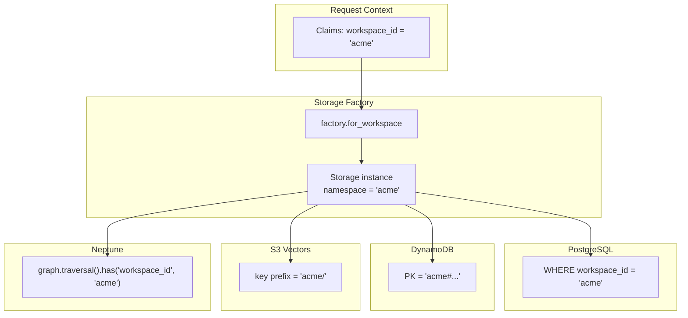
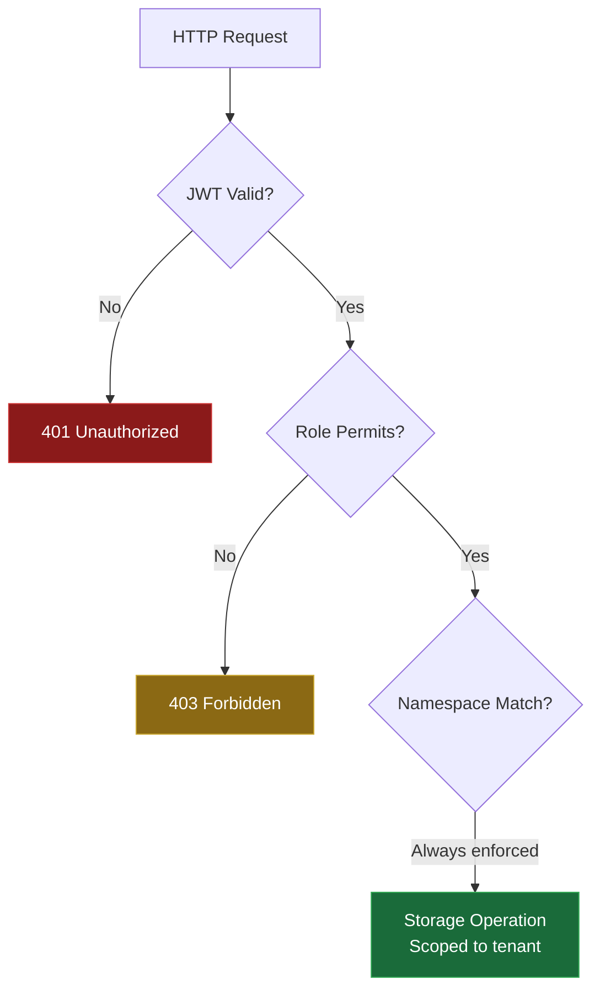

## 11.3 Namespace-Based Tenant Isolation

Authentication and RBAC protect the application layer, but the strongest
multi-tenancy guarantee comes from the storage layer itself. EdgeQuake uses
**namespace-based isolation** -- every storage operation is scoped to a
namespace derived from the authenticated user's `workspace_id`. This means
that even if a bug in the application layer fails to check permissions, the
storage layer will not return data from the wrong tenant.

This is not just a query filter. It is an architectural boundary enforced by
the `GraphStorage` trait itself.

### How the GraphStorage Trait Enforces Isolation

Recall the `GraphStorage` trait from Chapter 4. Every implementation must
provide a `namespace()` method that returns the current isolation scope:

```rust
/// The core trait for graph storage backends.
///
/// All operations are implicitly scoped to the namespace
/// returned by `namespace()`. Implementations must guarantee
/// that queries and mutations never cross namespace boundaries.
#[async_trait]
pub trait GraphStorage: Send + Sync {
    /// Return the namespace (tenant scope) for all operations.
    fn namespace(&self) -> &str;

    /// Query entities within the current namespace.
    async fn get_entities(
        &self,
        query: &EntityQuery,
    ) -> Result<Vec<Entity>>;

    /// Insert entities into the current namespace.
    async fn upsert_entities(
        &self,
        entities: &[Entity],
    ) -> Result<()>;

    /// Query relationships within the current namespace.
    async fn get_relationships(
        &self,
        query: &RelationshipQuery,
    ) -> Result<Vec<Relationship>>;

    /// Delete all data in the current namespace.
    async fn clear_workspace(&self) -> Result<CleanupStats>;

    // ... additional methods
}
```

The key insight: **there is no method that accepts a namespace parameter**.
The namespace is set when the storage instance is created, and it cannot be
changed afterward. This makes cross-tenant access impossible through the trait
interface.

### Creating Per-Request Storage Instances

In a multi-tenant API, each request creates a storage instance scoped to the
authenticated tenant's `workspace_id`. Here is how this looks in practice:

```rust
use std::sync::Arc;

/// Factory for creating tenant-scoped storage instances.
pub struct StorageFactory {
    /// Shared database connection pool.
    pool: Arc<sqlx::PgPool>,

    /// Shared configuration.
    config: Arc<StorageConfig>,
}

impl StorageFactory {
    /// Create a new storage instance scoped to the given workspace.
    ///
    /// The returned storage will only operate on data within
    /// the specified namespace. There is no way to widen the scope
    /// after creation.
    pub fn for_workspace(&self, workspace_id: &str) -> PostgresGraphStorage {
        PostgresGraphStorage::new(
            self.pool.clone(),
            self.config.clone(),
            workspace_id.to_string(),
        )
    }
}
```

And in the Axum handler:

```rust
use axum::Extension;

async fn handle_query(
    Extension(claims): Extension<Claims>,
    Extension(factory): Extension<Arc<StorageFactory>>,
    Json(query): Json<QueryRequest>,
) -> Result<Json<QueryResponse>, AppError> {
    require_permission(&claims, Permission::Read)?;

    // Create a storage instance scoped to this tenant.
    let storage = factory.for_workspace(&claims.workspace_id);

    // All operations through `storage` are now isolated to this tenant.
    // There is no API to query another tenant's data.
    let entities = storage.get_entities(&query.entity_query).await?;
    let relationships = storage.get_relationships(&query.rel_query).await?;

    Ok(Json(QueryResponse { entities, relationships }))
}
```

### How Namespace Isolation Works in PostgreSQL

In the PostgreSQL adapter, the namespace becomes a `WHERE` clause on every
query. The storage implementation automatically injects this filter -- it
cannot be bypassed by the caller:

```rust
impl PostgresGraphStorage {
    /// Query entities, automatically filtered by namespace.
    async fn get_entities(&self, query: &EntityQuery) -> Result<Vec<Entity>> {
        let rows = sqlx::query_as::<_, EntityRow>(
            r#"
            SELECT id, name, entity_type, description, metadata
            FROM entities
            WHERE workspace_id = $1
              AND ($2::text IS NULL OR entity_type = $2)
              AND ($3::text IS NULL OR name ILIKE '%' || $3 || '%')
            ORDER BY name
            LIMIT $4
            "#,
        )
        .bind(&self.namespace)   // <-- Always the first parameter
        .bind(&query.entity_type)
        .bind(&query.search_term)
        .bind(query.limit.unwrap_or(100) as i64)
        .fetch_all(&*self.pool)
        .await?;

        Ok(rows.into_iter().map(Into::into).collect())
    }
}
```

The `workspace_id = $1` filter is not something the handler can omit or
override. It is baked into the SQL, and the `$1` parameter comes from
`self.namespace` which was set at construction time.

### Namespace Isolation Across Storage Backends

The same pattern applies regardless of the storage backend:



| Backend | Isolation Mechanism |
|---------|-------------------|
| PostgreSQL | `WHERE workspace_id = $1` on every query |
| DynamoDB | Partition key prefix `{workspace_id}#` |
| S3 / S3 Vectors | Object key prefix `{workspace_id}/` |
| Neptune (Gremlin) | `.has('workspace_id', value)` step in every traversal |

### The `clear_workspace` Method

When a tenant is deprovisioned or requests data deletion, `clear_workspace`
removes all data within the namespace:

```rust
impl PostgresGraphStorage {
    async fn clear_workspace(&self) -> Result<CleanupStats> {
        // Delete relationships first (foreign key constraints).
        let relationships_removed = sqlx::query_scalar::<_, i64>(
            "DELETE FROM relationships WHERE workspace_id = $1 RETURNING count(*)"
        )
        .bind(&self.namespace)
        .fetch_optional(&*self.pool)
        .await?
        .unwrap_or(0);

        // Delete entities.
        let entities_removed = sqlx::query_scalar::<_, i64>(
            "DELETE FROM entities WHERE workspace_id = $1 RETURNING count(*)"
        )
        .bind(&self.namespace)
        .fetch_optional(&*self.pool)
        .await?
        .unwrap_or(0);

        // Delete chunks.
        let chunks_removed = sqlx::query_scalar::<_, i64>(
            "DELETE FROM chunks WHERE workspace_id = $1 RETURNING count(*)"
        )
        .bind(&self.namespace)
        .fetch_optional(&*self.pool)
        .await?
        .unwrap_or(0);

        tracing::info!(
            workspace = %self.namespace,
            entities = entities_removed,
            relationships = relationships_removed,
            chunks = chunks_removed,
            "workspace cleared"
        );

        Ok(CleanupStats {
            entities_removed: entities_removed as usize,
            relationships_removed: relationships_removed as usize,
            chunks_removed: chunks_removed as usize,
        })
    }
}
```

Important points about workspace cleanup:

- **Order matters** -- delete relationships before entities to respect foreign
  key constraints.
- **Scoped by namespace** -- even the delete operation cannot accidentally
  touch another tenant's data.
- **Returns statistics** -- callers get a `CleanupStats` struct to verify the
  deletion.

### Preventing Cross-Tenant Data Leakage

Namespace isolation is the primary defense, but additional practices strengthen
the guarantee:

**1. Never accept workspace_id from query parameters.**

```rust
// WRONG: workspace_id from user input can be spoofed.
async fn handle_query(
    Query(params): Query<QueryParams>,  // params.workspace_id -- attacker-controlled!
) -> Result<Json<QueryResponse>, AppError> {
    let storage = factory.for_workspace(&params.workspace_id); // DANGER
    // ...
}

// CORRECT: workspace_id always comes from validated JWT claims.
async fn handle_query(
    Extension(claims): Extension<Claims>,
    Extension(factory): Extension<Arc<StorageFactory>>,
) -> Result<Json<QueryResponse>, AppError> {
    let storage = factory.for_workspace(&claims.workspace_id); // Safe
    // ...
}
```

**2. Index on workspace_id for performance.**

Without an index, the `WHERE workspace_id = $1` filter requires a full table
scan:

```sql
-- Create indexes that support namespace-scoped queries efficiently.
CREATE INDEX idx_entities_workspace ON entities (workspace_id);
CREATE INDEX idx_relationships_workspace ON relationships (workspace_id);
CREATE INDEX idx_chunks_workspace ON chunks (workspace_id);

-- Composite indexes for common query patterns.
CREATE INDEX idx_entities_workspace_type ON entities (workspace_id, entity_type);
CREATE INDEX idx_relationships_workspace_type ON relationships (workspace_id, relationship_type);
```

**3. Use row-level security (RLS) as a second layer.**

PostgreSQL's RLS provides database-level enforcement that works even if
application code has a bug:

```sql
-- Enable RLS on the entities table.
ALTER TABLE entities ENABLE ROW LEVEL SECURITY;

-- Create a policy that restricts access to the current tenant.
-- The app sets `current_setting('app.workspace_id')` at connection time.
CREATE POLICY tenant_isolation ON entities
    USING (workspace_id = current_setting('app.workspace_id'));
```

### The Three Layers of Defense

Together, JWT authentication, RBAC, and namespace isolation form a
defense-in-depth strategy:



| Layer | Stops | How |
|-------|-------|-----|
| JWT Authentication | Unauthenticated access | Signature + expiry check |
| RBAC | Unauthorized operations | Role hierarchy comparison |
| Namespace Isolation | Cross-tenant data access | Storage-layer scoping |

### Key Takeaways

- Namespace isolation is the strongest multi-tenancy guarantee because it
  operates at the storage layer, below application logic.
- The `GraphStorage` trait enforces isolation by construction -- there is no
  method to escape the namespace.
- The `workspace_id` must always come from validated JWT claims, never from
  user-supplied input.
- Combine namespace isolation with database indexes and optionally PostgreSQL
  row-level security for defense-in-depth.
- `clear_workspace` provides a clean way to delete all tenant data when
  deprovisioning.

---

*Next: [Chapter 12: Batch Ingestion at Scale](../part4-enterprise/ch12-batch-ingestion.md)*
