# Chapter 11: Security and Multi-Tenancy

> **"In a multi-tenant knowledge base, a security failure is not a bug -- it is a data breach."**

Moving a knowledge base from a single-user prototype to a production enterprise
system introduces an entirely new class of requirements. You must authenticate
every request, authorize every operation, and guarantee that one tenant's data
never leaks into another tenant's queries. These are not optional features you
bolt on later -- they are architectural decisions that must be baked into the
system from the start.

EdgeQuake's approach to enterprise security rests on three pillars:

1. **JWT authentication** at the API boundary -- every request carries a
   cryptographically signed token that identifies the caller.
2. **Role-based access control (RBAC)** inside the application layer --
   permissions are checked against the caller's role before any operation
   proceeds.
3. **Namespace-based tenant isolation** at the storage layer -- the
   `GraphStorage` trait's `namespace()` method ensures that queries and
   mutations are scoped to a single tenant's data.

```mermaid
flowchart LR
    subgraph "API Boundary"
        A[HTTP Request] --> B[JWT Validation]
    end
    subgraph "Application Layer"
        B --> C[RBAC Check]
    end
    subgraph "Storage Layer"
        C --> D[Namespace Isolation]
        D --> E[(Tenant A Data)]
        D --> F[(Tenant B Data)]
    end
    style E fill:#2d5016,stroke:#4a8c28
    style F fill:#16305a,stroke:#2868a8
```

This layered approach means that even if one layer has a misconfiguration, the
others provide defense-in-depth. A request that somehow bypasses RBAC still
cannot read Tenant B's data if it authenticated as Tenant A, because the
storage layer enforces namespace boundaries independently.

## Learning Objectives

After completing this chapter you will be able to:

1. **Implement JWT validation middleware** in Axum that rejects unauthenticated
   requests and extracts tenant and role claims.
2. **Design an RBAC system** with hierarchical roles (admin, editor, viewer)
   and apply permission checks to API endpoints.
3. **Explain how namespace isolation works** in EdgeQuake's `GraphStorage`
   trait and why it is the strongest guarantee against cross-tenant data
   leakage.
4. **Identify common multi-tenancy pitfalls** and how EdgeQuake's architecture
   avoids them.

## Chapter Outline

| Section | Topic |
|---------|-------|
| [11.1 JWT Authentication](ch11-01-jwt-auth.md) | Token validation, claim extraction, Axum middleware |
| [11.2 Role-Based Access Control](ch11-02-rbac.md) | Role hierarchy, permission checks, endpoint protection |
| [11.3 Namespace-Based Tenant Isolation](ch11-03-tenant-isolation.md) | Storage-layer isolation, workspace filtering, cleanup |

## Prerequisites

- Familiarity with Axum middleware and extractors (Chapter 7)
- Understanding of EdgeQuake's `GraphStorage` trait (Chapter 4)
- Basic knowledge of JWT structure (header, payload, signature)

## Key Terminology

| Term | Definition |
|------|-----------|
| **JWT** | JSON Web Token -- a compact, URL-safe token format for transmitting claims between parties |
| **RBAC** | Role-Based Access Control -- permissions determined by a user's assigned role |
| **Tenant** | An organizational entity (company, team, workspace) whose data must be isolated |
| **Namespace** | A logical partition in the storage layer that scopes all operations to one tenant |
| **Claims** | Key-value pairs encoded in a JWT payload (e.g., `sub`, `role`, `workspace_id`) |

## The Security Threat Model

Before diving into implementation, consider what you are defending against:

| Threat | Mitigation |
|--------|-----------|
| Unauthenticated access | JWT validation rejects requests without valid tokens |
| Privilege escalation | RBAC enforces least-privilege per role |
| Cross-tenant data access | Namespace isolation partitions storage queries |
| Token replay after expiration | Expiration (`exp`) claim validation |
| Token tampering | Cryptographic signature verification |

Each section in this chapter addresses one or more of these threats. Together,
they form a defense-in-depth strategy where no single point of failure
compromises the entire system.

---

*Next: [11.1 JWT Authentication](ch11-01-jwt-auth.md)*

{{#quiz ../quizzes/ch11-security.toml}}
