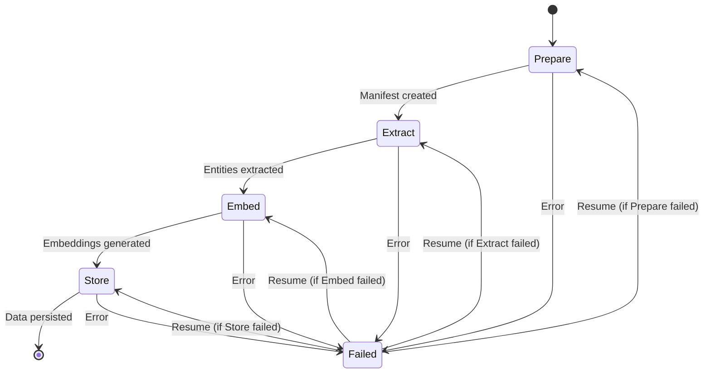
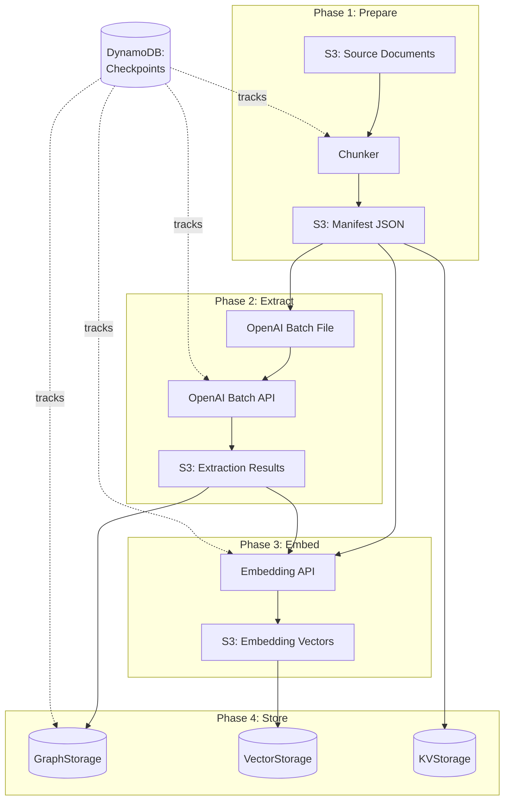

## 12.1 The Four-Phase Pipeline

EdgeQuake's batch ingestion system decomposes document processing into four
distinct phases: **Prepare**, **Extract**, **Embed**, and **Store**. Each
phase has a single responsibility, produces a well-defined output, and
checkpoints its progress to DynamoDB before handing off to the next phase.

This decomposition is not arbitrary. It reflects the natural boundaries in
the processing pipeline where the work changes character -- from I/O-bound
file scanning, to LLM-bound extraction, to embedding model API calls, to
database writes. Separating phases enables independent scaling, cost
optimization, and most critically, the ability to resume after failure without
repeating expensive LLM calls.

### Pipeline State Machine

The batch pipeline is a state machine with well-defined transitions:



Each state transition is recorded in DynamoDB. When a failure occurs, the
resume logic reads the last successful checkpoint and restarts from the
appropriate phase. Work completed in earlier phases is never repeated.

### Phase 1: Prepare

The Prepare phase scans the input source (an S3 prefix, a local directory,
or a list of URLs), reads each document, chunks it, and produces a
**manifest** -- a JSON file that describes every chunk to be processed.

```rust
use serde::{Deserialize, Serialize};

/// A single entry in the batch manifest.
#[derive(Debug, Clone, Serialize, Deserialize)]
pub struct ManifestEntry {
    /// Unique identifier for this chunk.
    pub chunk_id: String,

    /// The source document this chunk came from.
    pub source_document: String,

    /// The chunk index within the source document.
    pub chunk_index: usize,

    /// The chunked text content.
    pub content: String,

    /// Byte offset in the original document.
    pub byte_offset: usize,

    /// Contextual header prepended for better extraction.
    pub context_header: String,
}

/// The complete manifest for a batch job.
#[derive(Debug, Serialize, Deserialize)]
pub struct BatchManifest {
    /// Unique identifier for this batch run.
    pub batch_id: String,

    /// Workspace (tenant) this batch belongs to.
    pub workspace_id: String,

    /// When the manifest was created.
    pub created_at: chrono::DateTime<chrono::Utc>,

    /// Total number of source documents scanned.
    pub document_count: usize,

    /// All chunks to be processed.
    pub entries: Vec<ManifestEntry>,
}
```

The Prepare phase also applies EdgeQuake's chunking strategy (from Chapter 2)
and prepends context headers for domain-specific extraction. For example,
when processing legal documents in the Epstein dataset, the context header
might include the document type, date, and classification.

```rust
/// Prepare phase: scan documents and create the manifest.
pub async fn prepare(config: &BatchConfig) -> Result<BatchManifest> {
    let mut entries = Vec::new();
    let batch_id = generate_batch_id();

    tracing::info!(batch_id = %batch_id, source = %config.source_prefix, "starting prepare phase");

    // List all documents under the source prefix.
    let documents = list_documents(&config.source_prefix).await?;
    tracing::info!(count = documents.len(), "found documents to process");

    for doc in &documents {
        // Read and chunk the document.
        let content = read_document(doc).await?;
        let chunks = chunk_document(&content, &config.chunking_config);

        for (index, chunk) in chunks.iter().enumerate() {
            let context_header = build_context_header(doc, index, chunks.len());

            entries.push(ManifestEntry {
                chunk_id: format!("{}-{}-{}", batch_id, doc.name, index),
                source_document: doc.path.clone(),
                chunk_index: index,
                content: chunk.text.clone(),
                byte_offset: chunk.byte_offset,
                context_header,
            });
        }
    }

    let manifest = BatchManifest {
        batch_id,
        workspace_id: config.workspace_id.clone(),
        created_at: chrono::Utc::now(),
        document_count: documents.len(),
        entries,
    };

    // Upload manifest to S3 for durability.
    upload_manifest(&manifest, &config.manifest_bucket).await?;

    tracing::info!(
        batch_id = %manifest.batch_id,
        documents = manifest.document_count,
        chunks = manifest.entries.len(),
        "prepare phase complete"
    );

    Ok(manifest)
}
```

### Phase 2: Extract

The Extract phase sends each chunk to an LLM for entity and relationship
extraction. This is the most expensive phase, which is why EdgeQuake uses
the OpenAI Batch API (covered in detail in section 12.2) to cut costs by 50%.

The Extract phase:

1. Converts each manifest entry into an OpenAI Batch API request.
2. Uploads the batch file to OpenAI.
3. Submits the batch job and waits for completion.
4. Downloads and parses the results.

```rust
/// A single extraction result for one chunk.
#[derive(Debug, Clone, Serialize, Deserialize)]
pub struct ExtractionResult {
    pub chunk_id: String,
    pub entities: Vec<ExtractedEntity>,
    pub relationships: Vec<ExtractedRelationship>,
}

/// Extract phase: run LLM entity extraction on all chunks.
pub async fn extract(
    manifest: &BatchManifest,
    config: &BatchConfig,
) -> Result<Vec<ExtractionResult>> {
    tracing::info!(
        batch_id = %manifest.batch_id,
        chunks = manifest.entries.len(),
        "starting extract phase"
    );

    // Build the batch request file (see section 12.2 for details).
    let batch_file = build_extraction_batch_file(manifest, &config.extraction_prompt)?;

    // Submit to OpenAI Batch API.
    let batch_job = submit_batch_job(&batch_file, &config.openai_config).await?;

    tracing::info!(
        batch_id = %manifest.batch_id,
        openai_batch_id = %batch_job.id,
        "batch job submitted, polling for completion"
    );

    // Poll until complete (with exponential backoff).
    let completed_job = poll_batch_completion(&batch_job.id, &config.openai_config).await?;

    // Download and parse results.
    let results = download_batch_results(&completed_job, manifest).await?;

    tracing::info!(
        batch_id = %manifest.batch_id,
        results = results.len(),
        total_entities = results.iter().map(|r| r.entities.len()).sum::<usize>(),
        total_relationships = results.iter().map(|r| r.relationships.len()).sum::<usize>(),
        "extract phase complete"
    );

    Ok(results)
}
```

### Phase 3: Embed

The Embed phase generates vector embeddings for each chunk and for each
extracted entity. These embeddings enable the similarity search that powers
EdgeQuake's query engine.

```rust
/// Embed phase: generate embeddings for chunks and entities.
pub async fn embed(
    manifest: &BatchManifest,
    extractions: &[ExtractionResult],
    config: &BatchConfig,
) -> Result<EmbeddingResults> {
    tracing::info!(
        batch_id = %manifest.batch_id,
        "starting embed phase"
    );

    // Collect all texts that need embeddings.
    let mut texts: Vec<(String, String)> = Vec::new(); // (id, text)

    // Chunk texts.
    for entry in &manifest.entries {
        texts.push((entry.chunk_id.clone(), entry.content.clone()));
    }

    // Entity descriptions.
    for extraction in extractions {
        for entity in &extraction.entities {
            texts.push((
                format!("entity-{}", entity.name),
                entity.description.clone(),
            ));
        }
    }

    tracing::info!(total_texts = texts.len(), "generating embeddings");

    // Process in batches of 2048 (OpenAI embedding API limit).
    let mut all_embeddings = Vec::new();
    for batch in texts.chunks(2048) {
        let batch_texts: Vec<&str> = batch.iter().map(|(_, t)| t.as_str()).collect();
        let embeddings = generate_embeddings(&batch_texts, &config.embedding_config).await?;
        all_embeddings.extend(
            batch.iter().zip(embeddings).map(|((id, _), emb)| (id.clone(), emb))
        );
    }

    tracing::info!(
        batch_id = %manifest.batch_id,
        embeddings = all_embeddings.len(),
        "embed phase complete"
    );

    Ok(EmbeddingResults {
        embeddings: all_embeddings,
    })
}
```

### Phase 4: Store

The Store phase writes everything to the storage backends -- entities and
relationships to `GraphStorage`, embeddings to `VectorStorage`, and chunks
to `KVStorage`:

```rust
/// Store phase: persist all results to storage backends.
pub async fn store(
    manifest: &BatchManifest,
    extractions: &[ExtractionResult],
    embeddings: &EmbeddingResults,
    storage: &dyn GraphStorage,
    vector_storage: &dyn VectorStorage,
    kv_storage: &dyn KVStorage,
) -> Result<StoreStats> {
    tracing::info!(
        batch_id = %manifest.batch_id,
        workspace = %manifest.workspace_id,
        "starting store phase"
    );

    let mut stats = StoreStats::default();

    // Store entities and relationships.
    for extraction in extractions {
        let entities: Vec<Entity> = extraction.entities.iter()
            .map(|e| e.clone().into())
            .collect();
        storage.upsert_entities(&entities).await?;
        stats.entities_stored += entities.len();

        let relationships: Vec<Relationship> = extraction.relationships.iter()
            .map(|r| r.clone().into())
            .collect();
        storage.upsert_relationships(&relationships).await?;
        stats.relationships_stored += relationships.len();
    }

    // Store embeddings.
    for (id, embedding) in &embeddings.embeddings {
        vector_storage.upsert_embedding(id, embedding).await?;
        stats.embeddings_stored += 1;
    }

    // Store original chunks for retrieval.
    for entry in &manifest.entries {
        kv_storage.put(&entry.chunk_id, &entry.content).await?;
        stats.chunks_stored += 1;
    }

    tracing::info!(
        batch_id = %manifest.batch_id,
        entities = stats.entities_stored,
        relationships = stats.relationships_stored,
        embeddings = stats.embeddings_stored,
        chunks = stats.chunks_stored,
        "store phase complete"
    );

    Ok(stats)
}
```

### The Complete Pipeline Orchestrator

The orchestrator ties all four phases together with checkpoint management:

```rust
/// Run the complete batch ingestion pipeline.
///
/// Each phase is checkpointed to DynamoDB. If the pipeline is
/// interrupted, calling `run` again with the same batch_id will
/// resume from the last completed phase.
pub async fn run_pipeline(config: &BatchConfig) -> Result<PipelineResult> {
    let state_manager = DynamoStateManager::new(&config.dynamodb_config).await?;

    // Phase 1: Prepare (or skip if already checkpointed).
    let manifest = if state_manager.is_phase_complete(&config.batch_id, Phase::Prepare).await? {
        tracing::info!("prepare phase already complete, loading manifest");
        state_manager.load_manifest(&config.batch_id).await?
    } else {
        let manifest = prepare(config).await?;
        state_manager.checkpoint(Phase::Prepare, &config.batch_id).await?;
        manifest
    };

    // Phase 2: Extract (or skip if already checkpointed).
    let extractions = if state_manager.is_phase_complete(&config.batch_id, Phase::Extract).await? {
        tracing::info!("extract phase already complete, loading results");
        state_manager.load_extractions(&config.batch_id).await?
    } else {
        let extractions = extract(&manifest, config).await?;
        state_manager.checkpoint(Phase::Extract, &config.batch_id).await?;
        extractions
    };

    // Phase 3: Embed (or skip if already checkpointed).
    let embeddings = if state_manager.is_phase_complete(&config.batch_id, Phase::Embed).await? {
        tracing::info!("embed phase already complete, loading embeddings");
        state_manager.load_embeddings(&config.batch_id).await?
    } else {
        let embeddings = embed(&manifest, &extractions, config).await?;
        state_manager.checkpoint(Phase::Embed, &config.batch_id).await?;
        embeddings
    };

    // Phase 4: Store.
    if !state_manager.is_phase_complete(&config.batch_id, Phase::Store).await? {
        let storage = create_storage(&config, &manifest.workspace_id).await?;
        store(&manifest, &extractions, &embeddings,
              &*storage.graph, &*storage.vector, &*storage.kv).await?;
        state_manager.checkpoint(Phase::Store, &config.batch_id).await?;
    }

    tracing::info!(batch_id = %config.batch_id, "pipeline complete");
    Ok(PipelineResult { batch_id: config.batch_id.clone(), status: PipelineStatus::Complete })
}
```

### Data Flow Between Phases

Each phase reads from and writes to well-defined locations:



### Phase Characteristics

| Phase | Bottleneck | Duration (10K docs) | Cost Driver | Parallelizable |
|-------|-----------|---------------------|-------------|---------------|
| Prepare | I/O (S3 reads) | Minutes | S3 requests | Yes (per document) |
| Extract | LLM API | Hours | Token usage | Yes (via Batch API) |
| Embed | Embedding API | Minutes | Token usage | Yes (batches of 2048) |
| Store | Database writes | Minutes | Write throughput | Yes (concurrent writes) |

The Extract phase dominates both time and cost. By using the OpenAI Batch API
(section 12.2), you reduce the cost of this phase by 50%.

### Key Takeaways

- The four-phase pipeline decomposes batch ingestion into Prepare, Extract,
  Embed, and Store -- each with a clear responsibility and checkpoint boundary.
- Each phase is independently resumable. If the Extract phase fails after
  processing 8,000 of 10,000 chunks, you do not re-run the Prepare phase.
- Intermediate results are stored in S3, making them durable across restarts.
- The Extract phase is the bottleneck -- it is the most expensive and the
  slowest, which is why it uses the Batch API for cost savings.

---

*Next: [12.2 OpenAI Batch API Integration](ch12-02-openai-batch.md)*
