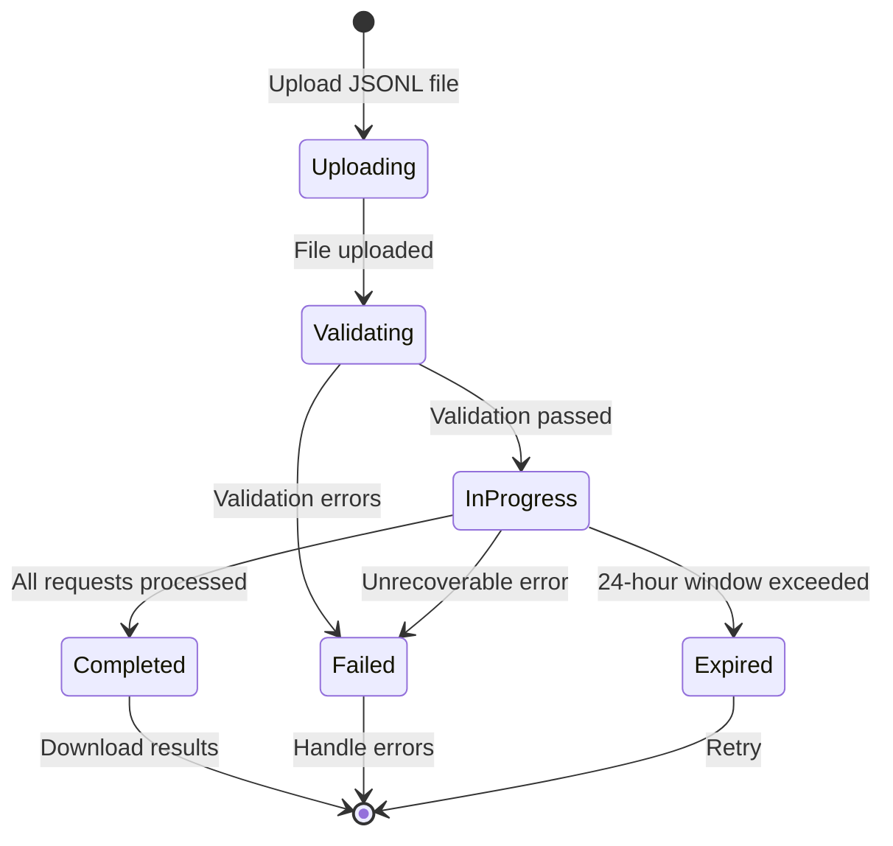

## 12.2 OpenAI Batch API Integration

The OpenAI Batch API is designed for workloads that do not require real-time
responses. You upload a file containing multiple requests, OpenAI processes
them asynchronously within a 24-hour window, and you download the results when
ready. The tradeoff is simple: you give up low latency in exchange for a **50%
cost reduction**.

For batch ingestion of knowledge bases, where you are processing thousands of
documents and latency is measured in hours anyway, this tradeoff is excellent.
The Extract phase of EdgeQuake's pipeline uses the Batch API for entity and
relationship extraction.

### The Batch File Format

The Batch API expects a JSONL (JSON Lines) file where each line is a
self-contained API request:

```json
{"custom_id": "chunk-001", "method": "POST", "url": "/v1/chat/completions", "body": {"model": "gpt-4o", "messages": [{"role": "system", "content": "Extract entities..."}, {"role": "user", "content": "Document text here..."}], "response_format": {"type": "json_object"}}}
{"custom_id": "chunk-002", "method": "POST", "url": "/v1/chat/completions", "body": {"model": "gpt-4o", "messages": [{"role": "system", "content": "Extract entities..."}, {"role": "user", "content": "Another document..."}], "response_format": {"type": "json_object"}}}
```

Each line has:

| Field | Purpose |
|-------|---------|
| `custom_id` | Your identifier to match results back to inputs (the chunk_id) |
| `method` | Always `"POST"` for chat completions |
| `url` | The API endpoint path |
| `body` | The complete request body, identical to what you would send in a real-time call |

### Building the Batch File in Rust

```rust
use serde::Serialize;
use std::io::Write;

/// A single request in the OpenAI Batch API file.
#[derive(Serialize)]
struct BatchRequest {
    custom_id: String,
    method: String,
    url: String,
    body: BatchRequestBody,
}

#[derive(Serialize)]
struct BatchRequestBody {
    model: String,
    messages: Vec<Message>,
    response_format: ResponseFormat,
    temperature: f32,
}

#[derive(Serialize)]
struct Message {
    role: String,
    content: String,
}

#[derive(Serialize)]
struct ResponseFormat {
    #[serde(rename = "type")]
    format_type: String,
}

/// Build a JSONL batch file from the manifest entries.
///
/// Each chunk becomes one line in the batch file with
/// the entity extraction prompt.
pub fn build_extraction_batch_file(
    manifest: &BatchManifest,
    system_prompt: &str,
) -> Result<Vec<u8>> {
    let mut buffer = Vec::new();

    for entry in &manifest.entries {
        let request = BatchRequest {
            custom_id: entry.chunk_id.clone(),
            method: "POST".into(),
            url: "/v1/chat/completions".into(),
            body: BatchRequestBody {
                model: "gpt-4o".into(),
                messages: vec![
                    Message {
                        role: "system".into(),
                        content: system_prompt.to_string(),
                    },
                    Message {
                        role: "user".into(),
                        content: format!(
                            "{}\n\n---\n\n{}",
                            entry.context_header, entry.content
                        ),
                    },
                ],
                response_format: ResponseFormat {
                    format_type: "json_object".into(),
                },
                temperature: 0.0,
            },
        };

        serde_json::to_writer(&mut buffer, &request)?;
        buffer.write_all(b"\n")?;
    }

    tracing::info!(
        entries = manifest.entries.len(),
        bytes = buffer.len(),
        "batch file created"
    );

    Ok(buffer)
}
```

### The Batch Job Lifecycle

The Batch API has a well-defined lifecycle:



### Submitting and Polling Batch Jobs

Here is the complete flow for submitting a batch job and waiting for results:

```rust
use reqwest::Client;
use serde::Deserialize;
use std::time::Duration;
use tokio::time::sleep;

/// Configuration for the OpenAI API.
pub struct OpenAIConfig {
    pub api_key: String,
    pub base_url: String,
}

/// Response from the batch job creation endpoint.
#[derive(Debug, Deserialize)]
pub struct BatchJob {
    pub id: String,
    pub status: String,
    pub output_file_id: Option<String>,
    pub error_file_id: Option<String>,
    pub request_counts: Option<RequestCounts>,
}

#[derive(Debug, Deserialize)]
pub struct RequestCounts {
    pub total: usize,
    pub completed: usize,
    pub failed: usize,
}

/// Submit a batch job to OpenAI.
///
/// Steps:
/// 1. Upload the JSONL file.
/// 2. Create a batch job referencing the uploaded file.
pub async fn submit_batch_job(
    batch_file: &[u8],
    config: &OpenAIConfig,
) -> Result<BatchJob> {
    let client = Client::new();

    // Step 1: Upload the batch file.
    let file_response: serde_json::Value = client
        .post(format!("{}/v1/files", config.base_url))
        .bearer_auth(&config.api_key)
        .multipart(
            reqwest::multipart::Form::new()
                .text("purpose", "batch")
                .part(
                    "file",
                    reqwest::multipart::Part::bytes(batch_file.to_vec())
                        .file_name("batch_input.jsonl")
                        .mime_str("application/jsonl")?,
                ),
        )
        .send()
        .await?
        .json()
        .await?;

    let file_id = file_response["id"]
        .as_str()
        .ok_or_else(|| anyhow::anyhow!("missing file id in upload response"))?;

    tracing::info!(file_id = %file_id, "batch file uploaded");

    // Step 2: Create the batch job.
    let batch_job: BatchJob = client
        .post(format!("{}/v1/batches", config.base_url))
        .bearer_auth(&config.api_key)
        .json(&serde_json::json!({
            "input_file_id": file_id,
            "endpoint": "/v1/chat/completions",
            "completion_window": "24h"
        }))
        .send()
        .await?
        .json()
        .await?;

    tracing::info!(
        batch_id = %batch_job.id,
        status = %batch_job.status,
        "batch job created"
    );

    Ok(batch_job)
}

/// Poll a batch job until it reaches a terminal state.
///
/// Uses exponential backoff starting at 30 seconds,
/// capping at 5 minutes between polls.
pub async fn poll_batch_completion(
    batch_id: &str,
    config: &OpenAIConfig,
) -> Result<BatchJob> {
    let client = Client::new();
    let mut interval = Duration::from_secs(30);
    let max_interval = Duration::from_secs(300);

    loop {
        sleep(interval).await;

        let job: BatchJob = client
            .get(format!("{}/v1/batches/{}", config.base_url, batch_id))
            .bearer_auth(&config.api_key)
            .send()
            .await?
            .json()
            .await?;

        match job.status.as_str() {
            "completed" => {
                tracing::info!(
                    batch_id = %batch_id,
                    completed = ?job.request_counts,
                    "batch job completed"
                );
                return Ok(job);
            }
            "failed" | "expired" | "cancelled" => {
                tracing::error!(
                    batch_id = %batch_id,
                    status = %job.status,
                    "batch job failed"
                );
                return Err(anyhow::anyhow!(
                    "batch job {} ended with status: {}",
                    batch_id,
                    job.status
                ));
            }
            status => {
                if let Some(counts) = &job.request_counts {
                    tracing::info!(
                        batch_id = %batch_id,
                        status = %status,
                        completed = counts.completed,
                        total = counts.total,
                        "polling batch job"
                    );
                }
            }
        }

        // Exponential backoff with cap.
        interval = std::cmp::min(interval * 2, max_interval);
    }
}
```

### Processing Batch Results

The output file is also JSONL, with each line containing the result for one
request:

```json
{"id": "response-abc", "custom_id": "chunk-001", "response": {"status_code": 200, "body": {"choices": [{"message": {"content": "{\"entities\": [...], \"relationships\": [...]}"}}]}}}
{"id": "response-def", "custom_id": "chunk-002", "response": {"status_code": 200, "body": {"choices": [{"message": {"content": "{\"entities\": [...], \"relationships\": [...]}"}}]}}}
```

```rust
/// A single result from the batch output file.
#[derive(Debug, Deserialize)]
struct BatchOutputLine {
    custom_id: String,
    response: BatchResponse,
}

#[derive(Debug, Deserialize)]
struct BatchResponse {
    status_code: u16,
    body: Option<BatchResponseBody>,
}

#[derive(Debug, Deserialize)]
struct BatchResponseBody {
    choices: Vec<Choice>,
}

#[derive(Debug, Deserialize)]
struct Choice {
    message: ChoiceMessage,
}

#[derive(Debug, Deserialize)]
struct ChoiceMessage {
    content: String,
}

/// Download and parse batch results into ExtractionResults.
pub async fn download_batch_results(
    job: &BatchJob,
    manifest: &BatchManifest,
) -> Result<Vec<ExtractionResult>> {
    let output_file_id = job.output_file_id.as_ref()
        .ok_or_else(|| anyhow::anyhow!("completed job has no output file"))?;

    // Download the output file content.
    let content = download_file(output_file_id).await?;

    let mut results = Vec::new();
    let mut failures = 0;

    for line in content.lines() {
        let output: BatchOutputLine = serde_json::from_str(line)?;

        if output.response.status_code != 200 {
            tracing::warn!(
                chunk_id = %output.custom_id,
                status = output.response.status_code,
                "batch request failed"
            );
            failures += 1;
            continue;
        }

        if let Some(body) = output.response.body {
            if let Some(choice) = body.choices.first() {
                // Parse the structured extraction response.
                match serde_json::from_str::<ExtractionOutput>(&choice.message.content) {
                    Ok(extraction) => {
                        results.push(ExtractionResult {
                            chunk_id: output.custom_id,
                            entities: extraction.entities,
                            relationships: extraction.relationships,
                        });
                    }
                    Err(e) => {
                        tracing::warn!(
                            chunk_id = %output.custom_id,
                            error = %e,
                            "failed to parse extraction output"
                        );
                        failures += 1;
                    }
                }
            }
        }
    }

    tracing::info!(
        successful = results.len(),
        failed = failures,
        total = manifest.entries.len(),
        "batch results processed"
    );

    // Also download and log the error file if it exists.
    if let Some(error_file_id) = &job.error_file_id {
        let errors = download_file(error_file_id).await?;
        if !errors.is_empty() {
            tracing::warn!(
                errors = errors.lines().count(),
                "batch job had errors (see error file)"
            );
        }
    }

    Ok(results)
}
```

### Cost Savings Breakdown

The economic case for the Batch API is straightforward:

| Model | Real-Time Input | Real-Time Output | Batch Input | Batch Output |
|-------|----------------|-----------------|-------------|-------------|
| GPT-4o | $2.50/1M tokens | $10.00/1M tokens | $1.25/1M tokens | $5.00/1M tokens |
| GPT-4o-mini | $0.15/1M tokens | $0.60/1M tokens | $0.075/1M tokens | $0.30/1M tokens |

For a concrete example, consider ingesting 10,000 documents:

```text
Average document: 2,000 tokens input, 500 tokens output
Total: 20M input tokens + 5M output tokens

Real-Time (GPT-4o):
  Input:  20M * $2.50/1M  = $50.00
  Output:  5M * $10.00/1M = $50.00
  Total: $100.00

Batch API (GPT-4o):
  Input:  20M * $1.25/1M  = $25.00
  Output:  5M * $5.00/1M  = $25.00
  Total: $50.00

Savings: $50.00 (50%)
```

At scale (100,000+ documents), this savings compounds to thousands of dollars
per ingestion run.

### Handling Partial Failures

Not every request in a batch will succeed. The Batch API provides both an
output file (successful results) and an error file (failed requests). Your
pipeline must handle partial failures gracefully:

```rust
/// Handle partial batch failures by identifying which chunks need retry.
pub fn identify_failed_chunks(
    manifest: &BatchManifest,
    results: &[ExtractionResult],
) -> Vec<String> {
    let successful_ids: std::collections::HashSet<&str> =
        results.iter().map(|r| r.chunk_id.as_str()).collect();

    manifest
        .entries
        .iter()
        .filter(|entry| !successful_ids.contains(entry.chunk_id.as_str()))
        .map(|entry| entry.chunk_id.clone())
        .collect()
}

/// Retry failed chunks using the real-time API (more expensive but immediate).
///
/// This is appropriate when only a small percentage of chunks failed
/// and you do not want to re-submit an entire batch.
pub async fn retry_failed_chunks(
    failed_ids: &[String],
    manifest: &BatchManifest,
    config: &BatchConfig,
) -> Result<Vec<ExtractionResult>> {
    tracing::info!(
        count = failed_ids.len(),
        "retrying failed chunks via real-time API"
    );

    let mut results = Vec::new();
    let failed_set: std::collections::HashSet<&str> =
        failed_ids.iter().map(|s| s.as_str()).collect();

    for entry in manifest.entries.iter().filter(|e| failed_set.contains(e.chunk_id.as_str())) {
        match extract_single_chunk(entry, config).await {
            Ok(result) => results.push(result),
            Err(e) => {
                tracing::error!(
                    chunk_id = %entry.chunk_id,
                    error = %e,
                    "retry also failed, skipping chunk"
                );
            }
        }
    }

    Ok(results)
}
```

### Batch API Limits and Best Practices

| Constraint | Limit | EdgeQuake Handling |
|-----------|-------|-------------------|
| Max file size | 100 MB | Split into multiple batch jobs |
| Max requests per batch | 50,000 | Split manifest into sub-batches |
| Completion window | 24 hours | Monitor and retry if expired |
| Concurrent batches | Varies by tier | Queue management in state table |
| Enqueued tokens | Varies by tier | Token counting before submission |

```rust
/// Split a manifest into sub-batches if it exceeds API limits.
pub fn split_manifest(manifest: &BatchManifest, max_per_batch: usize) -> Vec<Vec<&ManifestEntry>> {
    manifest.entries.chunks(max_per_batch).map(|c| c.to_vec()).collect()
}
```

### Key Takeaways

- The OpenAI Batch API provides a 50% cost reduction for workloads that
  tolerate higher latency -- ideal for knowledge base ingestion.
- The batch file is a JSONL format where each line is a complete API request
  with a `custom_id` for result matching.
- Always handle partial failures -- some requests in a batch may fail while
  others succeed.
- Use exponential backoff when polling for completion to avoid rate limiting.
- For very large datasets, split the manifest into sub-batches that fit within
  API limits.

---

*Next: [12.3 DynamoDB State Management](ch12-03-dynamodb-state.md)*
