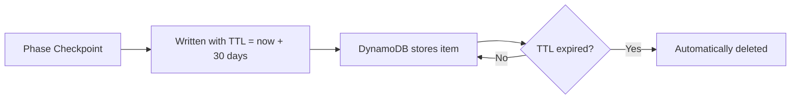

## 12.3 DynamoDB State Management

A batch pipeline processing thousands of documents over several hours will
encounter failures -- network timeouts, API rate limits, service outages, or
simply a process restart. Without state management, a failure in Phase 3
(Embed) means re-running Phase 2 (Extract), wasting hours of LLM processing
and the associated cost.

EdgeQuake solves this with DynamoDB-based state management. Every phase
transition is recorded as a checkpoint, and the pipeline can resume from the
last completed phase at any time. DynamoDB is ideal for this role because it
offers single-digit-millisecond writes, conditional updates for concurrency
safety, and automatic item expiration via TTL.

### State Schema Design

The state table uses a composite primary key that naturally partitions data
by batch job:

```text
Table: edgequake-batch-state
  Partition Key (PK): batch_id     (String)
  Sort Key (SK):      state_key    (String)
```

Different sort key prefixes represent different types of state:

| Sort Key Pattern | Purpose | Example |
|-----------------|---------|---------|
| `PHASE#<name>` | Phase checkpoint | `PHASE#Extract` |
| `META` | Batch metadata (config, timing) | `META` |
| `MANIFEST` | Pointer to manifest in S3 | `MANIFEST` |
| `ERROR#<chunk_id>` | Per-chunk error record | `ERROR#chunk-001-5` |
| `STATS#<phase>` | Phase-level statistics | `STATS#Embed` |

```mermaid
erDiagram
    BATCH_STATE {
        string PK "batch_id"
        string SK "state_key"
        string status "completed | failed | in_progress"
        string timestamp "ISO 8601"
        string s3_uri "pointer to phase output"
        number ttl "Unix epoch for auto-expiry"
        map details "phase-specific metadata"
    }
```

### The Phase Enum

```rust
use serde::{Deserialize, Serialize};
use std::fmt;

/// The four phases of the batch pipeline.
#[derive(Debug, Clone, Copy, PartialEq, Eq, PartialOrd, Ord, Serialize, Deserialize)]
pub enum Phase {
    Prepare,
    Extract,
    Embed,
    Store,
}

impl Phase {
    /// Return the next phase in the pipeline, if any.
    pub fn next(&self) -> Option<Phase> {
        match self {
            Phase::Prepare => Some(Phase::Extract),
            Phase::Extract => Some(Phase::Embed),
            Phase::Embed => Some(Phase::Store),
            Phase::Store => None,
        }
    }

    /// Return all phases in order.
    pub fn all() -> &'static [Phase] {
        &[Phase::Prepare, Phase::Extract, Phase::Embed, Phase::Store]
    }
}

impl fmt::Display for Phase {
    fn fmt(&self, f: &mut fmt::Formatter<'_>) -> fmt::Result {
        match self {
            Phase::Prepare => write!(f, "Prepare"),
            Phase::Extract => write!(f, "Extract"),
            Phase::Embed => write!(f, "Embed"),
            Phase::Store => write!(f, "Store"),
        }
    }
}
```

### The DynamoDB State Manager

The state manager encapsulates all interactions with the DynamoDB state table:

```rust
use aws_sdk_dynamodb::Client as DynamoClient;
use aws_sdk_dynamodb::types::AttributeValue;
use chrono::Utc;

pub struct DynamoStateManager {
    client: DynamoClient,
    table_name: String,
    /// TTL for state records in seconds (default: 30 days).
    ttl_seconds: u64,
}

impl DynamoStateManager {
    pub async fn new(config: &DynamoConfig) -> Result<Self> {
        let aws_config = aws_config::load_defaults(aws_config::BehaviorVersion::latest()).await;
        let client = DynamoClient::new(&aws_config);

        Ok(Self {
            client,
            table_name: config.table_name.clone(),
            ttl_seconds: config.ttl_seconds.unwrap_or(30 * 24 * 3600),
        })
    }

    /// Record that a phase has completed successfully.
    ///
    /// This is the checkpoint that enables resume-after-failure.
    pub async fn checkpoint(
        &self,
        phase: Phase,
        batch_id: &str,
    ) -> Result<()> {
        let now = Utc::now();
        let ttl = now.timestamp() as u64 + self.ttl_seconds;

        self.client
            .put_item()
            .table_name(&self.table_name)
            .item("PK", AttributeValue::S(batch_id.to_string()))
            .item("SK", AttributeValue::S(format!("PHASE#{}", phase)))
            .item("status", AttributeValue::S("completed".into()))
            .item("timestamp", AttributeValue::S(now.to_rfc3339()))
            .item("ttl", AttributeValue::N(ttl.to_string()))
            .send()
            .await?;

        tracing::info!(
            batch_id = %batch_id,
            phase = %phase,
            "phase checkpoint recorded"
        );

        Ok(())
    }

    /// Check whether a phase has been completed for a given batch.
    pub async fn is_phase_complete(
        &self,
        batch_id: &str,
        phase: Phase,
    ) -> Result<bool> {
        let result = self.client
            .get_item()
            .table_name(&self.table_name)
            .key("PK", AttributeValue::S(batch_id.to_string()))
            .key("SK", AttributeValue::S(format!("PHASE#{}", phase)))
            .send()
            .await?;

        match result.item() {
            Some(item) => {
                let status = item
                    .get("status")
                    .and_then(|v| v.as_s().ok())
                    .map(|s| s.as_str());
                Ok(status == Some("completed"))
            }
            None => Ok(false),
        }
    }

    /// Determine which phase to resume from.
    ///
    /// Finds the last completed phase and returns the next one.
    /// If no phases are complete, returns Phase::Prepare.
    pub async fn find_resume_point(&self, batch_id: &str) -> Result<Phase> {
        for phase in Phase::all().iter().rev() {
            if self.is_phase_complete(batch_id, *phase).await? {
                return match phase.next() {
                    Some(next) => {
                        tracing::info!(
                            batch_id = %batch_id,
                            last_completed = %phase,
                            resuming_from = %next,
                            "found resume point"
                        );
                        Ok(next)
                    }
                    None => {
                        tracing::info!(
                            batch_id = %batch_id,
                            "all phases already complete"
                        );
                        Ok(Phase::Store) // Already done
                    }
                };
            }
        }

        tracing::info!(batch_id = %batch_id, "no checkpoints found, starting from Prepare");
        Ok(Phase::Prepare)
    }
}
```

### Recording Phase Statistics

Beyond simple completion checkpoints, the state manager can record detailed
statistics for each phase:

```rust
impl DynamoStateManager {
    /// Record statistics for a completed phase.
    pub async fn record_stats(
        &self,
        batch_id: &str,
        phase: Phase,
        stats: &serde_json::Value,
    ) -> Result<()> {
        let now = Utc::now();
        let ttl = now.timestamp() as u64 + self.ttl_seconds;

        self.client
            .put_item()
            .table_name(&self.table_name)
            .item("PK", AttributeValue::S(batch_id.to_string()))
            .item("SK", AttributeValue::S(format!("STATS#{}", phase)))
            .item("timestamp", AttributeValue::S(now.to_rfc3339()))
            .item("stats", AttributeValue::S(serde_json::to_string(stats)?))
            .item("ttl", AttributeValue::N(ttl.to_string()))
            .send()
            .await?;

        Ok(())
    }

    /// Record an error for a specific chunk.
    pub async fn record_chunk_error(
        &self,
        batch_id: &str,
        chunk_id: &str,
        phase: Phase,
        error: &str,
    ) -> Result<()> {
        let now = Utc::now();
        let ttl = now.timestamp() as u64 + self.ttl_seconds;

        self.client
            .put_item()
            .table_name(&self.table_name)
            .item("PK", AttributeValue::S(batch_id.to_string()))
            .item("SK", AttributeValue::S(format!("ERROR#{}", chunk_id)))
            .item("phase", AttributeValue::S(phase.to_string()))
            .item("error", AttributeValue::S(error.to_string()))
            .item("timestamp", AttributeValue::S(now.to_rfc3339()))
            .item("ttl", AttributeValue::N(ttl.to_string()))
            .send()
            .await?;

        Ok(())
    }
}
```

### Idempotent Operations

A critical property of the pipeline is **idempotency** -- running the same
phase twice with the same input produces the same result. This is essential
for safe resume behavior. If a phase partially completes before a failure,
re-running it must not create duplicate data.

Each storage operation uses idempotent patterns:

```rust
/// Idempotent entity upsert -- inserts or updates based on the
/// (workspace_id, entity_name) composite key.
///
/// If the entity already exists, it is updated rather than duplicated.
async fn upsert_entity(pool: &PgPool, workspace_id: &str, entity: &Entity) -> Result<()> {
    sqlx::query(
        r#"
        INSERT INTO entities (workspace_id, name, entity_type, description, metadata)
        VALUES ($1, $2, $3, $4, $5)
        ON CONFLICT (workspace_id, name)
        DO UPDATE SET
            entity_type = EXCLUDED.entity_type,
            description = EXCLUDED.description,
            metadata = EXCLUDED.metadata,
            updated_at = NOW()
        "#,
    )
    .bind(workspace_id)
    .bind(&entity.name)
    .bind(&entity.entity_type)
    .bind(&entity.description)
    .bind(&entity.metadata)
    .execute(pool)
    .await?;

    Ok(())
}

/// Idempotent embedding upsert -- uses the chunk_id as the unique key.
async fn upsert_embedding(
    storage: &dyn VectorStorage,
    chunk_id: &str,
    embedding: &[f32],
) -> Result<()> {
    // VectorStorage.upsert_embedding is inherently idempotent --
    // it overwrites the embedding for the given key.
    storage.upsert_embedding(chunk_id, embedding).await?;
    Ok(())
}
```

The key patterns for idempotency:

| Operation | Idempotency Mechanism |
|-----------|---------------------|
| Entity insert | `ON CONFLICT ... DO UPDATE` (PostgreSQL upsert) |
| Relationship insert | `ON CONFLICT ... DO UPDATE` |
| Embedding insert | Key-based overwrite in VectorStorage |
| Chunk insert | Key-based overwrite in KVStorage |
| DynamoDB checkpoint | `PutItem` overwrites existing item |

### Querying Pipeline Status

The state table supports efficient status queries for monitoring dashboards:

```rust
impl DynamoStateManager {
    /// Get the full status of a batch job, including all phase checkpoints.
    pub async fn get_batch_status(&self, batch_id: &str) -> Result<BatchStatus> {
        let result = self.client
            .query()
            .table_name(&self.table_name)
            .key_condition_expression("PK = :pk")
            .expression_attribute_values(":pk", AttributeValue::S(batch_id.to_string()))
            .send()
            .await?;

        let mut status = BatchStatus {
            batch_id: batch_id.to_string(),
            phases: Vec::new(),
            errors: Vec::new(),
            stats: Vec::new(),
        };

        for item in result.items() {
            let sk = item.get("SK")
                .and_then(|v| v.as_s().ok())
                .unwrap_or(&String::new())
                .clone();

            if sk.starts_with("PHASE#") {
                let phase_name = sk.strip_prefix("PHASE#").unwrap_or("");
                let phase_status = item.get("status")
                    .and_then(|v| v.as_s().ok())
                    .cloned()
                    .unwrap_or_default();
                let timestamp = item.get("timestamp")
                    .and_then(|v| v.as_s().ok())
                    .cloned()
                    .unwrap_or_default();

                status.phases.push(PhaseStatus {
                    phase: phase_name.to_string(),
                    status: phase_status,
                    timestamp,
                });
            } else if sk.starts_with("ERROR#") {
                let chunk_id = sk.strip_prefix("ERROR#").unwrap_or("");
                let error_msg = item.get("error")
                    .and_then(|v| v.as_s().ok())
                    .cloned()
                    .unwrap_or_default();

                status.errors.push(ChunkError {
                    chunk_id: chunk_id.to_string(),
                    error: error_msg,
                });
            }
        }

        Ok(status)
    }
}

#[derive(Debug, Serialize)]
pub struct BatchStatus {
    pub batch_id: String,
    pub phases: Vec<PhaseStatus>,
    pub errors: Vec<ChunkError>,
    pub stats: Vec<serde_json::Value>,
}

#[derive(Debug, Serialize)]
pub struct PhaseStatus {
    pub phase: String,
    pub status: String,
    pub timestamp: String,
}

#[derive(Debug, Serialize)]
pub struct ChunkError {
    pub chunk_id: String,
    pub error: String,
}
```

### Concurrency Safety with Conditional Writes

If multiple pipeline instances might operate on the same batch (e.g., after
a restart with a new process), you need conditional writes to prevent race
conditions:

```rust
impl DynamoStateManager {
    /// Atomically claim a batch for processing.
    ///
    /// Uses a DynamoDB conditional write to ensure only one
    /// process can claim a batch at a time.
    pub async fn claim_batch(&self, batch_id: &str, worker_id: &str) -> Result<bool> {
        let now = Utc::now();
        let lease_expiry = now + chrono::Duration::minutes(30);

        let result = self.client
            .put_item()
            .table_name(&self.table_name)
            .item("PK", AttributeValue::S(batch_id.to_string()))
            .item("SK", AttributeValue::S("LOCK".into()))
            .item("worker_id", AttributeValue::S(worker_id.to_string()))
            .item("lease_expiry", AttributeValue::S(lease_expiry.to_rfc3339()))
            .item("claimed_at", AttributeValue::S(now.to_rfc3339()))
            // Only succeed if no lock exists or the existing lock has expired.
            .condition_expression(
                "attribute_not_exists(PK) OR lease_expiry < :now"
            )
            .expression_attribute_values(
                ":now",
                AttributeValue::S(now.to_rfc3339()),
            )
            .send()
            .await;

        match result {
            Ok(_) => {
                tracing::info!(
                    batch_id = %batch_id,
                    worker_id = %worker_id,
                    "batch claimed"
                );
                Ok(true)
            }
            Err(e) if is_condition_check_failed(&e) => {
                tracing::info!(
                    batch_id = %batch_id,
                    "batch already claimed by another worker"
                );
                Ok(false)
            }
            Err(e) => Err(e.into()),
        }
    }
}
```

### TTL-Based Cleanup

DynamoDB's Time To Live (TTL) feature automatically deletes expired items.
Every state record includes a `ttl` attribute set to 30 days after creation.
This ensures that state from old batch runs does not accumulate indefinitely:



No cleanup code is needed -- DynamoDB handles this automatically. You only
need to enable TTL on the table during setup:

```typescript
// In your CDK stack:
const stateTable = new dynamodb.Table(this, 'BatchState', {
    partitionKey: { name: 'PK', type: dynamodb.AttributeType.STRING },
    sortKey: { name: 'SK', type: dynamodb.AttributeType.STRING },
    billingMode: dynamodb.BillingMode.PAY_PER_REQUEST,
    timeToLiveAttribute: 'ttl',
});
```

### Key Takeaways

- DynamoDB state management enables resume-after-failure by checkpointing
  each phase completion.
- The composite key `(batch_id, state_key)` naturally partitions state by
  batch job and supports different record types via sort key prefixes.
- All storage operations must be idempotent -- upserts ensure that re-running
  a phase does not create duplicate data.
- Conditional writes prevent race conditions when multiple workers might
  claim the same batch.
- TTL-based cleanup ensures old state records are automatically purged.

---

*Next: [Chapter 13: Observability and Operations](../part4-enterprise/ch13-observability.md)*
