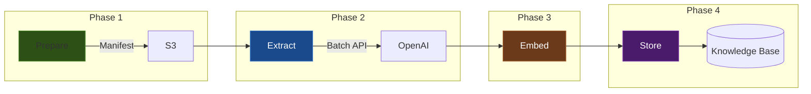

# Chapter 12: Batch Ingestion at Scale

> **"Real-world knowledge bases are not built one document at a time."**

In previous chapters, you ingested documents through the real-time API --
sending one document, waiting for entity extraction, generating embeddings,
and storing results. This works well for interactive use cases, but enterprise
knowledge bases often need to process thousands or millions of documents at
once. The real-time approach breaks down for several reasons:

1. **Cost** -- calling the LLM API synchronously for each document is
   expensive. OpenAI's Batch API offers a 50% discount for workloads that
   can tolerate higher latency.
2. **Reliability** -- in a long-running job processing 100,000 documents,
   failures are inevitable. You need the ability to resume from where you left
   off rather than starting over.
3. **Throughput** -- sequential processing cannot saturate the available
   bandwidth. A pipeline architecture allows parallelism within and across
   phases.
4. **Observability** -- with thousands of documents in flight, you need
   structured state management to know what has been processed, what failed,
   and what remains.

EdgeQuake's batch ingestion system (`edgequake-batch`) addresses all of these
with a **four-phase pipeline** backed by DynamoDB state management and the
OpenAI Batch API.

## Learning Objectives

After completing this chapter you will be able to:

1. **Describe the four phases** of EdgeQuake's batch ingestion pipeline and
   explain why each phase exists.
2. **Implement OpenAI Batch API integration** including batch file creation,
   job submission, polling, and result processing.
3. **Design a DynamoDB-based state management system** with phase
   checkpointing that enables resume-after-failure.
4. **Calculate the cost savings** of batch vs real-time API usage and decide
   when batch ingestion is appropriate.

## Chapter Outline

| Section | Topic |
|---------|-------|
| [12.1 The Four-Phase Pipeline](ch12-01-four-phases.md) | Prepare, Extract, Embed, Store -- architecture and data flow |
| [12.2 OpenAI Batch API Integration](ch12-02-openai-batch.md) | Batch file format, job lifecycle, cost savings, error handling |
| [12.3 DynamoDB State Management](ch12-03-dynamodb-state.md) | Phase checkpointing, resume logic, idempotent operations |

## Prerequisites

- Understanding of EdgeQuake's ingestion pipeline (Chapter 5)
- Familiarity with the `GraphStorage` and `VectorStorage` traits (Chapters 4, 8)
- Basic knowledge of AWS DynamoDB and S3

## Key Terminology

| Term | Definition |
|------|-----------|
| **Batch ingestion** | Processing a large set of documents in bulk, optimized for throughput and cost |
| **Manifest** | A JSON file listing all documents to process, with metadata for tracking |
| **Phase** | One stage of the pipeline (Prepare, Extract, Embed, Store) |
| **Checkpoint** | A DynamoDB record marking that a phase has completed for a given batch |
| **Batch API** | OpenAI's asynchronous API that processes requests in bulk at 50% reduced cost |
| **Idempotent** | An operation that produces the same result whether executed once or multiple times |

## When to Use Batch vs Real-Time Ingestion

| Factor | Real-Time API | Batch Pipeline |
|--------|--------------|---------------|
| Document count | 1-100 | 100-1,000,000+ |
| Latency requirement | Seconds | Hours |
| Cost per document | Full price | 50% discount (OpenAI Batch) |
| Failure recovery | Retry individual request | Resume from last checkpoint |
| Observability | Request logs | DynamoDB state table |
| Use case | Interactive ingestion | Initial load, periodic refresh |

Most production deployments use both -- batch ingestion for the initial
knowledge base load and periodic bulk updates, real-time ingestion for
individual document additions during normal operation.

---

*Next: [12.1 The Four-Phase Pipeline](ch12-01-four-phases.md)*

{{#quiz ../quizzes/ch12-batch-ingestion.toml}}
