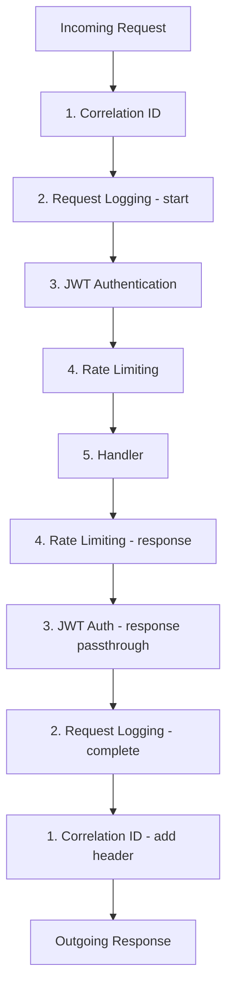
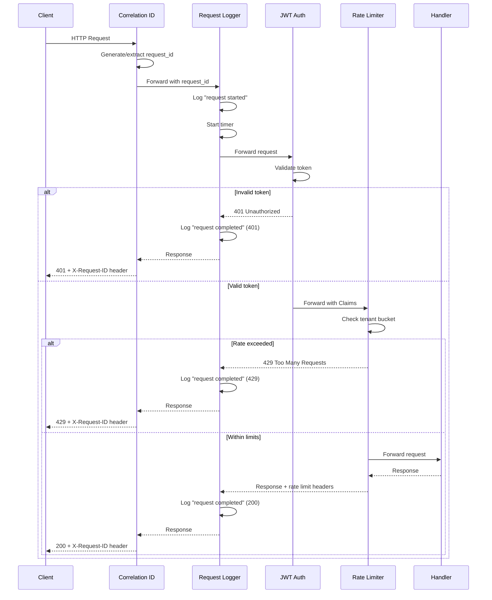

## 13.2 Middleware Stack

Axum's middleware system is built on Tower, a library of composable, reusable
components for building network services. Each middleware wraps the next
handler in the chain, forming a stack that processes every request. The order
of middleware in this stack is not arbitrary -- it determines which operations
run first, which run last, and which see the most complete request context.

Getting the order wrong leads to subtle bugs: logging middleware that cannot
log the authenticated user because it runs before auth, or rate limiting that
does not know which tenant to limit because it runs before JWT validation.

### The Correct Middleware Order

EdgeQuake's middleware stack follows this order from outermost (first to
execute on request, last on response) to innermost:



| Order | Middleware | Why This Position |
|-------|-----------|------------------|
| 1 | Correlation ID | Must run first so all subsequent middleware can include the request ID in logs |
| 2 | Request Logging | Must run before auth so it can log failed auth attempts; must run after correlation ID |
| 3 | JWT Authentication | Must run before rate limiting so the rate limiter knows which tenant to limit |
| 4 | Rate Limiting | Must run after auth (needs tenant identity) but before handlers (to reject excess traffic) |
| 5 | Handler | The actual business logic |

### Building the Stack in Axum

In Axum, middleware is added with `.layer()`. Layers are applied in
**reverse order** -- the last `.layer()` call wraps the innermost handler, and
the first `.layer()` call wraps the outermost layer. This means you add
them bottom-up:

```rust
use axum::{middleware, Router, routing::{get, post}};
use tower_http::timeout::TimeoutLayer;
use std::time::Duration;

pub fn create_router(
    jwt_config: Arc<JwtConfig>,
    rate_limiter: Arc<RateLimiter>,
) -> Router {
    Router::new()
        .route("/api/query", get(handle_query))
        .route("/api/ingest", post(handle_ingest))
        // Layers are applied bottom-up: last added = outermost.
        // 5. (innermost) Request timeout -- safety net.
        .layer(TimeoutLayer::new(Duration::from_secs(30)))
        // 4. Rate limiting -- per-tenant request throttling.
        .layer(middleware::from_fn_with_state(
            rate_limiter,
            rate_limit_middleware,
        ))
        // 3. JWT authentication -- validates token, injects Claims.
        .layer(middleware::from_fn(jwt_auth_middleware))
        .layer(Extension(jwt_config))
        // 2. Request logging -- logs start/end with timing.
        .layer(middleware::from_fn(request_logging_middleware))
        // 1. (outermost) Correlation ID -- generates/propagates request ID.
        .layer(middleware::from_fn(correlation_id_middleware))
}
```

### The Request Logging Middleware

This middleware logs every request with timing information, status code, and
the correlation ID. It wraps the request so it can measure total duration:

```rust
use axum::{extract::Request, http::StatusCode, middleware::Next, response::Response};
use std::time::Instant;

/// Middleware that logs request start and completion with timing.
///
/// Must run after correlation_id_middleware (to have the request ID)
/// and before jwt_auth_middleware (to log auth failures).
pub async fn request_logging_middleware(
    request: Request,
    next: Next,
) -> Response {
    let method = request.method().clone();
    let path = request.uri().path().to_string();
    let request_id = request
        .extensions()
        .get::<RequestId>()
        .map(|r| r.0.clone())
        .unwrap_or_else(|| "unknown".into());

    tracing::info!(
        request_id = %request_id,
        method = %method,
        path = %path,
        "request started"
    );

    let start = Instant::now();
    let response = next.run(request).await;
    let duration = start.elapsed();

    let status = response.status();
    let level = if status.is_server_error() {
        tracing::Level::ERROR
    } else if status.is_client_error() {
        tracing::Level::WARN
    } else {
        tracing::Level::INFO
    };

    // Use the appropriate log level based on response status.
    match level {
        tracing::Level::ERROR => tracing::error!(
            request_id = %request_id,
            method = %method,
            path = %path,
            status = %status.as_u16(),
            duration_ms = %duration.as_millis(),
            "request completed"
        ),
        tracing::Level::WARN => tracing::warn!(
            request_id = %request_id,
            method = %method,
            path = %path,
            status = %status.as_u16(),
            duration_ms = %duration.as_millis(),
            "request completed"
        ),
        _ => tracing::info!(
            request_id = %request_id,
            method = %method,
            path = %path,
            status = %status.as_u16(),
            duration_ms = %duration.as_millis(),
            "request completed"
        ),
    }

    response
}
```

### Rate Limiting Middleware

Rate limiting protects the system from overload and ensures fair resource
sharing across tenants. After JWT authentication, the rate limiter knows the
tenant identity and can apply per-tenant limits:

```rust
use std::collections::HashMap;
use std::sync::Mutex;
use std::time::Instant;

/// Simple token bucket rate limiter, keyed by workspace_id.
pub struct RateLimiter {
    /// Maximum requests per window.
    max_requests: u64,
    /// Window duration.
    window: Duration,
    /// Per-tenant bucket state.
    buckets: Mutex<HashMap<String, TokenBucket>>,
}

struct TokenBucket {
    tokens: u64,
    last_refill: Instant,
}

impl RateLimiter {
    pub fn new(max_requests: u64, window: Duration) -> Self {
        Self {
            max_requests,
            window,
            buckets: Mutex::new(HashMap::new()),
        }
    }

    /// Try to consume one token for the given tenant.
    /// Returns Ok(remaining) or Err(retry_after).
    pub fn try_acquire(&self, workspace_id: &str) -> Result<u64, Duration> {
        let mut buckets = self.buckets.lock().unwrap();
        let now = Instant::now();

        let bucket = buckets.entry(workspace_id.to_string()).or_insert(TokenBucket {
            tokens: self.max_requests,
            last_refill: now,
        });

        // Refill tokens if the window has passed.
        let elapsed = now.duration_since(bucket.last_refill);
        if elapsed >= self.window {
            bucket.tokens = self.max_requests;
            bucket.last_refill = now;
        }

        if bucket.tokens > 0 {
            bucket.tokens -= 1;
            Ok(bucket.tokens)
        } else {
            let retry_after = self.window - elapsed;
            Err(retry_after)
        }
    }
}

/// Rate limiting middleware -- applied per-tenant based on JWT claims.
pub async fn rate_limit_middleware(
    axum::extract::State(limiter): axum::extract::State<Arc<RateLimiter>>,
    request: Request,
    next: Next,
) -> Result<Response, StatusCode> {
    // Extract the workspace_id from claims (set by JWT middleware).
    let workspace_id = request
        .extensions()
        .get::<Claims>()
        .map(|c| c.workspace_id.clone())
        .unwrap_or_else(|| "anonymous".into());

    match limiter.try_acquire(&workspace_id) {
        Ok(remaining) => {
            tracing::debug!(
                workspace = %workspace_id,
                remaining = remaining,
                "rate limit check passed"
            );
            let mut response = next.run(request).await;
            // Add rate limit headers to the response.
            response.headers_mut().insert(
                "X-RateLimit-Remaining",
                remaining.to_string().parse().unwrap(),
            );
            Ok(response)
        }
        Err(retry_after) => {
            tracing::warn!(
                workspace = %workspace_id,
                retry_after_secs = retry_after.as_secs(),
                "rate limit exceeded"
            );
            Err(StatusCode::TOO_MANY_REQUESTS)
        }
    }
}
```

### Audit Logging Middleware

For enterprise deployments, you may need to record an audit trail of every
mutation (writes, deletes, configuration changes). Audit logs are separate
from operational logs -- they are retained longer and may have compliance
requirements:

```rust
use serde::Serialize;

#[derive(Serialize)]
struct AuditEntry {
    timestamp: String,
    request_id: String,
    user_id: String,
    workspace_id: String,
    action: String,
    resource: String,
    method: String,
    status: u16,
    ip_address: String,
}

/// Audit logging middleware for mutation endpoints.
///
/// Records who did what, when, and whether it succeeded.
/// Only applied to routes that modify data (POST, PUT, DELETE).
pub async fn audit_middleware(
    request: Request,
    next: Next,
) -> Response {
    let method = request.method().clone();

    // Only audit mutations, not reads.
    if method == axum::http::Method::GET || method == axum::http::Method::HEAD {
        return next.run(request).await;
    }

    let path = request.uri().path().to_string();
    let request_id = request
        .extensions()
        .get::<RequestId>()
        .map(|r| r.0.clone())
        .unwrap_or_default();
    let claims = request.extensions().get::<Claims>().cloned();
    let ip = request
        .headers()
        .get("X-Forwarded-For")
        .and_then(|v| v.to_str().ok())
        .unwrap_or("unknown")
        .to_string();

    let response = next.run(request).await;

    if let Some(claims) = claims {
        let entry = AuditEntry {
            timestamp: chrono::Utc::now().to_rfc3339(),
            request_id,
            user_id: claims.sub,
            workspace_id: claims.workspace_id,
            action: format!("{} {}", method, path),
            resource: path,
            method: method.to_string(),
            status: response.status().as_u16(),
            ip_address: ip,
        };

        // Log the audit entry as structured JSON.
        // In production, this might also write to a dedicated audit table.
        tracing::info!(
            target: "audit",
            audit = %serde_json::to_string(&entry).unwrap_or_default(),
            "audit log entry"
        );
    }

    response
}
```

### Tower Layers vs Axum Middleware

Axum provides two ways to add middleware:

| Approach | When to Use | Example |
|----------|------------|---------|
| `middleware::from_fn` | Custom logic, access to Axum extractors | Auth, audit, correlation ID |
| Tower `Layer` / `Service` | Reusable, library-provided, composable | Timeout, compression, CORS |

```rust
use tower_http::{
    cors::CorsLayer,
    compression::CompressionLayer,
    timeout::TimeoutLayer,
};

pub fn create_router(/* ... */) -> Router {
    Router::new()
        .route("/api/query", get(handle_query))
        // Custom middleware via from_fn.
        .layer(middleware::from_fn(jwt_auth_middleware))
        // Tower layers from tower-http.
        .layer(TimeoutLayer::new(Duration::from_secs(30)))
        .layer(CompressionLayer::new())
        .layer(CorsLayer::permissive())
}
```

### Visualizing Request Flow Through the Stack

A complete request through EdgeQuake's middleware stack:



### Key Takeaways

- Middleware order matters: correlation ID first, then logging, then auth,
  then rate limiting, then handlers.
- In Axum, layers are applied bottom-up -- the last `.layer()` is the
  innermost middleware.
- Use `middleware::from_fn` for custom logic and Tower layers for standard
  concerns like timeout, compression, and CORS.
- Audit logging should be separate from operational logging, applied only to
  mutations, and include the authenticated user's identity.
- Rate limiting should be per-tenant, which requires running after JWT
  authentication.

---

*Next: [13.3 Performance Optimization](ch13-03-performance.md)*
