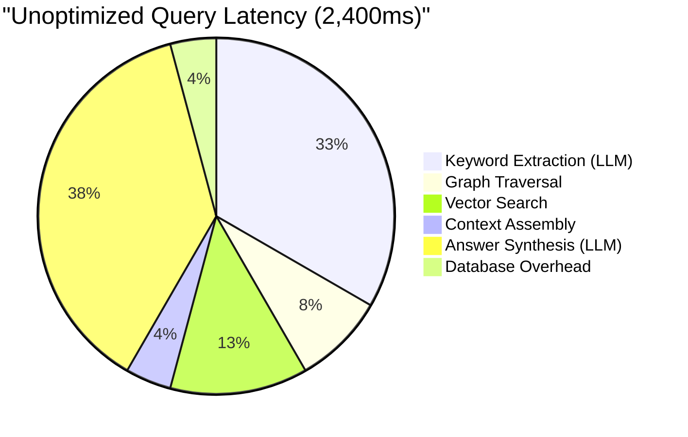

## 13.3 Performance Optimization

A knowledge base's perceived quality depends as much on response time as on
answer accuracy. A query that returns a perfect answer in 10 seconds feels
broken, while a good answer in 500 milliseconds feels magical. In this section,
we cover the concrete optimization techniques that bring EdgeQuake's query
latency from seconds to sub-second.

The optimizations fall into four categories: **batch database operations**,
**connection pooling**, **caching**, and **profiling**. Each targets a
different layer of the system, and together they compound for dramatic
improvements.

### Where Time Goes: The Query Latency Budget

Before optimizing, you need to understand where time is spent. A typical
EdgeQuake hybrid query flows through these stages:



The LLM calls (extraction + synthesis) dominate, but they have a fixed minimum
latency that you cannot easily reduce. The retrieval stages (graph + vector +
database) are where optimization has the most impact.

### Batch Database Operations

Instead of executing one SQL query per entity or relationship, batch them
into a single round-trip. The difference between 100 individual queries and
one batched query is enormous -- not because of row processing time, but
because of network round-trip elimination.

```rust
/// SLOW: One query per entity -- 100 entities = 100 round trips.
async fn get_entities_naive(
    pool: &PgPool,
    workspace_id: &str,
    names: &[String],
) -> Result<Vec<Entity>> {
    let mut entities = Vec::new();
    for name in names {
        let entity = sqlx::query_as::<_, EntityRow>(
            "SELECT * FROM entities WHERE workspace_id = $1 AND name = $2"
        )
        .bind(workspace_id)
        .bind(name)
        .fetch_optional(pool)
        .await?;

        if let Some(e) = entity {
            entities.push(e.into());
        }
    }
    Ok(entities)
}

/// FAST: One query for all entities -- 100 entities = 1 round trip.
async fn get_entities_batched(
    pool: &PgPool,
    workspace_id: &str,
    names: &[String],
) -> Result<Vec<Entity>> {
    let entities = sqlx::query_as::<_, EntityRow>(
        r#"
        SELECT * FROM entities
        WHERE workspace_id = $1
          AND name = ANY($2)
        "#,
    )
    .bind(workspace_id)
    .bind(names)
    .fetch_all(pool)
    .await?;

    Ok(entities.into_iter().map(Into::into).collect())
}
```

The same principle applies to upserts during ingestion:

```rust
/// Batch upsert entities using unnest for multi-row insert.
async fn upsert_entities_batch(
    pool: &PgPool,
    workspace_id: &str,
    entities: &[Entity],
) -> Result<()> {
    let names: Vec<&str> = entities.iter().map(|e| e.name.as_str()).collect();
    let types: Vec<&str> = entities.iter().map(|e| e.entity_type.as_str()).collect();
    let descriptions: Vec<&str> = entities.iter().map(|e| e.description.as_str()).collect();

    sqlx::query(
        r#"
        INSERT INTO entities (workspace_id, name, entity_type, description)
        SELECT $1, unnest($2::text[]), unnest($3::text[]), unnest($4::text[])
        ON CONFLICT (workspace_id, name)
        DO UPDATE SET
            entity_type = EXCLUDED.entity_type,
            description = EXCLUDED.description,
            updated_at = NOW()
        "#,
    )
    .bind(workspace_id)
    .bind(&names)
    .bind(&types)
    .bind(&descriptions)
    .execute(pool)
    .await?;

    Ok(())
}
```

### Connection Pooling

Creating a new database connection for every request is prohibitively
expensive -- TCP handshake, TLS negotiation, and authentication add hundreds
of milliseconds per connection. Connection pooling maintains a set of
pre-established connections that are reused across requests.

```rust
use sqlx::postgres::PgPoolOptions;

/// Create a connection pool with production-tuned settings.
pub async fn create_pool(config: &DatabaseConfig) -> Result<PgPool> {
    let pool = PgPoolOptions::new()
        // Maximum number of connections in the pool.
        // Rule of thumb: 2-4x the number of CPU cores.
        .max_connections(config.max_connections.unwrap_or(20))

        // Minimum number of idle connections to maintain.
        // Prevents cold-start latency spikes.
        .min_connections(config.min_connections.unwrap_or(5))

        // Maximum time to wait for a connection from the pool.
        .acquire_timeout(Duration::from_secs(5))

        // Maximum lifetime of a connection before it is closed and replaced.
        // Prevents issues with stale connections and load balancer timeouts.
        .max_lifetime(Duration::from_secs(1800))

        // Time after which an idle connection is closed.
        .idle_timeout(Duration::from_secs(600))

        // Test the connection before handing it to a caller.
        .test_before_acquire(true)

        .connect(&config.database_url)
        .await?;

    tracing::info!(
        max_connections = config.max_connections.unwrap_or(20),
        min_connections = config.min_connections.unwrap_or(5),
        "connection pool created"
    );

    Ok(pool)
}
```

Monitor pool health to detect connection exhaustion:

```rust
/// Periodically log connection pool statistics.
pub async fn monitor_pool(pool: PgPool) {
    loop {
        tokio::time::sleep(Duration::from_secs(60)).await;

        tracing::info!(
            size = pool.size(),
            idle = pool.num_idle(),
            "connection pool stats"
        );

        // Alert if the pool is nearly exhausted.
        if pool.num_idle() == 0 {
            tracing::warn!("connection pool has no idle connections -- consider increasing max_connections");
        }
    }
}
```

### Embedding Cache

Embedding generation is both slow (API call) and expensive (per-token
billing). Caching embeddings for frequently queried terms avoids redundant
API calls. A simple LRU (Least Recently Used) cache is effective because
query patterns tend to cluster around popular topics:

```rust
use std::collections::HashMap;
use std::sync::RwLock;
use std::time::{Duration, Instant};

/// LRU-like cache for embedding vectors.
///
/// Entries expire after `ttl` to ensure embeddings stay fresh
/// if the embedding model is updated.
pub struct EmbeddingCache {
    entries: RwLock<HashMap<String, CacheEntry>>,
    max_entries: usize,
    ttl: Duration,
}

struct CacheEntry {
    embedding: Vec<f32>,
    created_at: Instant,
    last_accessed: Instant,
}

impl EmbeddingCache {
    pub fn new(max_entries: usize, ttl: Duration) -> Self {
        Self {
            entries: RwLock::new(HashMap::new()),
            max_entries,
            ttl,
        }
    }

    /// Get a cached embedding, if it exists and has not expired.
    pub fn get(&self, text: &str) -> Option<Vec<f32>> {
        let mut entries = self.entries.write().unwrap();

        if let Some(entry) = entries.get_mut(text) {
            if entry.created_at.elapsed() < self.ttl {
                entry.last_accessed = Instant::now();
                tracing::debug!(text_len = text.len(), "embedding cache hit");
                return Some(entry.embedding.clone());
            } else {
                // Expired -- remove it.
                entries.remove(text);
            }
        }

        tracing::debug!(text_len = text.len(), "embedding cache miss");
        None
    }

    /// Insert an embedding into the cache.
    pub fn insert(&self, text: String, embedding: Vec<f32>) {
        let mut entries = self.entries.write().unwrap();

        // Evict the least recently accessed entry if at capacity.
        if entries.len() >= self.max_entries {
            if let Some(lru_key) = entries
                .iter()
                .min_by_key(|(_, v)| v.last_accessed)
                .map(|(k, _)| k.clone())
            {
                entries.remove(&lru_key);
            }
        }

        let now = Instant::now();
        entries.insert(text, CacheEntry {
            embedding,
            created_at: now,
            last_accessed: now,
        });
    }

    /// Return cache statistics for monitoring.
    pub fn stats(&self) -> CacheStats {
        let entries = self.entries.read().unwrap();
        CacheStats {
            size: entries.len(),
            capacity: self.max_entries,
        }
    }
}

#[derive(Debug)]
pub struct CacheStats {
    pub size: usize,
    pub capacity: usize,
}
```

Use the cache in the embedding service:

```rust
pub struct EmbeddingService {
    client: OpenAIClient,
    cache: EmbeddingCache,
}

impl EmbeddingService {
    /// Generate an embedding, using the cache when possible.
    pub async fn embed(&self, text: &str) -> Result<Vec<f32>> {
        // Check cache first.
        if let Some(cached) = self.cache.get(text) {
            return Ok(cached);
        }

        // Cache miss -- call the API.
        let embedding = self.client.create_embedding(text).await?;

        // Cache the result for future queries.
        self.cache.insert(text.to_string(), embedding.clone());

        Ok(embedding)
    }
}
```

### Query Result Caching

For repeated queries (common in dashboard-style applications), caching the
entire query result avoids all retrieval and LLM overhead:

```rust
use std::hash::{Hash, Hasher};

/// Cache key for a query, combining the query text and workspace.
#[derive(Clone, Eq, PartialEq, Hash)]
struct QueryCacheKey {
    workspace_id: String,
    query_text: String,
    query_mode: String,
}

/// Query result cache with tenant-aware keys.
///
/// Caching is tenant-scoped: a cached result for workspace "acme"
/// will never be returned for workspace "globex".
pub struct QueryCache {
    entries: RwLock<HashMap<QueryCacheKey, QueryCacheEntry>>,
    max_entries: usize,
    ttl: Duration,
}

struct QueryCacheEntry {
    response: QueryResponse,
    created_at: Instant,
}

impl QueryCache {
    /// Attempt to serve a query from cache.
    pub fn get(
        &self,
        workspace_id: &str,
        query_text: &str,
        query_mode: &str,
    ) -> Option<QueryResponse> {
        let key = QueryCacheKey {
            workspace_id: workspace_id.to_string(),
            query_text: query_text.to_string(),
            query_mode: query_mode.to_string(),
        };

        let entries = self.entries.read().unwrap();
        entries.get(&key).and_then(|entry| {
            if entry.created_at.elapsed() < self.ttl {
                tracing::info!("query cache hit");
                Some(entry.response.clone())
            } else {
                None
            }
        })
    }

    /// Invalidate all cached results for a workspace.
    ///
    /// Called after ingestion to ensure queries reflect new data.
    pub fn invalidate_workspace(&self, workspace_id: &str) {
        let mut entries = self.entries.write().unwrap();
        entries.retain(|k, _| k.workspace_id != workspace_id);
        tracing::info!(workspace = %workspace_id, "query cache invalidated for workspace");
    }
}
```

### Profiling with tokio-console

When you cannot identify the bottleneck from logs alone, `tokio-console`
provides a real-time dashboard for async Rust applications. It shows:

- Active tasks and their state (idle, running, scheduled)
- Task poll durations (how long each `.await` point blocks the executor)
- Resource contention (mutexes, semaphores)

Add the console subscriber to your application:

```toml
[dependencies]
console-subscriber = "0.4"
tokio = { version = "1", features = ["full", "tracing"] }
```

```rust
/// Initialize tracing with tokio-console support.
///
/// Run with: RUSTFLAGS="--cfg tokio_unstable" cargo run
/// Then connect: tokio-console http://127.0.0.1:6669
pub fn init_tracing_with_console() {
    use tracing_subscriber::layer::SubscriberExt;

    let console_layer = console_subscriber::spawn();

    let fmt_layer = tracing_subscriber::fmt::layer()
        .json()
        .with_target(true);

    let env_filter = tracing_subscriber::EnvFilter::new(
        "warn,edgequake=info,tokio=trace,runtime=trace"
    );

    tracing_subscriber::registry()
        .with(console_layer)
        .with(env_filter)
        .with(fmt_layer)
        .init();
}
```

Run the application with the `tokio_unstable` cfg flag:

```bash
RUSTFLAGS="--cfg tokio_unstable" cargo run --release
```

Then connect with the console tool:

```bash
tokio-console http://127.0.0.1:6669
```

The dashboard shows you exactly which tasks are spending time waiting vs
executing, helping you identify:

- **Slow futures** -- tasks that poll for a long time (blocking the executor)
- **Starved tasks** -- tasks that are rarely scheduled despite being ready
- **Lock contention** -- tasks waiting to acquire a mutex or semaphore

### Optimization Checklist

Use this checklist to systematically optimize a slow EdgeQuake deployment:

| Check | What to Look For | Fix |
|-------|-----------------|-----|
| Database queries | N+1 patterns (one query per entity) | Batch with `ANY($1)` or `unnest` |
| Connection pool | Pool exhaustion (0 idle connections) | Increase `max_connections` |
| Embedding calls | Redundant embeddings for same text | Add `EmbeddingCache` |
| Query results | Same query repeated by multiple users | Add `QueryCache` |
| LLM latency | Model too large for the task | Use GPT-4o-mini for keyword extraction |
| Graph traversal | Full scan without indexes | Add composite indexes on `workspace_id` |
| Vector search | Searching all vectors | Use namespace-scoped vector indexes |
| Serialization | Large JSON parsing in hot paths | Pre-parse and cache parsed structures |
| Async tasks | Blocking code on the Tokio runtime | Move blocking work to `spawn_blocking` |

### Measuring the Impact

After applying optimizations, measure the before/after with structured logging:

```rust
/// Wrap any async operation to measure and log its duration.
async fn timed<F, T>(name: &str, future: F) -> T
where
    F: std::future::Future<Output = T>,
{
    let start = Instant::now();
    let result = future.await;
    let duration = start.elapsed();

    tracing::info!(
        operation = %name,
        duration_ms = %duration.as_millis(),
        "operation completed"
    );

    result
}

// Usage:
let entities = timed("graph_query", storage.get_entities(&query)).await?;
let embeddings = timed("vector_search", vector_storage.search(&query_embedding, 10)).await?;
```

A well-optimized EdgeQuake deployment should achieve the following latency
budget for a hybrid query:

```text
Optimized Query Latency (~1,200ms)
  Keyword extraction (LLM):    400ms  (using GPT-4o-mini)
  Graph traversal:               50ms  (batched, indexed)
  Vector search:                 80ms  (S3 Vectors, cached index)
  Context assembly:              20ms  (in-memory)
  Answer synthesis (LLM):       600ms  (streaming to client)
  Overhead:                      50ms  (middleware, serialization)
```

### Key Takeaways

- Batch database operations eliminate per-entity round trips, often providing
  10-100x speedup for multi-entity queries.
- Connection pooling avoids per-request connection overhead. Size the pool at
  2-4x your CPU core count.
- Embedding caching prevents redundant API calls for repeated query terms.
  An LRU cache with a reasonable TTL is effective and simple.
- Query result caching is the most impactful optimization for repeated
  queries but must be invalidated after ingestion.
- `tokio-console` provides real-time visibility into async task behavior
  when logs alone are insufficient for diagnosis.

---

*Back to: [Chapter 13: Observability and Operations](ch13-observability.md)*
