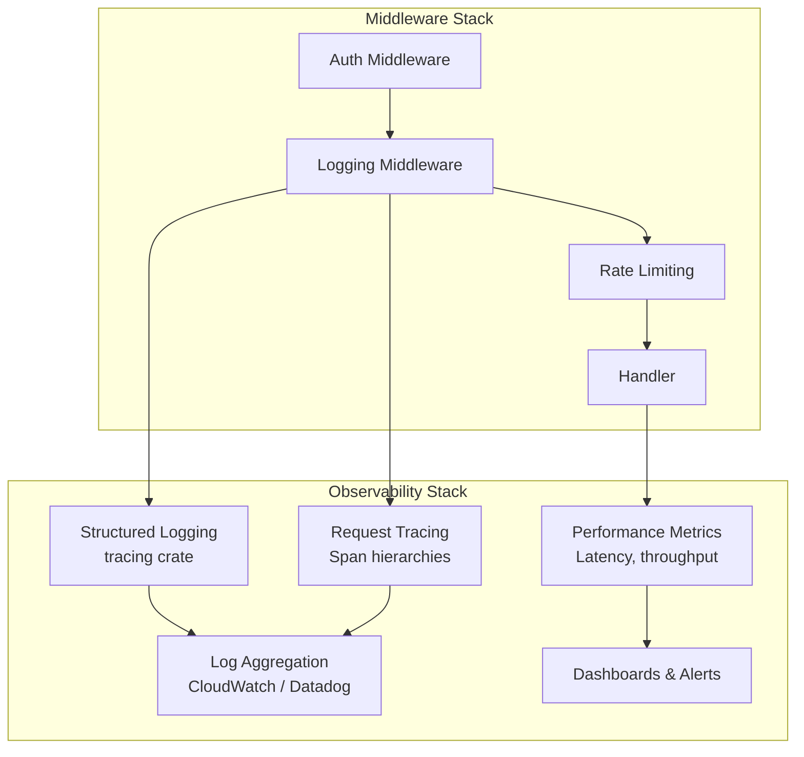

# Chapter 13: Observability and Operations

> **"You cannot improve what you cannot measure, and you cannot debug what you cannot see."**

A production knowledge base is a complex system with many moving parts --
LLM API calls, embedding generation, graph traversals, vector similarity
searches, and database writes. When a query takes 5 seconds instead of 500
milliseconds, you need to know which component is the bottleneck. When an
ingestion pipeline fails at 3 AM, the on-call engineer needs structured logs
that pinpoint the failure, not a stack trace buried in megabytes of
unformatted text.

Observability is not just logging. It is the combination of **structured
logging**, **request tracing**, and **performance metrics** that lets you
understand what your system is doing at any moment. In this chapter, we build
the observability stack that makes EdgeQuake operable in production.

This chapter covers three areas:

1. **Structured logging** with the `tracing` crate -- hierarchical spans,
   key-value fields, and request correlation.
2. **The middleware stack** -- how Axum's Tower-based middleware layer
   provides auth, logging, and rate limiting in the correct order.
3. **Performance optimization** -- connection pooling, caching, batch
   operations, and profiling with `tokio-console`.

## Learning Objectives

After completing this chapter you will be able to:

1. **Configure structured logging** with the `tracing` crate, including span
   hierarchies and request-scoped context.
2. **Design an Axum middleware stack** with correct ordering for auth,
   logging, and rate limiting.
3. **Implement performance optimizations** including batch database
   operations, connection pooling, and caching.
4. **Profile async Rust applications** using `tokio-console` to identify
   bottlenecks.

## Chapter Outline

| Section | Topic |
|---------|-------|
| [13.1 Structured Logging](ch13-01-structured-logging.md) | tracing crate, spans, fields, request correlation |
| [13.2 Middleware Stack](ch13-02-middleware-stack.md) | Axum/Tower middleware ordering, audit logging |
| [13.3 Performance Optimization](ch13-03-performance.md) | Caching, pooling, batching, profiling |

## Prerequisites

- Familiarity with Axum request handling (Chapter 7)
- Understanding of async Rust and Tokio basics
- Experience reading log output (any format)

## Key Terminology

| Term | Definition |
|------|-----------|
| **Span** | A period of time during which a program was executing in a particular context |
| **Structured logging** | Log entries with machine-parseable key-value fields, not just freeform text |
| **Correlation ID** | A unique identifier that ties all log entries for a single request together |
| **Middleware** | A function that wraps a handler, processing the request before and/or after |
| **Tower layer** | Axum's middleware abstraction, based on the Tower service pattern |
| **Connection pool** | A cache of reusable database connections to avoid per-request connection overhead |

## Why Observability Matters for Knowledge Bases

Knowledge bases have unique observability challenges compared to typical web
services:

| Challenge | Why It Matters |
|-----------|---------------|
| LLM latency variance | GPT-4 response times range from 1s to 30s -- you need percentile tracking |
| Multi-step queries | A single user query triggers keyword extraction, graph traversal, vector search, and LLM synthesis |
| Embedding costs | Without monitoring, embedding API costs can spike unexpectedly |
| Storage diversity | Queries hit PostgreSQL, S3 Vectors, and DynamoDB -- each has different failure modes |
| Batch pipelines | Long-running jobs need phase-level progress tracking |

The observability stack we build in this chapter addresses all of these.

---

*Next: [13.1 Structured Logging](ch13-01-structured-logging.md)*

{{#quiz ../quizzes/ch13-observability.toml}}
